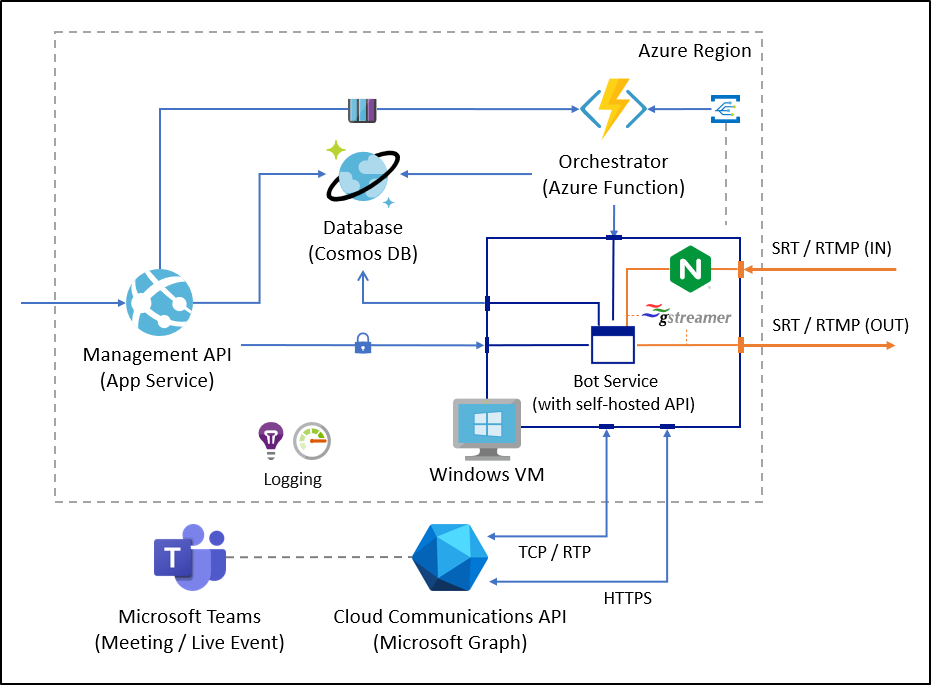

# Notice

This is a **PRE-RELEASE** project and is still in development. This project uses the [application-hosted media bot](https://docs.microsoft.com/en-us/microsoftteams/platform/bots/calls-and-meetings/requirements-considerations-application-hosted-media-bots) SDKs and APIs, which are still in **BETA**.

The code in this repository is provided "AS IS", without any warranty of any kind. Check the [LICENSE](LICENSE) for more information.

# Broadcast Development Kit

**Broadcast Development Kit** is a software solution that allows organizations to use a Microsoft Teams meeting in their tenant as a source (and destination) to extract and inject media streams from the meeting (e.g. participants, screen share, etc.) and use them as sources for producing live content.

> If you plan to use this solution to extract content for a Teams Meeting, please inform your attendees that you will be streaming their video and audio.

## Features

**Broadcast Development Kit** provides features both to extract and inject media from a Microsoft Teams meeting using either the SRT or the RTMP protocols. We recommend using the SRT protocols whenever possible, and just use RTMP (and RTMPS) if the system receiving / sending the feed does not support SRT.

The solutions works by adding a media bot to the meeting where you want to use this solution and using that media bot to capture the streams from the meeting and injecting new streams into it.

### Extraction

The sources that can be used for extraction are:

- **A participant**: any participant that has their camera on can be extracted as an individual media stream.

- **The primary speaker**: this is a media stream that automatically switches to the participant that is speaking at that time in the call. This allows to switch between participants automatically during a conversation. Only one participant is captured at a time.

- **The screen share**: if a participant is sharing their screen, that feed can also be extracted as an individual stream too.

- **Together mode**: if together mode is enabled in the meeting, it can be extracted as a separate media stream.

- **Large gallery mode**: if large gallery mode is enabled in the meeting, it can be extracted as a separate media stream too.

The solution supports multiple extractions at a time, allowing to stream any combination of the sources listed above (each as a individual stream) over SRT or RTMP to a video mixing solution of your choice.

To provide the best possible experience during a meeting, Microsoft Teams automatically changes the frame size and frame rate of each participant stream based on the network conditions of the participant. However, this can cause issues with using those streams in streaming services of video production solutions. To avoid these issues **Broadcast Development Kit** automatically upscales the video feed to **1080p at 30FPS**. This reduces the complexity of having to work with a variable frame size and frame rate.

Extraction of any of those streams can be done with the following configurations:
- SRT in "caller" mode (you have a SRT listener waiting to receive a connection from this solution).
- SRT in "listener" mode (the solution will wait for a SRT caller to connect and get the content).
- RTMP / RTMPS in "push" mode (you have a RTMP URL you want to push the stream to).
- RTMP / RTMPS in "pull" mode (the solution will wait for an RTMP client to connect and retrieve the content).

### Injection

A feed with audio and video can be injected to the Microsoft Teams meeting. Inside the meeting, the video will look like any other participant in the call. You can then using Microsoft Teams' spotlight functionality to focus the attention of the participants to the video that is being injected.

**Broadcast Development Kit** supports receiving video and audio in several resolutions and frame rates. It will automatically transform the video feed to **1080p and 30FPS** before injecting it into the Microsoft Teams call.

Injection is supported in the following configurations:
- SRT in "caller" mode (you have an SRT listener waiting for a client to connect).
- SRT in "listener" mode (the solution will wait for a SRT caller to connect and send the content)
- RTMP / RTMPS in "pull" mode (you have an RTMP server waiting for a client to connect and pull the content)
- RTMP / RTMPS in "push" mode (the solution will wait for RTMP content to be pushed into it)

The audio can be muted and unmuted though the API.

## Scenarios

The necessities of each organization are different and how they can use this solution depends on what the organization needs to do. Below are some short examples on how this solution can be used in different scenarios.

### Sharing a real-time conversation in a streaming platform

A simple use case is wanting to share a stream a conversation to a streaming service, where the "camera" automatically switches to the participant that is speaking. This can be achieved extracting the **primary speaker** from the meeting and sending it to the streaming service using SRT (or RTMPS).

### Producing a show

Let's say that you are producing a show where you plan to interview people and you want to be able to bring that people into the interview remotely using Microsoft Teams. You can extract the interviewers, interviewees and any content shared in the meeting, each as a separate video feed.

Then you can process those feeds in a video production solution of your choosing, do a composition of the different feeds and transmit the show live.

### Watch party

If you have media content that can be streamed through SRT or RTMP such as live event or a VOD, you can use the injection feature to playback the video inside the Microsoft Teams meeting to the rest of the participants and watch the stream together.

## Limitations

This solution currently has some limitations:

- The audio of all teams participants is shared in a single audio feed. Although all media extractions form the meeting contain both audio and video, the audio of all streams will be the combined audio of the meeting. If you need to use several extractions in a video production solution, use the audio from one of the feeds and mute the rest.

- No composed view of the call (e.g. 4x4 or 9x9 participants) is available with this solution.

- The current implementation supports one meeting per VM, and only one VM. Therefore, it can be used only in one meeting at a time. The solution can be updated to support more VM instances running in parallel.

- While this solution can extract the screen share feed, it cannot extract content that is shared in the meeting. For example, if you share a Power Point presentation directly in the meeting, this solution can not capture and extract that content. That is because while the screen share is a media feed, the content shared directly in the meeting is not.

- Only one video and audio can be injected into the meeting at a time.

- There are some restrictions on using this solution to record content from a Microsoft Teams meeting, which are inherited from the [Graph Communications Bot Media SDK](https://microsoftgraph.github.io/microsoft-graph-comms-samples/docs/bot_media/index.html#accompanying-documentation). Check the documentation of the SDK for more information.

## Getting Started

This section will guide you through the process of configuring the solution to run it locally and/or in azure.

### How to run the solution
Please follow these documents to build and configure this solution:
- [Prerequisites](docs/prerequisites/README.md)
- [How to run the solution locally](docs/how-to-run-the-solution-locally/README.md)
- [How to run the solution in Azure](docs/how-to-run-the-solution-in-azure/README.md)

You can find how to use the APIs in this solution in the following document:
- [How to use the Management API](docs/how-to-use-the-solution/README.md)

### Adding an UI

This solution doesn't include any UI that can be used to operate the application. However, you can find two UI samples in the following repositories that you can use either locally or in Azure to interact with the solution.

- [Web UI for the Broadcast Development Kit](https://github.com/microsoft/Broadcast-Development-Kit-Web-UI)
- [Teams App for the Broadcast Development Kit](https://github.com/microsoft/Broadcast-Development-Kit-Meeting-App)

### Exploring the repository

The repository is structured in the following directories:
- **src**: Contains the source code of the application.
    - **BotService**: Contains the core component that connects to the meeting and extracts and injects media feeds from and to the meeting.
    - **ManagementApi**: Contains the main API that is used to interact with the service.
    - **OrchestratorFunction**: Contains the Azure function in charge of managing the status of the VMs.
- **docs**: Contains the documentation on the solution.

### Architecture

## Reporting issues

Security issues and bugs should be reported privately to the Microsoft Security Response Center (MSRC) at https://msrc.microsoft.com/create-report, or via email to secure@microsoft.com. Please check [SECURITY](SECURITY.md) for more information on the reporting process.

For non-security related issues, feel free to file an new issue through [GitHub Issues](https://github.com/microsoft/Broadcast-Development-Kit/issues/new).

## Contributing

This project welcomes contributions and suggestions.  Most contributions require you to agree to a Contributor License Agreement (CLA) declaring that you have the right to, and actually do, grant us the rights to use your contribution. For details, visit https://cla.opensource.microsoft.com.

When you submit a pull request, a CLA bot will automatically determine whether you need to provide a CLA and decorate the PR appropriately (e.g., status check, comment). Simply follow the instructions provided by the bot. You will only need to do this once across all repos using our CLA.

This project has adopted the [Microsoft Open Source Code of Conduct](https://opensource.microsoft.com/codeofconduct/).
For more information see the [Code of Conduct FAQ](https://opensource.microsoft.com/codeofconduct/faq/) or contact [opencode@microsoft.com](mailto:opencode@microsoft.com) with any additional questions or comments.

## Trademarks

This project may contain trademarks or logos for projects, products, or services. Authorized use of Microsoft trademarks or logos is subject to and must follow [Microsoft's Trademark & Brand Guidelines](https://www.microsoft.com/en-us/legal/intellectualproperty/trademarks/usage/general).
Use of Microsoft trademarks or logos in modified versions of this project must not cause confusion or imply Microsoft sponsorship.
Any use of third-party trademarks or logos are subject to those third-party's policies.

## Acknowledgments

This project was implemented using the samples in the [Microsoft Graph Communications API and Samples](https://github.com/microsoftgraph/microsoft-graph-comms-samples) repository as a base. 

The architecture used in the solution was inspired by the samples in [Azure-Samples/PartitionedRepository](https://github.com/Azure-Samples/PartitionedRepository) and [ShawnShiSS/clean-architecture-azure-cosmos-db](https://github.com/ShawnShiSS/clean-architecture-azure-cosmos-db).

The media processing pipelines were creating using [GStreamer](https://gstreamer.freedesktop.org/), and open source multimedia framework.

## License

Copyright (c) Microsoft Corporation. All rights reserved.

Licensed under the [MIT](LICENSE) license.
