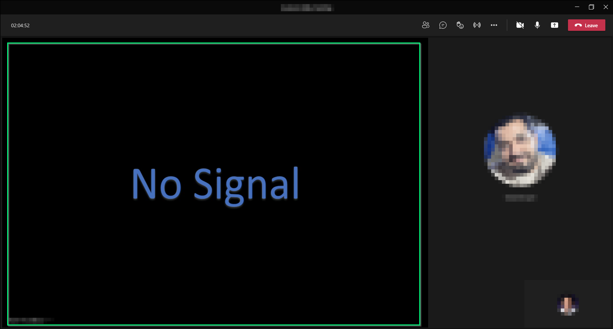
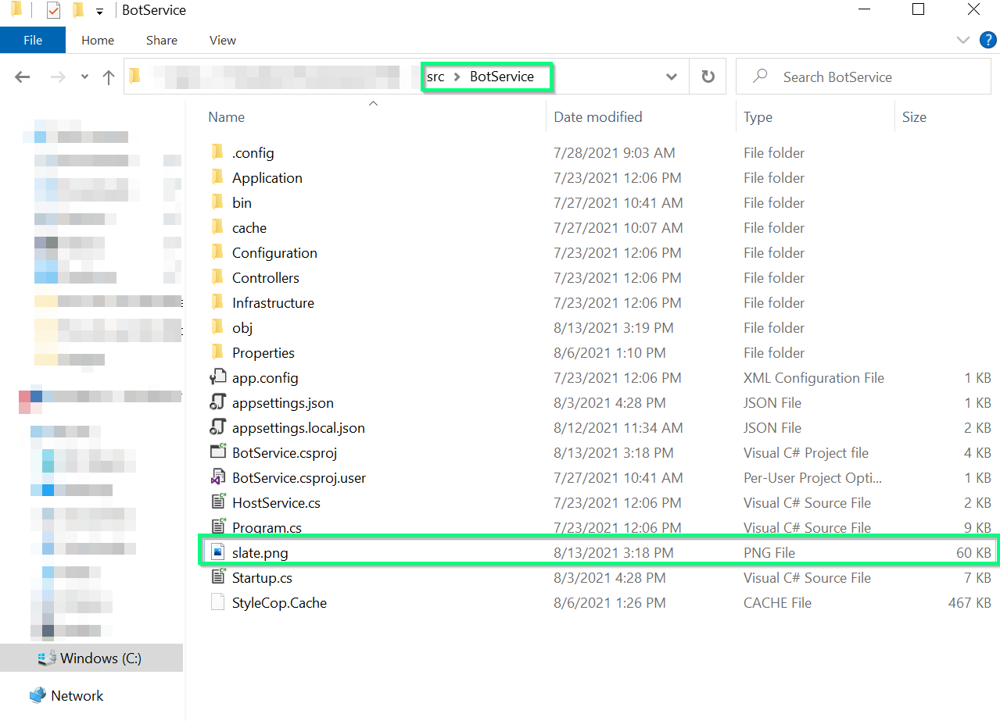

# Customize the Broadcast Development Kit Slate image

## Getting Started 
When the BDK is joined into a Microsoft Teams call, it starts rendering a "Slate" image on the bot spot in the Microsoft Teams client while no media content injection is active.

By default, the `Slate` image rendered on the Microsoft client is an image provided in the BDK solution, placed on the BDK `BotService` root solution folder. Once the bot is joined into a meeting the following image is displayed on the Microsoft Teams client.

||
|:--:|
|*Slate Image displayed by the bot when joins into the meeting.*|

## Customizing the Slate image

The `Slate` image rendered by the bot on the Microsoft Teams client can be customized. You only need to change the default image provided in the solution by one of your choices.

To do so, please go to the `BotService` solution folder, find the `PNG` file called `slate.png` and replace it with one of your preferences. 

||
|:--:|
|*Slate image provided on the `BotService` solution*|

The `Slate` image you need to provide must have the following characteristics:

- ***Format***: The image format must be PNG.
- ***Name***: The image name must be named `slate`. 
- ***Width***: The image width must be 1920px.
- ***Height***: The image height must be 1080px.  

> **NOTE**: Currently, the only image format supported is `PNG`. Also, the image resolution must be 1920x1080. If an image with different characteristics is provided it may cause video rendering issues on the Microsoft Teams client. 

> **NOTE**: The image provided in the solution is copied to the folder where the `BotService` is published. You can also change the image directly from the folder where the bot was published, you do not need to build and publish again the solution, every time you want to change the `Slate` image. 
