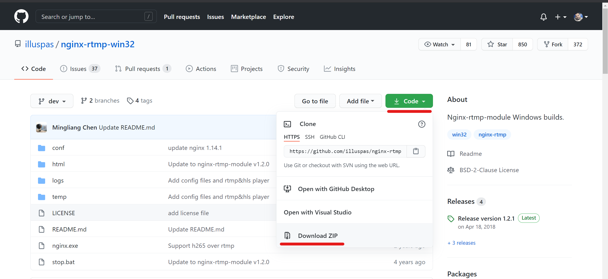
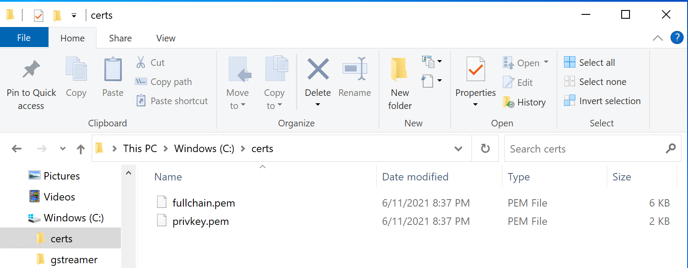
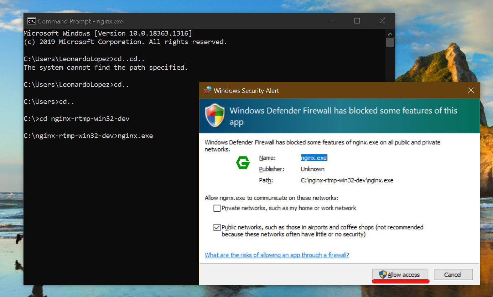
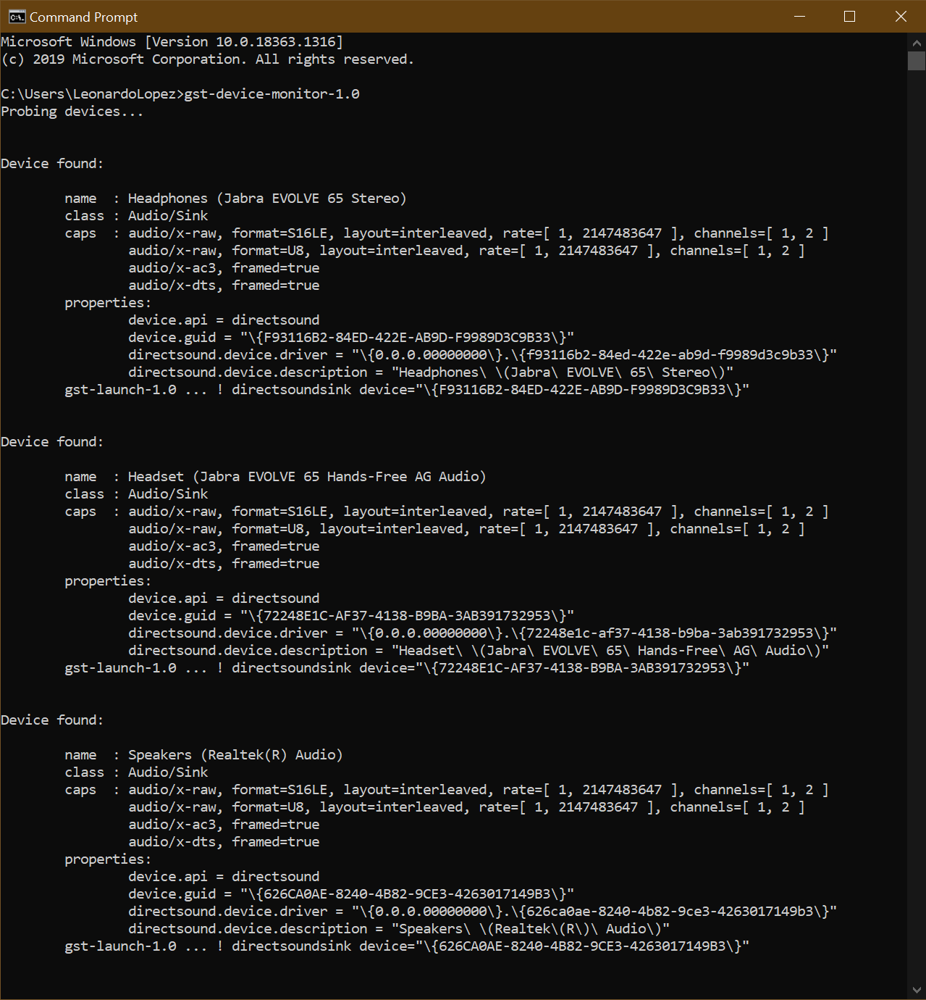
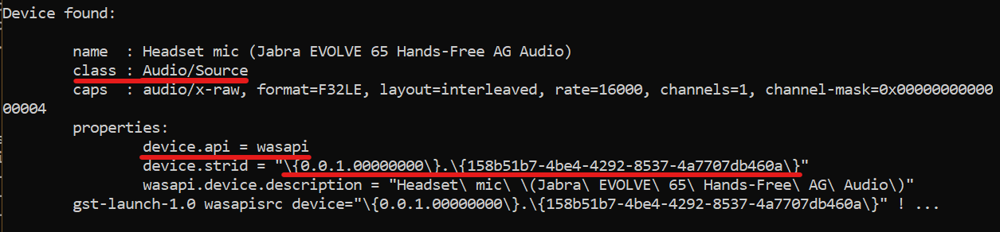
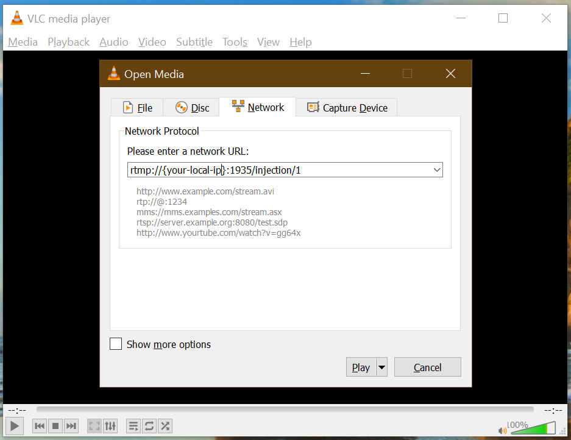
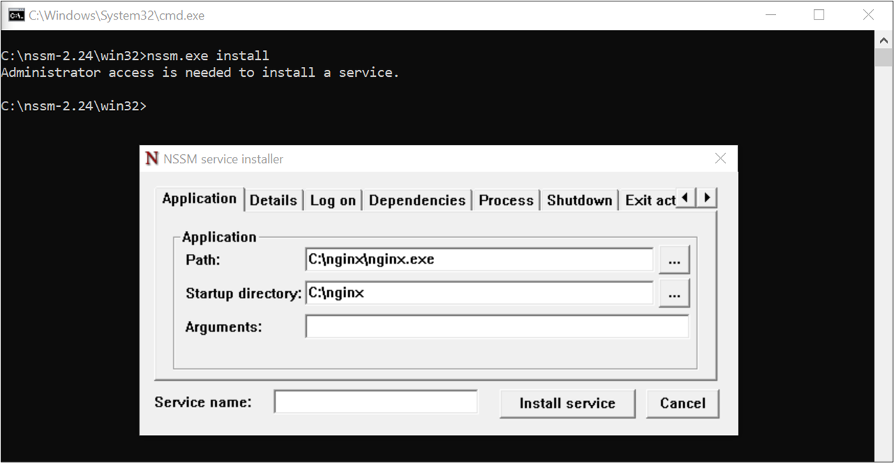
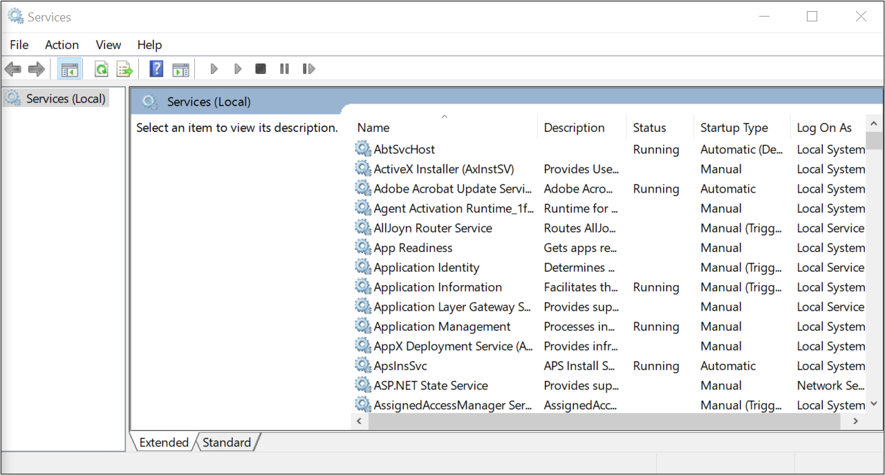

# How to Install and configure NGINX with RTMP module on Windows


## Getting Started

To support RTMP injection in {{insert the name of the solution}} we need to configure NGINX in the host machine. The objective of this guide is to explain how to correctly install and configure NGINX with the RTMP module in Windows, how to inject a live broadcast locally, and how to run NGINX as a Windows service.

>  **NOTE**: We are going to use NGINX version 1.14.1. It has not been tested with recent versions.

## Installation

Download as a zip NGINX with RTMP module from the following [GitHub repository](https://github.com/illuspas/nginx-rtmp-win32).

||
|:--:|
|*NGINX with RTMP module repository*|


Before editing the `nginx.config` file, to support RTMPS we must copy the SSL certificate (we've mentioned as prerequisite [here](../prerequisites/readme.md)) and its key into the host machine. (e.g.: C:\certs)

| |
|:--:|
|*Example certs*|

After that, unzip the file in a location of preference (e.g: C:\), open `nginx.config` file with your text editor of preferences and replace its content with the following code snippet:

```nginx
worker_processes  1;
error_log  logs/error.log;
error_log  logs/error.log  notice;
error_log  logs/error.log  info;
pid        logs/nginx.pid;

events {
    worker_connections  8192;
    # max value 32768, nginx recycling connections+registry optimization =
    #   this.value * 20 = max concurrent connections currently tested with one worker
    #   C1000K should be possible depending there is enough ram/cpu power
    # multi_accept on;
}

stream {
    upstream secure-extraction-1 {
        server 127.0.0.1:2951;
    }
    server {
        listen 2951 ssl;
        proxy_pass secure-extraction-1;
        ssl_certificate c:\\certs\\fullchain.pem;
        ssl_certificate_key c:\\certs\\privkey.pem;
        
        allow all;
    }    

    upstream secure-extraction-2 {
        server 127.0.0.1:2952;
    }
    server {
        listen 2952 ssl;
        proxy_pass secure-extraction-2;
        ssl_certificate c:\\certs\\fullchain.pem;
        ssl_certificate_key c:\\certs\\privkey.pem;
        
        allow all;
    }

    upstream secure-extraction-3 {
        server 127.0.0.1:2953;
    }
    server {
        listen 2953 ssl;
        proxy_pass secure-extraction-3;
        ssl_certificate c:\\certs\\fullchain.pem;
        ssl_certificate_key c:\\certs\\privkey.pem;
        
        allow all;
    }

    upstream secure-extraction-4 {
        server 127.0.0.1:2954;
    }
    server {
        listen 2954 ssl;
        proxy_pass secure-extraction-4;
        ssl_certificate c:\\certs\\fullchain.pem;
        ssl_certificate_key c:\\certs\\privkey.pem;
        
        allow all;
    }

    upstream publish {
        server 127.0.0.1:29361;
    }
    server {
        listen 2936 ssl;        # additional port for publishing
        proxy_pass publish;
        ssl_certificate c:\\certs\\fullchain.pem; #root path where your certificate is located e.g.: C:\certs\fullchain.pem
        ssl_certificate_key c:\\certs\\privkey.pem; #root path where your certificate key is located e.g.: C:\certs\privkey.pem
        allow all;
    }

    upstream live {
        server 127.0.0.1:29351;
    }
    server {
        listen 2935 ssl;        # standard RTMP(S) port
        proxy_pass live;
        ssl_certificate c:\\certs\\fullchain.pem; #root path where your certificate is located e.g.: C:\certs\fullchain.pem
        ssl_certificate_key c:\\certs\\privkey.pem; #root path where your certificate key is located e.g.: C:\certs\privkey.pem
        allow all;              # this is public (this is also the default)
    }
}

rtmp {
    server { 
        listen 127.0.0.1:2951;
        chunk_size 4096;

        application secure-extraction {
            live on;
            record off;
            allow publish 127.0.0.1;
        }
    }

    server { 
        listen 127.0.0.1:2952;
        chunk_size 4096;

        application secure-extraction {
            live on;
            record off;
            allow publish 127.0.0.1;
        }
    }

    server { 
        listen 127.0.0.1:2953;
        chunk_size 4096;

        application secure-extraction {
            live on;
            record off;
            allow publish 127.0.0.1;
        }
    }

   server { 
        listen 127.0.0.1:2954;
        chunk_size 4096;

        application secure-extraction {
            live on;
            record off;
            allow publish 127.0.0.1;
        }
    }

   server { 
        listen 2941;
        chunk_size 4096;

        application extraction {
            live on;
            record off;
        }
   }

   server { 
        listen 2942;
        chunk_size 4096;

        application extraction {
            live on;
            record off;
        }
    }

   server { 
        listen 2943;
        chunk_size 4096;

        application extraction {
            live on;
            record off;
        }
    }

    server { 
        listen 2944;
        chunk_size 4096;

        application extraction {
            live on;
            record off;
        }
    }

    server {
        listen 127.0.0.1:29361;
        chunk_size 4096;

        application secure-ingest{
            live on;
            record off;

            on_publish http://localhost/api/bot/validate-stream-key;
            allow publish 127.0.0.1;  # publishing through rtmps://rtmp.example.com:1936
            allow play 127.0.0.1;     # for the pull from rtmp://localhost:19351/live
        }
    }

    server {
        listen 127.0.0.1:29351;
        chunk_size 4096;

        application live {
            live on;
            record off;
            deny publish all;         # no need to publish on /live -- IMPORTANT!!!
            allow play 127.0.0.1;     # playing through rtmps://rtmp.example.com:1935/live
            pull rtmp://127.0.0.1:29361/secure-ingest;
        }
    }

    server {
        listen 1936;
        chunk_size 4096;
        application ingest {
            live on;
            record off;
        
            on_publish http://localhost/api/bot/validate-stream-key;
        }
    }
}

http {
    server {
        listen      8080;

        location / {
            root html;
        }
        
        location /stat {
            rtmp_stat all;
            rtmp_stat_stylesheet stat.xsl;
        }
        location /stat.xsl {
            root html;
        }
    }
}
```

## Test NGINX server configuration

>  **NOTE**: To test the NGINX server we will use GStreamer to create a pipeline that captures the audio and video of our PC and pushes it into the NGINX server. If you want to use other tool like OBS, feel free to skip this section.


To start testing the NGINX server, we must open a terminal window, navigate to the NGINX root folder and execute `nginx.exe`.



Once the server is running, we are going to locally test the RTMP endpoint by injecting content with GStreamer.

Open a new command line window, and execute the following command:

```bash
gst-device-monitor-1.0
```

### List of found devices



The command will prompt you with a list of input and output multimedia devices. We must identify the audio input device we will be using. We must search for a device with **Audio/Source** class where its **device.api** property equals to **wasapi**, and copy the value of **device.strid**.



Once we identified the device and copied its id value, we need to run the following command (GStreamer CLI pipeline) to start capturing the video from your webcam and the audio of the selected device, and process it so we can inject it as an RTMP stream into the RTMP server.

```bash
gst-launch-1.0 wasapisrc device="{{device-strid}}" ! audioconvert ! avenc_aac ! aacparse ! queue ! mux. autovideosrc ! "video/x-raw, format=YUY2, width=320, height=180, framerate=30/1" ! videoconvert ! x264enc tune=zerolatency key-int-max=60 bitrate=2500 ! queue ! mux. flvmux name=mux streamable=true latency=500000000 ! rtmpsink location=rtmp://localhost:1936/test-endpoint/1
```
> **NOTE:** Replace the placheholder **{{device-strid}}** with the **device.strid** value we copied before.

To validate the server and GStreamer are correctly working, we must start consuming the live endpoint with a player.

**Using GStreamer**

```bash
gst-launch-1.0 rtmpsrc location=rtmp://localhost:1936/test-endpoint/1 ! decodebin name=decoder ! queue ! videoconvert ! autovideosink decoder. ! queue ! audioconvert ! audioresample ! autoaudiosink
```
Or


```bash
gst-launch-1.0 playbin uri=rtmp://localhost:1936/test-endpoint/1
```


**Ffplay**
```bash
ffplay.exe rtmp://localhost:1936/test-endpoint/1
```


**VLC Player**

> **NOTE**: Make sure you have a sufficiently recent version of VLC. RTMP streaming is supported in VLC versions 1.1 and later; you can download the most recent version by pointing your browser to [videolan.org](https://www.videolan.org/) and clicking **Download VLC**. Follow the on-screen instructions to download and install the program.

Once VLC is installed, follow these steps:
1. Open VLC's ***Media*** menu and click **Open Network Stream**, or simply hold down **CTRL** and press **N**.

1. Paste the URL of the stream you want to watch, with the following format: `rtmp://localhost:1936/test-endpoint/1` in the **Please enter a network URL** box.  


1. Click the **Play** button.

## Run NGINX as a Windows Service
In order to run NGINX as Windows Service is necessary to wrap the executable file into a Windows Service using an external program.

To do so, we can use the [nssm](https://nssm.cc/) tool and execute it in the PC or VM where we want to install the service.  Download the nssm tool  ([download link](https://nssm.cc/download)), unzip the package, and execute the tool from the command line.

Once the tool is open, set the path for the NGINX executable file and click on the **Install Service** button. After receiving the confirmation message the service is ready to start.



The first time, the service does not run automatically. We must initialize the service from the Windows services manager or, restart the machine.


