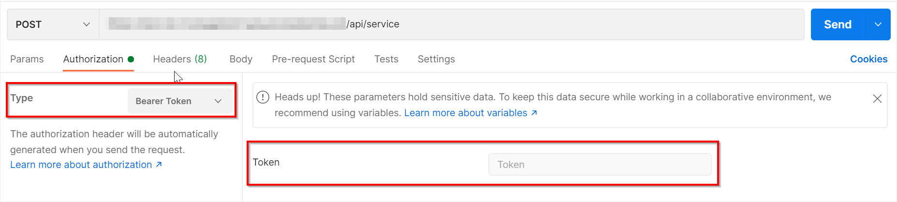
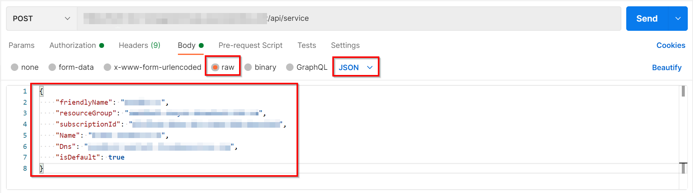

# How to Add the Service 

## Introduction
In order to start using the Azure environment once all the components have been deployed and configured, it is necessary to configure/register a service into the Cosmos DB.  

## Dependencies
To configure/register the service, the following dependencies need to be created:

- [Management API](deploy_web_app.md).
- [BotOrchestrator deployed](deploy_function_app.md).
- [Cosmos DB](cosmos_db.md).

>**NOTE**: The Web and the Function Apps not only need to be created but also both components (Management API and Orchestrator Function) need to be deployed and configured.

## Configure/Register the service
There are two approaches you can follow to configure/register the service in the database:
1. **Sending a request to the Management API**. This is the recommended approach, but take into account that the API is secured through Azure AD and you will need to generate an access token to use this endpoint.
2. **Manually adding the service in the database**. This approach is easier, but it can be error prone.

Below you can find both approaches.

### Configure/Register using the API
The service is configured/registered through the Management API by making a `POST` request to the `/api/service`. The snippet below shows the `payload` request needed.

```json
{
    "friendlyName": "{{serviceName}}",
    "resourceGroup": "{{virtualMachineResourceGroup}}",
    "subscriptionId": "{{subscriptionIdOfResourceGroup}}",
    "name": "{{virtualMachineName}}",
    "dns": "{{virtualMachineDnsName}}",
    "isDefault": "{{serviceDefault}}"
}
```

| Placeholder                            | Description                                                                         |
|----------------------------------------|-------------------------------------------------------------------------------------|
| serviceName                            | A meaningful name for the service to be configured/registered, e.g. `Test service`. |
| virtualMachineResourceGroup            | The [resource group](README.md#resource-groups) name where the virtual machine was created. |
| subscriptionIdOfResourceGroup          | The subscription Id where the virtual machine resource group was created.           |
| virtualMachineName                     | The name of the [virtual machine](virtual_machine.md)                               |
| serviceDefault                         | Indicates whether the service to be added is the default, set it to `true`.         |

#### Example of how to use this endpoint
You can use any HTTP client to configure/register the service to be used by the solution. In this example, the client used is `Postman`.

Open `Postman` and create a new `POST` request pointing to the following endpoint: https://{{webAppUrl}}/api/service 

| Placeholder                            | Description                                                                         |
|----------------------------------------|-------------------------------------------------------------------------------------|
| webAppUrl                              | This is the [Web App](web_app_and_app_service_plan.md) service in Azure URL where the Management API was deployed      |

In the authorization tab, select `Bearer Token` for `Type` and add the authorization token in the corresponding `Token` input.



To get the authorization token for the Management API resource you can follow the steps described in this [document](authorization_token.md).

In the header tab, add (if it does not exist) a new key `Content-Type` with the value `application/json`.

In the body tab select raw and complete by copying the following



Click on send to configure/register the service. 

### Configure/Register in the database
With the virtual machine running, go to your Cosmos DB database, locate the `Service` container and create a new entry with the following information. Then click `Save` to persist the changes.

```json
{
    "CallId": null,
    "Name": "{{service-name}}",
    "State": 1,
    "CreatedAt": "2021-08-01T00:00:00+00:00",
    "Infrastructure": {
        "VirtualMachineName": "{{vm-name}}",
        "ResourceGroup": "{{resource-group}}",
        "SubscriptionId": "{{subscription}}",
        "Id": "{{infrastructure-id}}",
        "PowerState": "PowerState/running",
        "IpAddress": null,
        "Dns": "{{dns-name}}",
        "ProvisioningDetails": {
            "Message": "Service provisioned.",
            "State": {
                "Id": 1,
                "Name": "Provisioned"
            }
        }
    },
    "id": "00000000-0000-0000-0000-000000000000"
}
```

| Placeholder           | Description                                                           |
|-----------------------|-----------------------------------------------------------------------|
| serviceName           | A custom name for this service instance. E.g. "Default Service".      |
| vm-name               | The name of the virtual machine you created in Azure.                 |
| resource-group        | The name of the Azure resource group containing the virtual machine.  |
| subscription          | The ID (GUID) of your Azure subscription.                             |
| infrastructure-id     | This ID is constructed with the previous placeholders using the following format. **The entire string needs to be in lowercase**. `/subscriptions/{{subscription}}/resourcegroups/{{resource-group}}/providers/microsoft.compute/virtualmachines/{{vm-name}}`.
| dns-name              | The domain name you configured for the virtual machine.               |

> Note: In the current implementation, the ID `00000000-0000-0000-0000-000000000000` is the ID of the bot service. Keep that ID in the json object as-is.

[← Back to How to Run the Solution in Azure](README.md#how-to-run-the-solution-in-azure)
