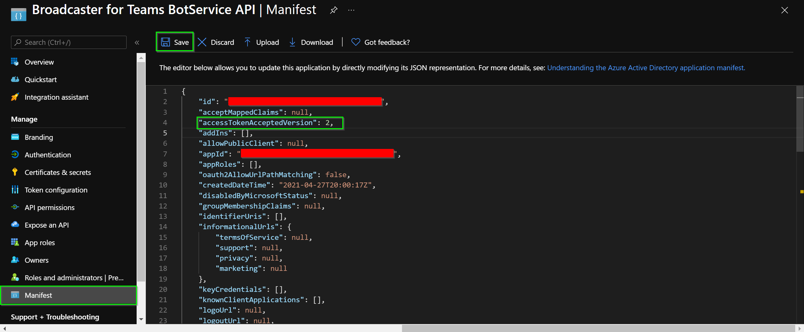
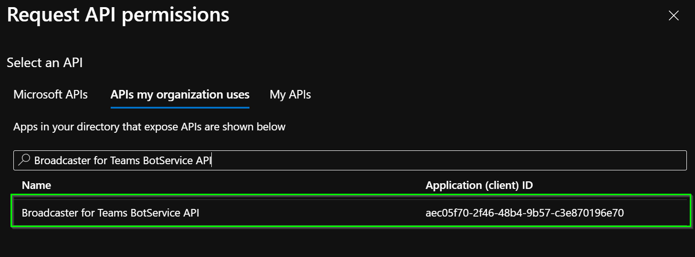
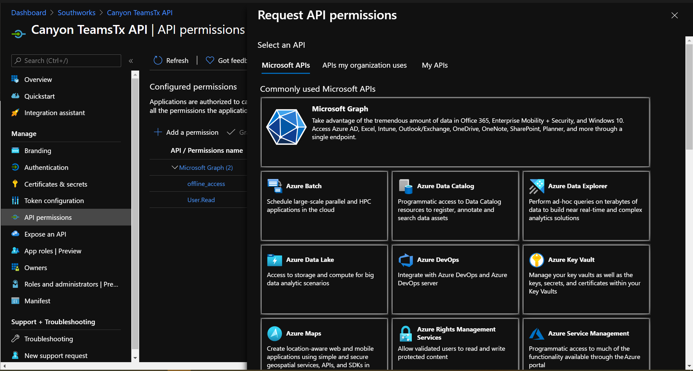
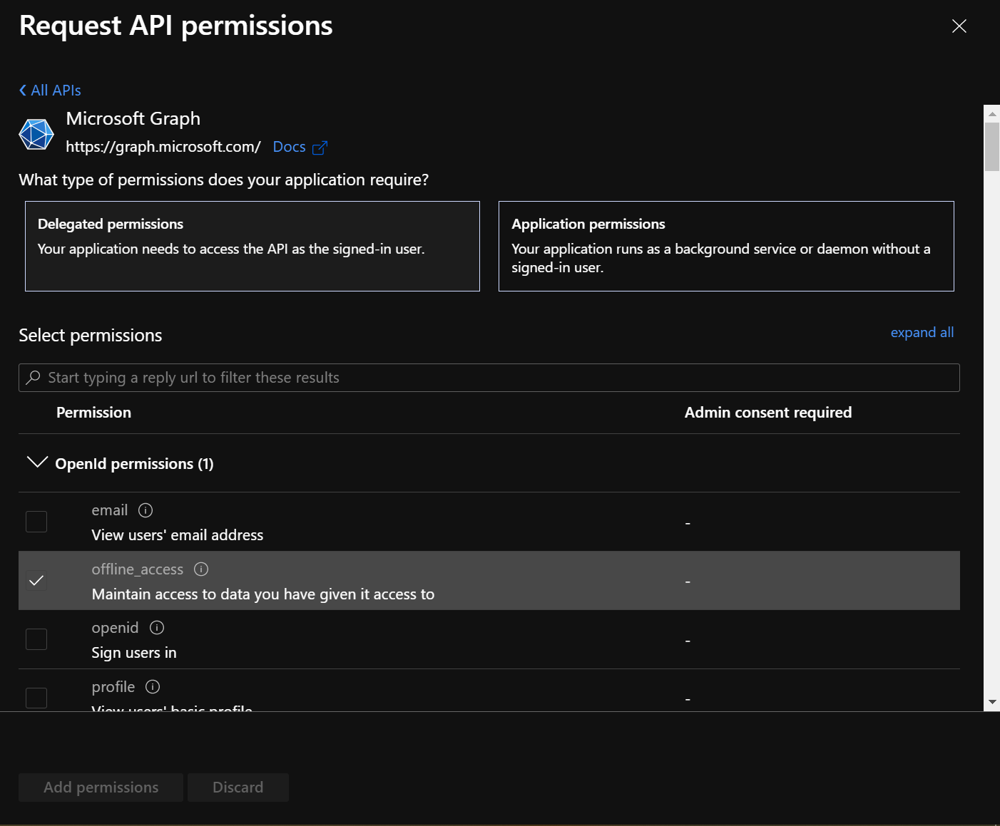

# App Registrations

## Getting Started

To enable authentication in the solution, we must create the different **app registrations**, and apply some configuration settings between them in Azure Active Directory.

We need to create app registrations for the following items:
- BotService API.
- BotService Client.
- Management API.
- Azure SDK Service Principal.

To create the necessary app registrations, review the following Microsoft [documentation](https://docs.microsoft.com/en-us/azure/active-directory/develop/quickstart-register-app#register-an-application) that will explain how to do it, and consider the following settings for each of them:

- ***Name:*** Meaningful name.
- ***Supported account types:*** Accounts in this organizational directory only (`your-organization` only - Single tenant).

> **NOTE**: Please follow the steps to register the app registration and return to this document to apply the corresponding settings. 

Once you've registered the app registration you must [add a client secret](https://docs.microsoft.com/en-us/azure/active-directory/develop/quickstart-register-app#add-a-client-secret), copy the value and save it together with the application client id in a secure place, we will need them for future steps.

> **NOTE**: You'll need this secret later to configure the project. This key value will not be displayed again, nor retrievable by any other means, so record it as soon as it is visible from the Azure portal.

## Authentication Setup

With the **App Registrations** created in the previous steps, we must proceed we the setup of each of them. While doing so, take into consideration that there are some dependencies between some app registrations and the resources.

- [How to Setup Bot Service API app registration](#how-to-setup-bot-service-api-application-registration)
- [How to Setup Bot Service Client app registration](#how-to-setup-bot-service-client-application-registration)
- [How to Setup Management API app registration](#how-to-setup-management-api-application-registration)

### How to Setup Bot Service API app registration

> **IMPORTANT**: it's necessary to have already created BotService API app registration.

This section explains how to configure the BotService API app registration to enable Client Credential Authentication between APIs.

#### Manifest

In the BotService API Application Manifest editor, we need to change the value `accessTokenAcceptedVersion` field from null (which defaults to: 1) to 2 (for v2.0 tokens).



Finally, click on the **Save** button.

#### App Roles

> **NOTE**: Next, we will create a new Role, which will serve as a mechanism to demand authorization from the application.

From the BotService API app registration view, go to the App roles option that is in the resource blade, click the **Create app role** button. Fill the following information with the values suggested.

- ***Display name***: AccessAll.
- ***Allowed member types***: Applications.
- ***Values***: BotService.AccessAll.
- ***Description***: Meaningful description e.g., Access to BotService API.


Finally, click on the Apply button.

#### Expose an API

From the resource blade of the app registration view, go to the **Expose an API** option and click **Set** next to the Application ID URI to generate a URI that is unique for this app (in the form of api://{clientId}).

### How to Setup Bot Service Client app registration

> **IMPORTANT**: To complete this section it is necessary to have the role in the BotService API created.

This section explains how to configure the BotService Client app registration to enable authentication.

#### API permissions

From the BotService Client app registration view, go to the **API permissions** option that is in the resource blade, click the **Add a permission** button and then ensure that the **APIs my organization** uses tab is selected. Search for the **BotService API** and click on the search result.



Then inside BotService select **AccessAll** and click on **Add permissions**.


> **NOTE**: If your user does not have the necessary permissions to enable the add-on permission. You must ask a user with the required permission to enable it.


### How to Setup Management API app registration

**IMPORTANT**: it's necessary to have already created Management API app registration.

This section explains how to configure the Management API app registration to enable authentication.

#### API Graph permissions

From the API app registration view, go to the **API permissions** option that is in the resource blade, click the **Add a permission** button and then ensure that the **Microsoft APIs** tab is selected.



In the Commonly used Microsoft APIs section, click on **Microsoft Graph**. Then click in the **Delegated permissions** section and ensure that the right permissions are checked (`User.Read` and `offline_access`) and click the **Add permissions** button.



#### Expose an API

From the resource blade of the app registration view, go to the **Expose an API** option and click **Set** next to the Application ID URI to generate a URI that is unique for this app (in the form of api://{clientId}). Then click **Add scope**, complete the form following the parameters listed below, and finally click A**dd scope** button.

#### Parameters

> **NOTE**: This `Scope` name is going to be used to develop/configure auth in the extension and they must match.

- ***Scope name***: use `access_as_producer`.
- ***Who can consent***: Admin and users.
- Admin consent display name: enter a meaningful name. E.g.: `Access Broadcaster for Teams as producer`.
- **Admin consent description**: enter a meaningful description.
- **User consent display name**: enter a meaningful name. E.g.: `Access Broadcaster for Teams as producer`.
- **User consent description**: enter a meaningful description.
- **State**: Enabled


#### Manifest

In order to enable RBAC through a security group, it is necessary to modify the app registration manifest to allow the application to include in the token all the security groups the user belongs to.

From the resource blade of the app registration view, go to the **Manifest** option. We need to modify the manifest and add/modify the following key-values:

```json
"groupMembershipClaims": "SecurityGroup",
"optionalClaims":{
  "idToken": [
    {
      "name":"groups",
      "source": null,
      "essential": false,
      "additionalProperties": [
        "emit_as_roles"
      ]
    }
  ],
  "accessToken":[],
  "saml2Token":[]
}
```


Click the **Save** button to finish.

> **NOTE**: The Azure SDK Service Principal app registration will be configured later after creating the resource group that will host the virtual machine.

[← Back to How to Run the Solution in Azure](README.md#how-to-run-the-solution-in-azure)
