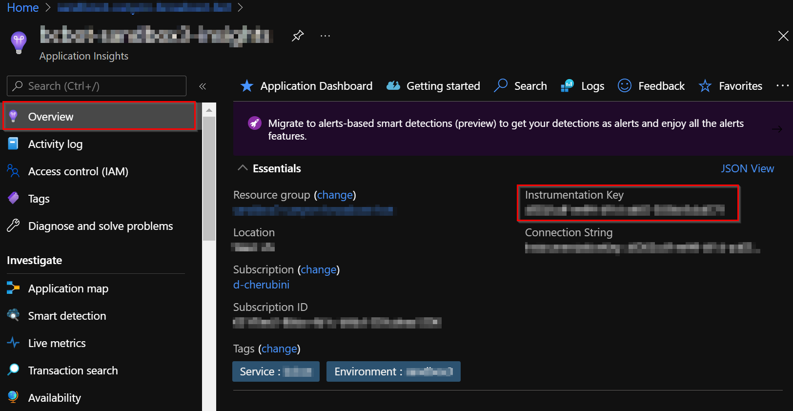

# Application Insights

## Getting Started

This instance will be used to log all the events happening in the solution. Create a new **Application Insights** resource in the resource group with the following settings: 

### Seetings:

- Name: a meaningfull name. 
- Region: same region as the rest of the resources. 
- Resource mode: Classic.

To create the Application Insights, please review the following Microsoft [documentation](https://docs.microsoft.com/en-us/azure/azure-monitor/app/create-workspace-resource).

Once the **Application Insights** has been created, within the **Overview** option on the left panel we can view the Instrumentation key. The **instrumentation key** identifies the resource that you want to associate your telemetry data with. You will need to copy the **instrumentation key** and add it to your application's code.  

[← Back to How to Run the Solution in Azure](README.md#how-to-run-the-solution-in-azure)