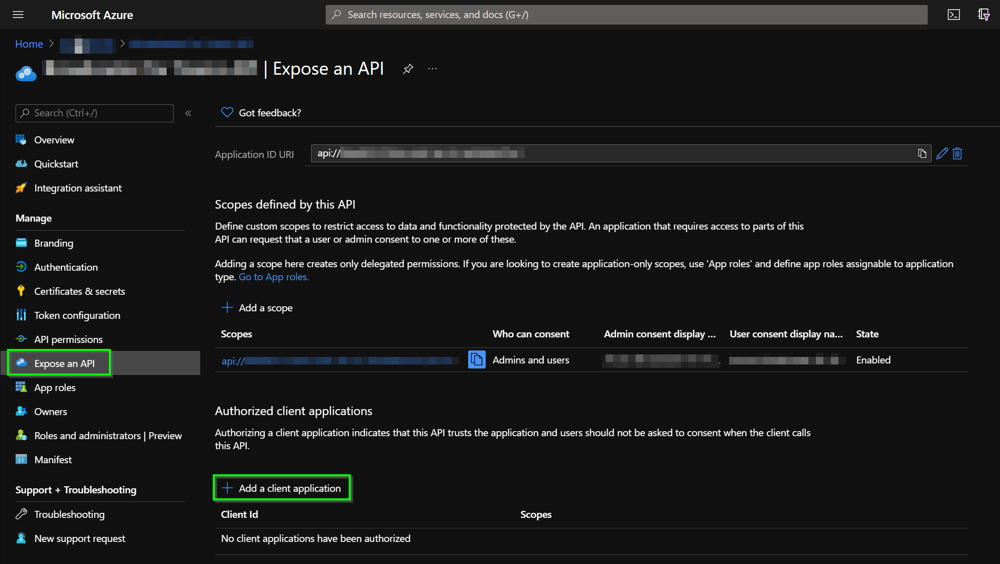
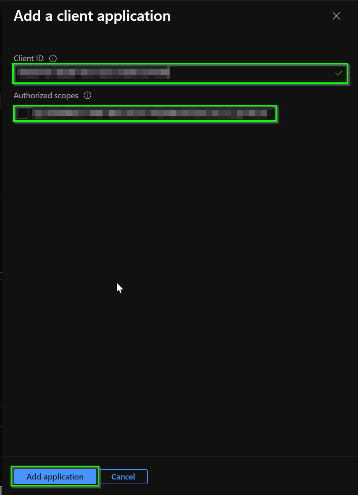
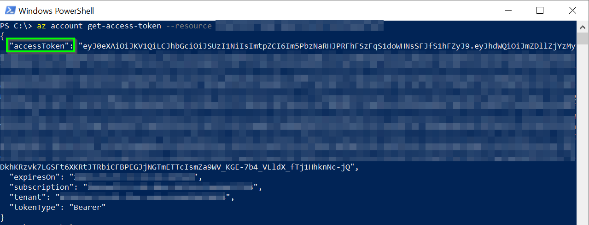

# Get Authorization Token

## Introduction

In order to make requests to the Management API deployed in Azure, you need to generate an authorization token. This token must be sent in the request by adding the `Authorization` header to it.

Following the steps in this document, you will be able to generate an authorization token using the Azure CLI.

1. Download and install the Azure CLI, please review the [Microsoft documentation](https://docs.microsoft.com/en-us/cli/azure/install-azure-cli-windows?tabs=azure-cli) to install it.

2. After installing the Azure CLI, in a terminal window execute the command `az login` and enter your credentials in the browser displayed.

3. In the [Azure Portal](https://portal.azure.com/), go to the app registration you want to obtain the authorization token in Azure AD, in this case, the app registration for the Management API.

4. On the left pane, click on **Expose an API**.

5. Click on **Add a client application**.
    

6. Add the application Id you want to add in the **Client ID**.
    >**NOTE**: In this case, you need to authorize the `Azure CLI` application to allow to generate the authorization token from this application. The Id of this application is `04b07795-8ddb-461a-bbee-02f9e1bf7b46`.

7. Select the **Authorized scopes**, and finally click on **Add application**.

    

8. Go to a terminal window and execute this command: `az account get-access-token --resource {{managementApiAppRegistrationId}}`. Replace the placeholder with the client Id of the app registration created for the [Management API](management-api-app-registration.md).
    

9. Copy the `accessToken` value.
    >**NOTE**: This token is valid for one hour. After that, you will need to generate a new one. In that case, you only need to execute the last step in this document.

[← Back to Register Service in Cosmos DB](register-service.md#example-of-how-to-use-this-endpoint)

[← Back to How to test the Management API](test-web-app.md#how-to-test-the-management-api)

[← Back to How to test the Orchestrator Function](test-function-app.md#how-to-test-the-orchestrator-function)
