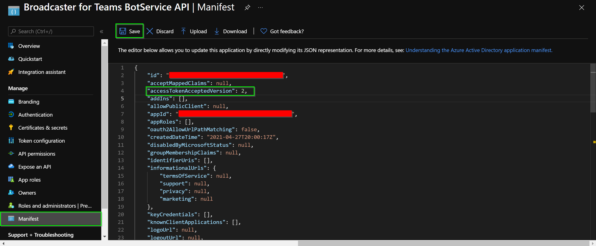
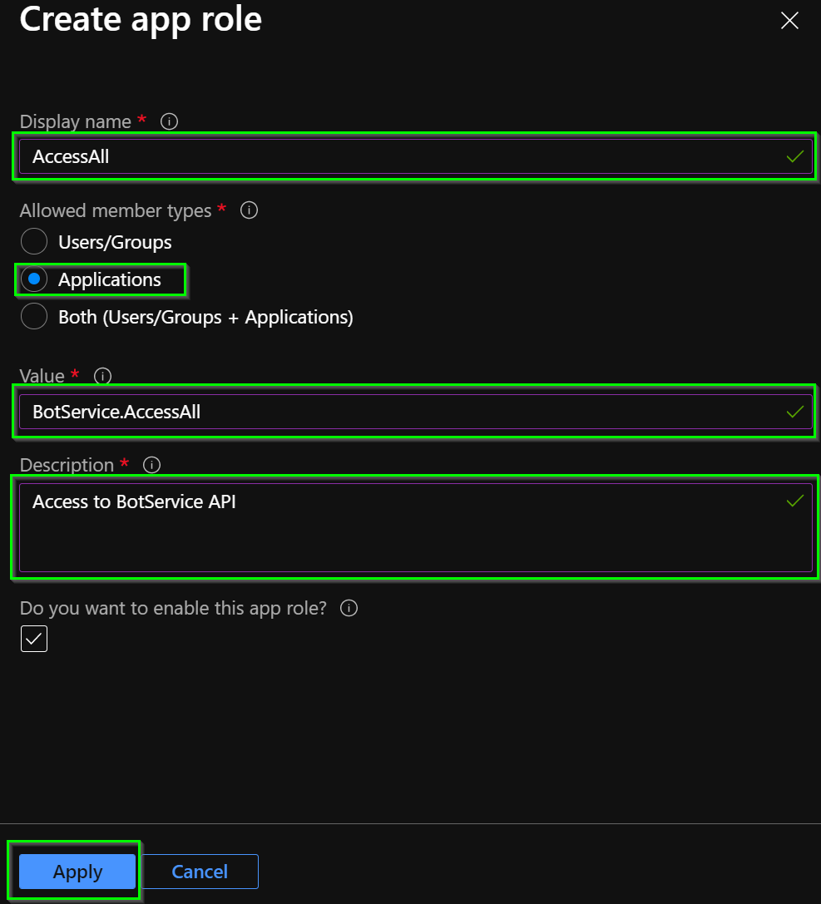

# Bot Service API app registration

This documents explains how to create and configure the BotService API app registration to enable Client Credential Authentication between APIs.

## Creation of the app registration

To create the app registrations, review the following [Microsoft documentation](https://docs.microsoft.com/en-us/azure/active-directory/develop/quickstart-register-app#register-an-application) that will explain how to do it, and consider the following settings:

- ***Name:*** Meaningful name.
- ***Supported account types:*** Accounts in this organizational directory only (`your-organization` only - Single tenant).

## Setup of the app registration

### Manifest

In the BotService API Application Manifest editor, we need to change the value `accessTokenAcceptedVersion` field from null (which defaults to: 1) to 2 (for v2.0 tokens).

Finally, click on the **Save** button.

### App Roles

From the BotService API app registration view, go to the App roles option that is in the resource blade, click the **Create app role** button. Fill the following information with the values suggested.

- ***Display name***: AccessAll.
- ***Allowed member types***: Applications.
- ***Values***: BotService.AccessAll.
- ***Description***: Meaningful description e.g., Access to BotService API.

Finally, click on the **Apply** button.

### Expose an API

From the resource blade of the app registration view, go to the **Expose an API** option and click **Set** next to the Application ID URI to generate a URI that is unique for this app (in the form of api://{clientId}).

[← Back to How to run the solution in Azure](README.md#app-registrations) | [Next: BotService Client app registration →](bot-service-client-app-registration.md#bot-service-client-app-registration)
