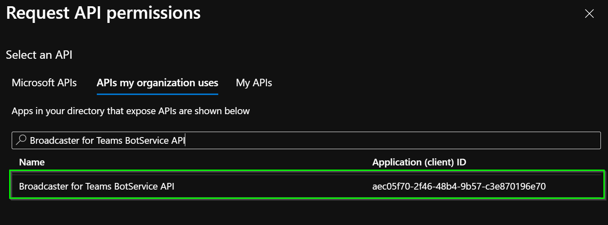
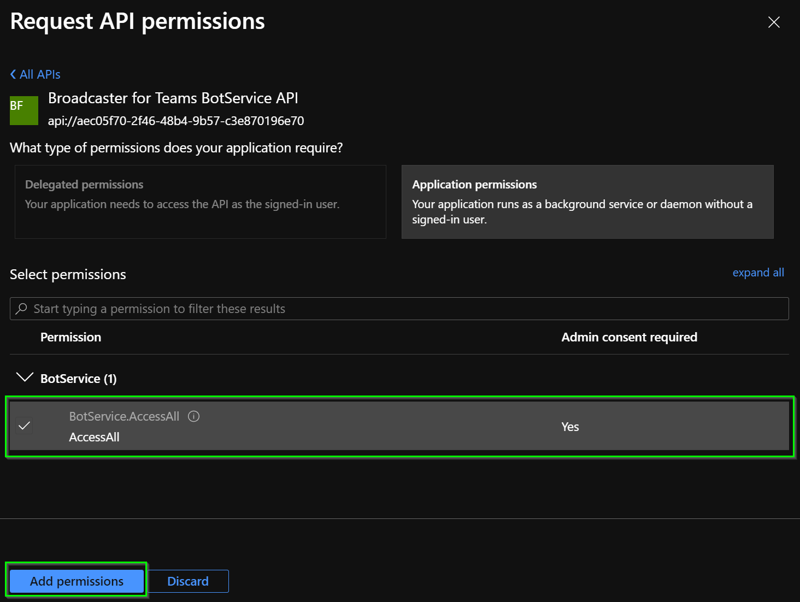
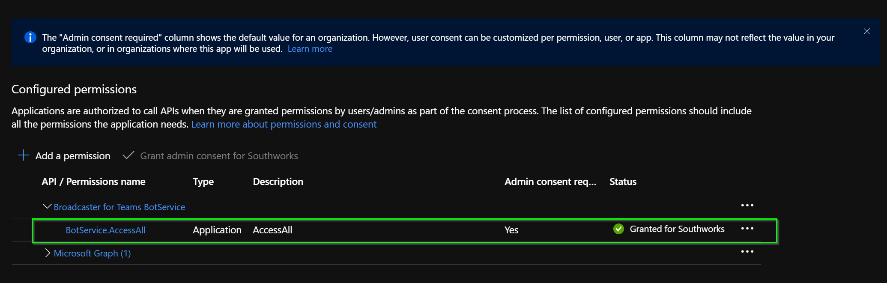

# Bot Service Client app registration

This documents explains how to create and configure the BotService Client app registration to enable Client Credential Authentication between APIs.

## Creation of the app registration

To create the app registrations, review the following [Microsoft documentation](https://docs.microsoft.com/en-us/azure/active-directory/develop/quickstart-register-app#register-an-application) that will explain how to do it, and consider the following settings:

- ***Name:*** Meaningful name.
- ***Supported account types:*** Accounts in this organizational directory only (`your-organization` only - Single tenant).

## Setup of the app registration

### API permissions

From the BotService Client app registration view, go to the **API permissions** option that is in the resource blade, click the **Add a permission** button and then ensure that the **APIs my organization** uses tab is selected. Search for the **BotService API** and click on the search result.

Then inside BotService select **AccessAll** and click on **Add permissions**.

> **NOTE**: If your user does not have the necessary permissions to enable the add-on permission. You must ask a user with the required permission to enable it.

### Add a client secret

Finally, you must [add a client secret](https://docs.microsoft.com/en-us/azure/active-directory/develop/quickstart-register-app#add-a-client-secret), copy the value and add it to the key vault as a secret with the following name:
`Settings--BotServiceAuthenticationConfiguration--ClientSecret`.

[← Back to How to run the solution in Azure](README.md#app-registrations) | [Next: Management API app registration →](management-api-app-registration.md#management-api-app-registration)
