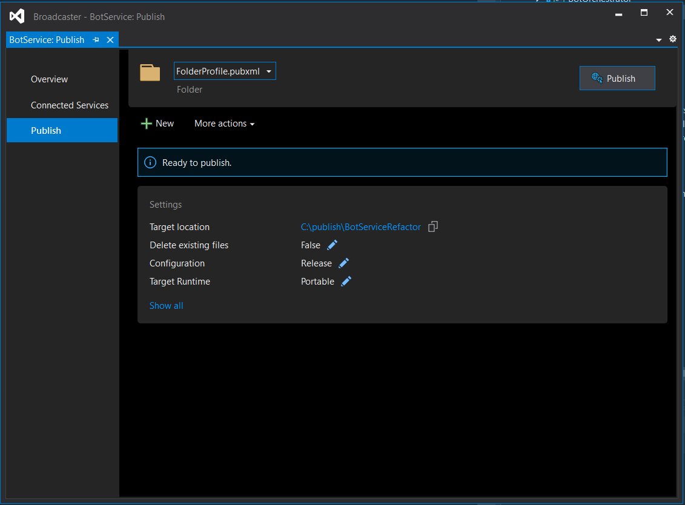

# Bot Service deploy

This document describes how to deploy and install the Bot Service into a pre-configured virtual machine.

## Deploying the service

At the moment, there isn't automated deployment for the Bot Service so you need to manually copy and install the compiled version of the Bot Service in your virtual machine. To do this you can use one of the released versions of the Bot Service or compile the code manually in Visual Studio.

### Using a released version

To deploy the latest released version (0.6.0-dev) of the solution go to the [Releases](https://github.com/microsoft/Broadcast-Development-Kit/releases) page and download the Zip file for the version (0.6.0-dev) of the Bot Service that you want to use.

Then copy the Zip file to your VM and un-zip the files into the folder where you want to install your Bot Service.

### Building from the source code

Open the solution in Visual Studio. Then, go to the solution explorer, right-click on BotService project and click **Publish**.


In the publish tab, configure the Target Location (a folder in your local machine), and edit the following settings:

- **Configuration:** Release
- **Target Framework:** net472
- **Target Runtime:** win7-x64



Check the configuration and to finish publishing, press the **Save** button.


After that, we can publish the project, and copy the files from the Target Location folder into the virtual machine. Later, we will explain how to configure the settings and how to run it from the command line or as a Windows Service.

## Updating appSettings.json

After unzipping/copying the bot service into the virtual machine, you must update the `appSettings.json` with the corresponding settings:

```json
{
 "Logging": {
    "LogLevel": {
      "Default": "Information",
      "Microsoft": "Warning",
      "Microsoft.Hosting.Lifetime": "Information"
    }
  },
  "AllowedHosts": "*",
  "HttpServer":{
    "Endpoints":{
        "Https":{
            "Host": "{{virtualMachineDnsCname}}",
            "Port": 443,
            "Scheme": "https"
        }
    }
  },
  "Settings": {
    "GraphClientConfiguration": {
      "TenantId": "{{tenantIdAzureBotAppRegistration}}",
      "ClientId": "{{clientIdAzureBotAppRegistration}}",
      "ClientSecret": ""
    },
    "CosmosDbConfiguration": {
      "EndpointUrl": "{{cosmosDbEndpointUrl}}",
      "PrimaryKey": "",
      "DatabaseName": "{{cosmosDbDatabaseName}}",
    },
    "BotConfiguration": {
      "ServiceDnsName": "{{virtualMachineDnsCname}}",
      "ServiceCname": "{{virtualMachineDnsCname}}",
      "PlaceCallEndpointUrl": "https://graph.microsoft.com/beta",
      "AadAppId": "{{clientIdAzureBotAppRegistration}}",
      "AadAppSecret": "",
      "NumberOfMultiviewSockets": 3,
      "InstanceInternalPort": 8445,
      "InstancePublicPort": 8445,
      "ServiceFqdn": "{{virtualMachineDnsCname}}",
      "CertificateName": "{{certificateName}}",
      "CertificatePassword": "",
      "CertificateThumbprint":"",
      "MainApiUrl":"{{managementApiUrl}}",
      "VirtualMachineName": "{{virtualMachineName}}",
      "SecondsWithoutParticipantsBeforeRemove": {{secondsBeforeRemove}}
    },
    "AzureAdConfiguration": {
      "Instance": "https://login.microsoftonline.com/",
      "TenantId": "{{tenantIdBotServiceApiAppRegistration}}"
    },
    "BotServiceAuthenticationConfiguration": {
      "BotServiceApiClientId": "{{botServiceApiClientId}}",
    },
    "KeyVaultName": "{{keyVaultName}}",
    "KeyVaultEnv": "{{keyVaultEnvPrefix}}"
  },
  "APPINSIGHTS_INSTRUMENTATIONKEY": "{{appInsightsKey}}"
}
```

> **NOTE:** The Bot Service appsettings will be completed in later steps.

### Placeholder specification table

| Placeholder                            | Description                                                                         |
|----------------------------------------|-------------------------------------------------------------------------------------|
| virtualMachineDnsCname                 | Full domain name assigned to the virtual machine where the bot service is hosted. E.g.: If your wildcard certificate is for *.domain.co and you added the cname botservicevm to the IP address of the virtual machine, the domain name will be botservicevm.domain.co. |
| tenantIdAzureBotAppRegistration        | Tenant Id of the [Azure Bot](../common/azure-bot.md#azure-bot) app registration.       |
| clientIdAzureBotAppRegistration        | Client Id of the [Azure Bot](../common/azure-bot.md#azure-bot) app registration.       |
| cosmosDbEndpointUrl                    | Endpoint URL of the [Cosmos DB](cosmos-db.md#cosmos-db) created.                              |
| cosmosDbDatabaseName                   | Database name of the [Cosmos DB](cosmos-db.md#cosmos-db) created.                             |
| certificateName                 | **Only needed if you want to delegate the installation of your certificate to the Bot Service**. Name of the certificate on Azure Key Vault.               |
| managementApiUrl                       | URL of the [Management API](web-app.md#web-app) without https:// prefix. |
| secondsBeforeRemove                    | Seconds before removing the bot from a meeting with no participants. |
| tenantIdBotServiceApiAppRegistration     | Tenant Id of the app registration for the [Bot Service API](bot-service-api-app-registration.md#bot-service-api-app-registration).          |
| botServiceApiClientId                  | Client Id of the app registration for the [Bot Service API](bot-service-api-app-registration.md#bot-service-api-app-registration). |
| appInsightsKey                         | Application Insights key of the [Application Insights](application-insights.md#application-insights) resource. |
| keyVaultName                         | Name of the [Azure Key Vault](azure-key-vault.md#azure-key-vault) resource created in previous steps  |
| keyVaultEnvPrefix                         | **Optional**: Add it only if you want to get secrets that has a specific prefix |

## Running the bot

You have two alternatives to run the bot, from the command line and as a Windows Service. The first alternative is used when you want to see the logs in the terminal. The second alternative is used to run the Bot Service automatically when the VM starts.

> **NOTE**: The first time you configure the environment, you MUST running it from the command line so windows prompts the firewall rule and we can accept and enable it. If windows doesn't prompt the firewall configuration, you must add the rule manually.

### From command line

In this scenario, you can run the Bot Service by executing the command `.\BotService.exe --console` in a terminal window from the path where the Bot Service is located.

### As a Windows Service

To run the bot every time the virtual machine is turned on, you have to configure it as a Windows Service. Before configuring it, you must validate that the group **ALL APPLICATION PACKAGES** has special permissions in the bot folder (right-click in the bot folder, click on **properties**, select the **security** tab). If the group doesn't have permissions, you must add it by clicking on **Advance** → **Add** → **Select a Principal**.


Finally, you must run the following Powershell command:

```bash
New-Service -Name "Bot-Service" -BinaryPathName '"C:\{bot-service-path}\BotService.exe"'
```

After completing these steps, you must restart the virtual machine or start the Bot Service from the Windows Services app.

[← Back to How to run the solution in Azure](README.md#deployments) | [Next: Management API deploy →](management-api-deploy.md#management-api-deploy)
