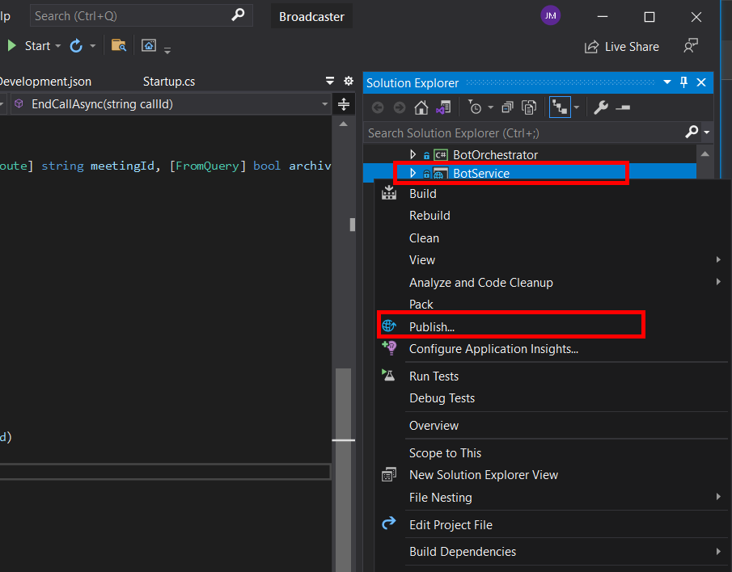
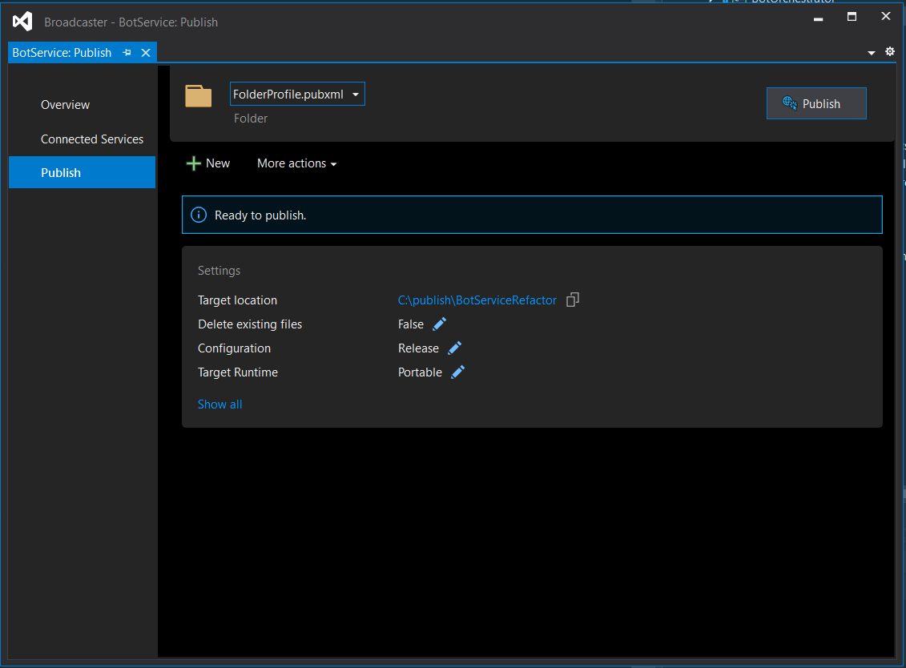
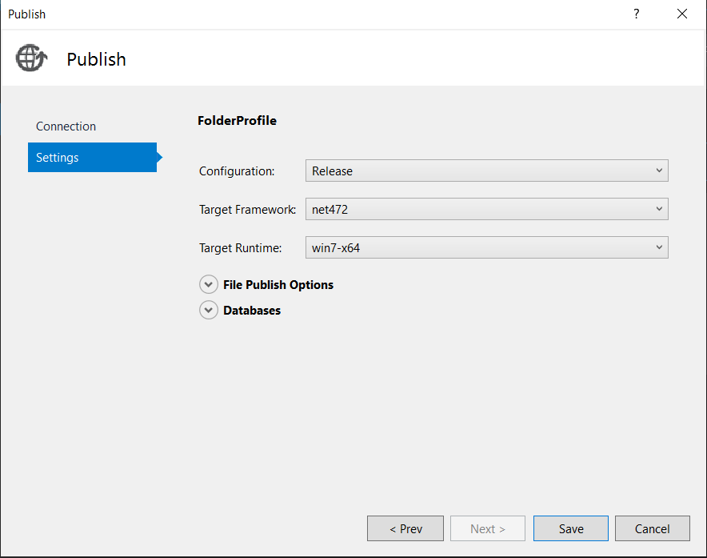
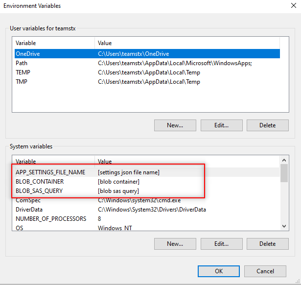
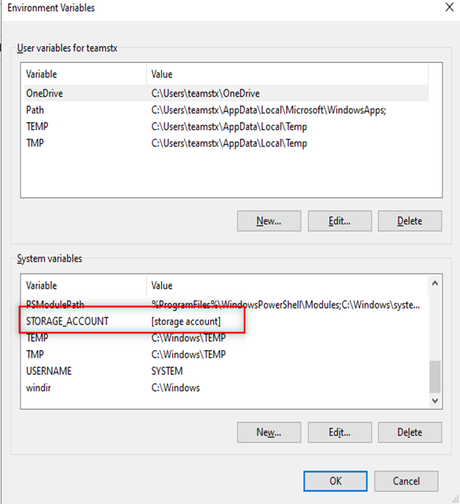
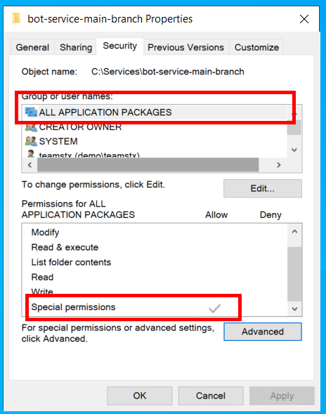
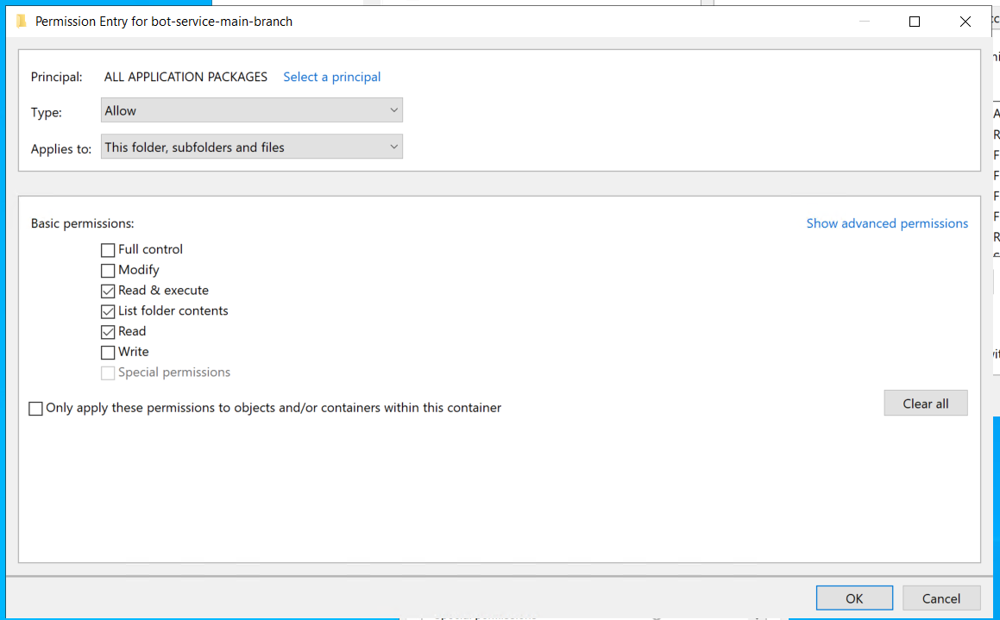

# Bot Service Virtual Machine

## Getting Started

This document explains how to create the virtual machine where the Bot Service API is going to be hosted, and how to configure it.

## Create the virtual machine in Azure

To create the virtual machine, check the following document [Create a Windows Virtual Machine in the Azure Portal](https://docs.microsoft.com/en-us/azure/virtual-machines/windows/quick-create-portal).

While creating the virtual machine, consider the following settings:
- ***Subscription:*** The azure subscription where you want to create the VM.
- ***Resource Group:*** The resource group where you want to create the VM. We recommend creating a specific resource group for the VM, so you can easily identify the VM resources in case of resource deletion.
- ***Virtual Machine Name:*** A meaningful name for the VM.
- ***Image:*** Windows 10 Pro, Version 20H2.
- ***Size:***
    - Standard_F4s_v2 - 4 vcpus, 8 GiB memory. recommended for testing purpose.
    - Standard_F8s_v2 - 8 vcpus, 16 GiB memory. Recommended for Production environments.
- ***Username:*** A meaningful username.
- ***Password:*** A meaningful password.

### Network Security Group inbound rules

Once the virtual machine is created, we must add inbound rules in the network security group.

**Inbound rules**

| Name            | Port      | Protocol | Purpose                                                                 |
|-----------------|-----------|----------|-------------------------------------------------------------------------|
| SRT             | 8880-9000 | UDP      | Used for SRT protocol for media extraction & injection.                 |
| HTTPS           | 443       | TCP      | Allows communication from the main API.                                 |
| MediaPlatform   | 8445      | TCP      | Used to establish communication between the bot and the media platform. |
| RTMP            | 1935-1936      | TCP      | Used to extract & inject RTMP content.                                          |
| RTMPS           | 2935-2936      | TCP      | Used to extract & inject RTMPS content.                                                 |

### Configure the virtual machine
Before starting using the virtual machine, we must install the applications listed below.

> **IMPORTANT**: The disk D:\ is a temporary disk (files are deleted after shutdown/restart of the virtual machine) so you must install all the applications in C:\.

#### Gstreamer
Download the GStreamer installer from this [link](https://gstreamer.freedesktop.org/data/pkg/windows/1.18.4/mingw/gstreamer-1.0-mingw-x86_64-1.18.4.msi). Once you have downloaded the installer and started the installation process, choose the custom installation and make sure that all modules have been selected and the installation path is in C:\.

> **IMPORTANT**: Remember to select all GStreamer modules/plugins while installing GStreamer as a custom installation.

After GStreamer installation, add the GStreamer bin folder path to the path environment variable.

#### VCRedist
Download [VCRedist](https://aka.ms/vs/16/release/vc_redist.x64.exe) and install it.

#### NGINX
Follow this guide [How to Install and configure NGINX with RTMP module on Windows](install_and_configure_nginx_with_rtmp_module_on_windows.md) to install and configure NGINX with RTMP module on windows, and configure it as a Windows service.

### Bot Service
At the moment,  there isn't automated deployment for the Bot Service API so, you need to use Visual Studio to publish the BotService project into a local folder.

Go to the Solution Explorer, right-click on BotService project and click **Publish**.



In the publish tab, configure the Target Location, and edit the following settings:
- ***Configuration:*** Release
- ***Target Framework:*** net472
- ***Target Runtime:*** win7-x64



Check the configuration and to finish publishing, press the **Save** button.


After that, we can publish the project, and copy the files into the virtual machine. Later, we will explain how to run it from the command line or as a Windows Service.

### Environment variables
In order to run the bot, we need to configure some environment variables that the bot will read in order to get access to its configuration settings and certificate.

> **IMPORTANT** Before performing these steps, the storage account with the bot configurations must be already created to set the environment's variables.





| **Placer**              | **Description**                                                      |
|-------------------------|----------------------------------------------------------------------|
| storage account         | Name of the [storage account](app_registrations.md) where the files are being stored.    |
| blob container          | Name the container of [storage account](app_registrations.md).                           |
| blob sas query          | SAS key to get access to the container files of [storage account](app_registrations.md). |
| settings json file name | Name of the bot app settings.                                        |


> **NOTE**: The `BLOB_SAS_QUERY` must include the '?' at the beginning. This token has an expiration date, be aware of this date to renew the access token.

### Running the bot
We have two alternatives to run the bot, from the command line and as a Windows Service. The first alternative is used when we want to see the logs in the terminal. There are some GStreamer and external libraries stdout/stderr we can't capture nor log them in application insights. The second alternative is used to run the Bot Service authomatically when the VM starts.

> **NOTE**: The first time we configure the environment, we recommend running it from the command line so windows prompts the firewall rule and we can accept and enable it.

#### From command line
In this scenario, we generally create a Powershell script in the root folder of the bot. Below we give you a sample script where we override the default environment variables for other ones if necessary.

> **NOTE**: Enable remote signed script for Powershell `set-executionpolicy remotesigned`.

```bash
$env:BLOB_SAS_QUERY = '?{{sasQuery}}'
$env:STORAGE_ACCOUNT = 'projectcanyonbot'
$env:BLOB_CONTAINER = 'config'
$env:APP_SETTINGS_FILE_NAME = '{{envfile}}'
.\BotService.exe --console
```

#### As a Windows Service
To run the bot every time the virtual machine is turned on, we configure it as a Windows Service. Before configuring it, we must validate that the group **ALL APPLICATION PACKAGES** has special permissions in the bot folder (right-click in the bot folder, click on **properties**, select the **security** tab). If the group doesn't have permissions, we must add it by clicking on **Advance** → **Add** → **Select a Principal**.




Finally, we must run the following Powershell command:

```bash
New-Service -Name "Bot-Service" -BinaryPathName '"C:\{bot-service-path}\BotService.exe"'
```

After completing these steps, we must restart the virtual machine or start the Bot Service from the Windows Services app. 

>**NOTE**: Before running the BotServie for the first time, we must complete the settings uploaded into the [Storage Account](storage_account.md#environment-json-file-settings-example). 

[← Back to How to Run the Solution in Azure](README.md#how-to-run-the-solution-in-azure)