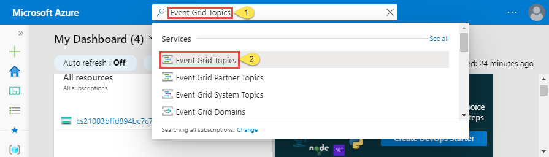
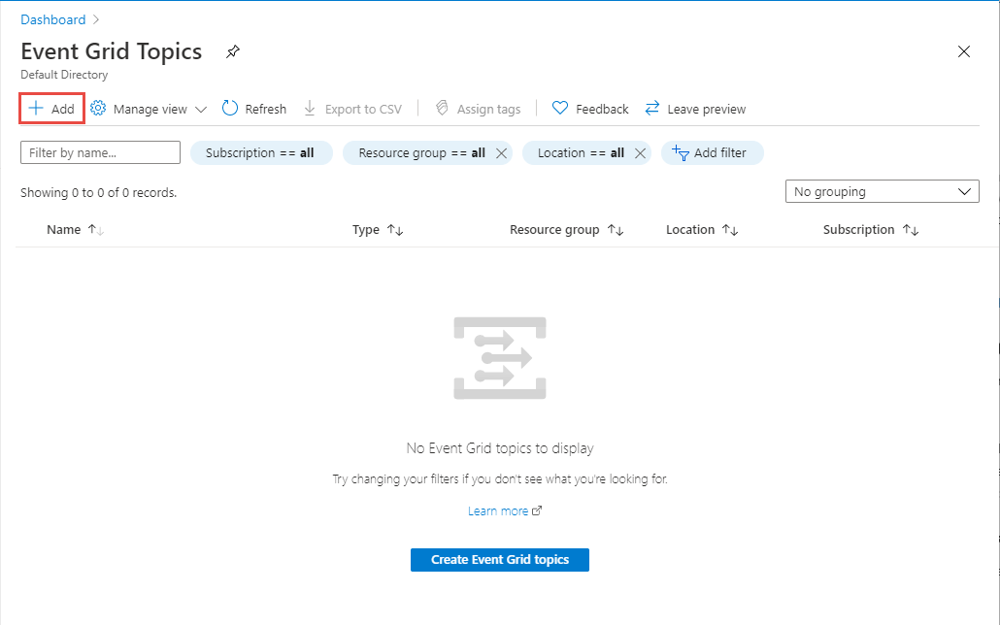
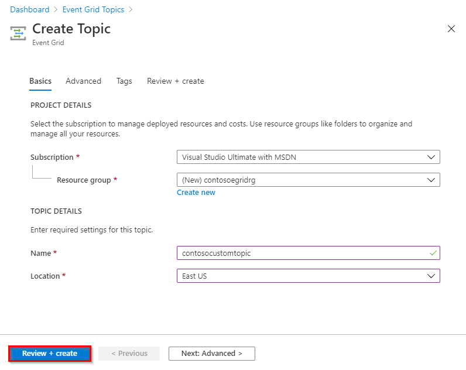
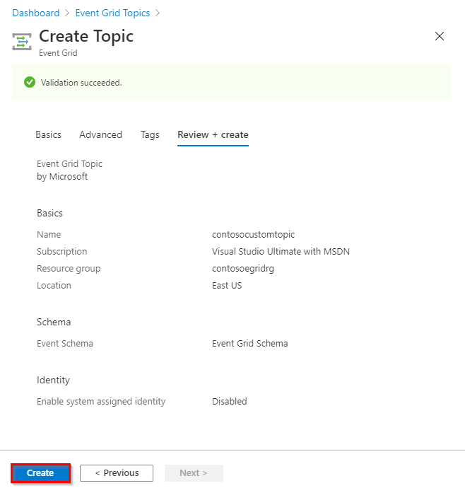
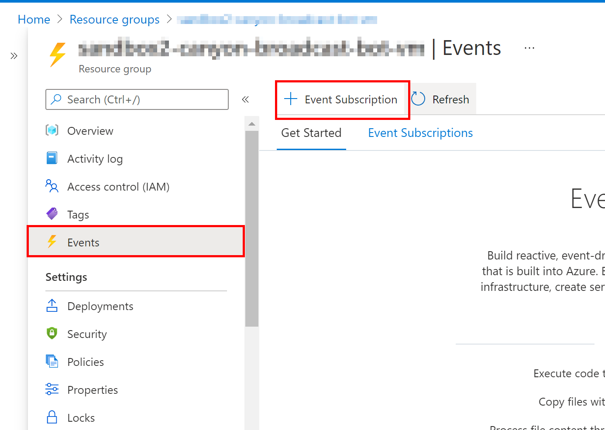
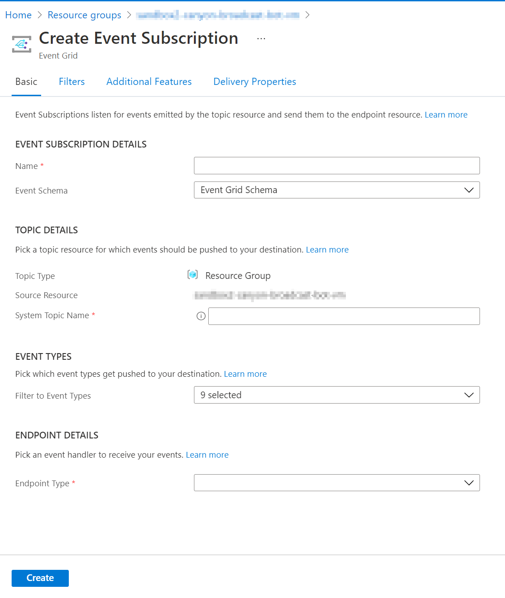
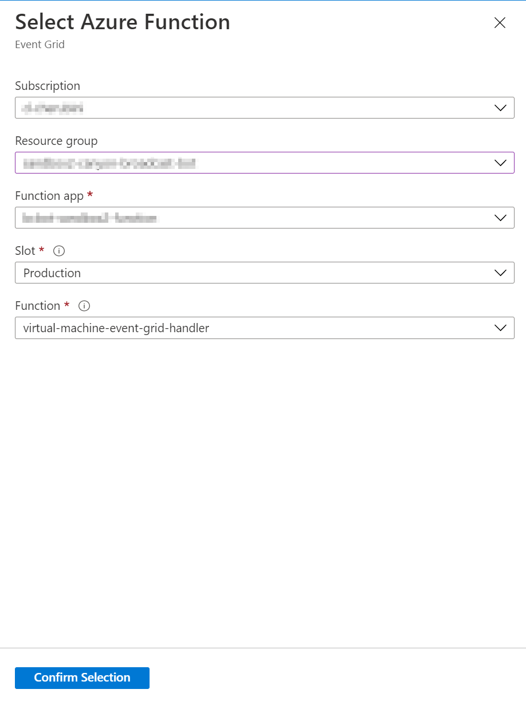

# How to configure Event Grid

## Introduction

To keep the state of the bot service virtual machine consistent is Cosmos DB, we
we must configure an event grid subscription to execute an Azure Function that updates its register in Cosmos DB, every time that it is being started/stopped from an external event, e.g.: A user starts/stops the virtual machine from Azure Portal or has scheduled auto-shutdown.

## Getting Started

To start configuring Event Grid events, we must create an Event Grid Topic resource.

1. Sign in to [Azure portal](https://portal.azure.com/).
1. In the search bar at the topic, type **Event Grid Topics**, and then select E**vent Grid Topics** from the drop-down list.  

1. On the **Event Grid Topics** page, select **+ Add** on the toolbar.  

1. On the **Create Topic** page, complete the requested information:
    > **NOTE**: We recommend creating the topic in the same resource group where we are going to subscribe to an event (the resource group of the virtual machine) and the same location where the virtual machine was created.
    - ***Subscription:*** The Azure subscription where you want to create the topic.
    - ***Resource Group:*** The resource group where you want to create the topic.
    - ***Name:*** A meaningful name.
    - ***Location:*** The Azure location of the resource.
1. Select **Review + create** at the bottom of the page.

1. To finish, check the information loaded in the **Review + create** tab, and click on the **Create** button.

After creating the topic, to configure an Azure function as an event handler for Event grid events, we must go to the resource group where we created the virtual machine, click on the **Events** option located in the resource blade, and then click on **Event Subscription** button.

While creating the Event Subscription, complete the requested information and click on Create button:

- ***Name:*** A meaningful name.
- ***Event Schema:*** Event Grid Schema.
- ***System Topic Name:*** The name of the topic we created before.
- ***Filter to Event Types:*** Select Resource Action types.
- ***Endpoint Types:*** Azure function.
- ***Endpoint:*** Select the Azure Function that will handle the Event Grid events. By default, it is created in the environment resource group, under the function app with the name virtual-machine-event-grid-handler.

[← Back to Running the Solution in Azure](README.md#how-to-run-the-solution-in-azure)