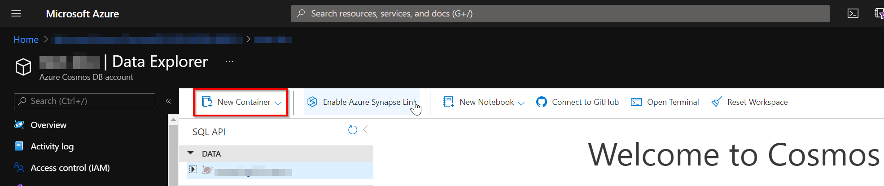
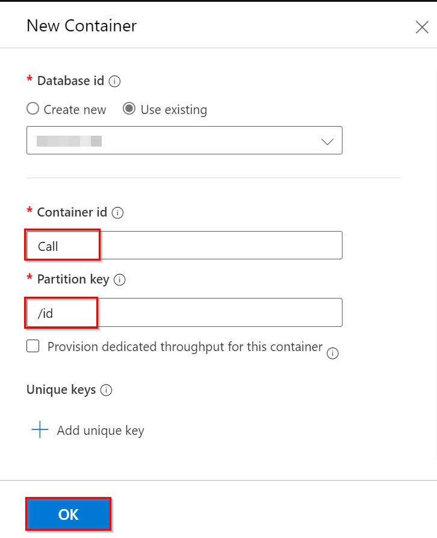
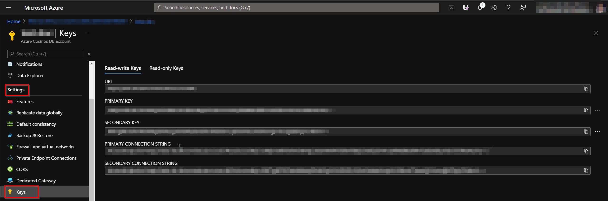

# Cosmos DB Database

## Getting Started
The **Azure Cosmos DB** database will be used to save the application status when the solution is being used in a call.

To create the Azure Cosmos DB, please review the following Microsoft [documentation](https://docs.microsoft.com/en-us/azure/cosmos-db/create-cosmosdb-resources-portal#create-an-azure-cosmos-db-account).

### Settings:

- ***Select API option:*** choose Core (SQL).
- ***Resource Group:*** Select the resource group created for the solution architecture.
- ***Account Name***: a meaningful name. 
- ***Location***: same region as the rest of the resources. 
- ***Capacity mode***: Provisioned throughput. 
- ***Apply Free Tier Discount***: Apply only if there is no other Cosmos DB using it in the subscription.

Leave the rest of the settings as-is.

Once the account is created, browse to the **Data Explorer** in the left panel of the account configuration and create a new database with the following settings: 

- Database Id: A meaningful name. 
- Throughput: Manual – 400 RU/s. 
    > Note: To keep the costs down, we are setting the RU to the lowest amount possible.

Click on **OK** button to create the database.

After the database is created, it is necessary to add all the containers needed by the solution. The following list shows the name of the containers to be created and the corresponding partition key name:

- ***Call***
    - Partition Key: /id
- ***ParticipantStream***
    - Partition Key: /id
- ***Service***
    - Partition Key: /id
- ***Stream***
    - Partition Key: /id

To create those containers, please follow the next steps:

1. In the `Data explorer` view for Cosmos DB in the Azure Portal, select `New Container`.
1. Fill the `New Container` blade displayed with the following values:
    - ***Database id***: Check use existing and select the one created in the previous step.
    - ***Container id***: Write the name of the container (e.g. *Call*).
    - ***Partition key***: Write the name of the partition key (e.g. for Call container the partition key name is /id).
    - ***Provision dedicated throughput for this container***: Keep unchecked to share the database throughput between all the containers created.
1. Click **OK** button to create the container.

The images below show the steps from the Azure Portal.

#### Create `New Container` button.



#### Create `New Container` blade displayed.



>NOTE: The steps described above can be done through the Microsoft Azure Storage explorer. 

Once the containers are created, the service container must be populated with one document. 

Below there is a json file template with placeholders values you need to complete to create the document in the service container before using the bot for the first time.

```json
{
    "CallId": null,
    "Name": "{{nameOfService}}",
    "State": 1,
    "CreatedAt": "{{dateOfServiceCreation}}",
    "Infrastructure": {
        "VirtualMachineName": "{{virtualMachineName}}",
        "ResourceGroup": "{{virtualMachineResourceGroupName}}",
        "SubscriptionId": "{{subscriptionId}}",
        "Id": "{{virtualMachineId}}",
        "PowerState": "{{powerState}}",
        "IpAddress": "{{virtualMachineIp}}",
        "Dns": "{{virtualMachineDnsName}}",
        "ProvisioningDetails": {
            "Message": "",
            "State": {
                "Id": 1,
                "Name": "Provisioned"
            }
        }
    },
    "id": "{{serviceId}}"
}
```

### Placeholder specification table

| Placeholder                           | Description      |
|---------------------------------------|------------------|
| nameOfService                         | Name of the service e.g. Test environment.                                   |
| dateOfServiceCreation                 | Date of the creation of the service e.g. `2021-06-08T16:17:37.5993824+00:00` |
| virtualMachineName                    | Name of the virtual machine created.                                         |
| virtualMachineResourceGroupName       | Name of the resource group where the virtual machine is hosted.              |
| subscriptionId                        | Subscription Id where the virtual machine is hosted.                         |
| virtualMachineId                      | the id of the virtual machine, /subscriptions/`{{subscriptionId}}`/resourceGroups/`{{virtualMachineResourceGroupName}}`/providers/Microsoft.Compute/virtualMachines/`virtualMachineName` |
| powerState                            | Status of the virtual machine, e.g. `PowerState/running`                     |
| virtualMachineIp                      | Current IP of the virtual machine                                            |
| virtualMachineDnsName                 | Virtual machine DNS name asigned.                                            |
| serviceId                             | UUID to identify the service e.g `00000000-0000-0000-0000-000000000000`.     |

Finally, go to the resource blade on the left, go to the setting section click on Keys. Copy and save the `URI` and `PRIMARY KEY` from the values displayed. Those values are required along with the database name to complete the configuration of the Bot Service, Bot Orchestrator and Management API.



[← Back to How to Run the Solution in Azure](README.md#how-to-run-the-solution-in-azure)
