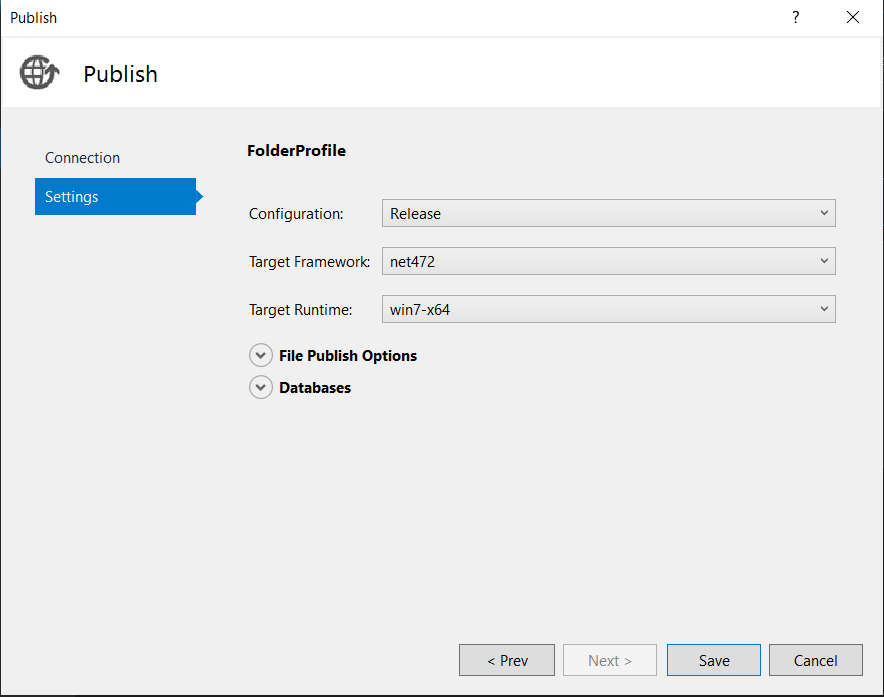
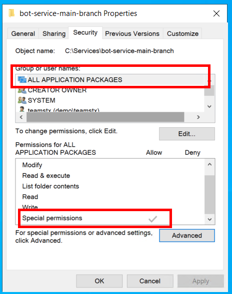

# Deploy the Bot Service

This document describes how to deploy and install the Bot Service into a pre-configured virtual machine.

## Dependencies

Before following this document, these dependencies need to be created and configured:
- [Virtual Machine](virtual_machine.md).

## Deploying the service

At the moment, there isn't automated deployment for the Bot Service so you need to manually copy and install the compiled version of the Bot Service in your virtual machine. To do this you can use one of the released versions of the Bot Service or compile the code manually in Visual Studio.

### Using a released version
To deploy a released version of the solution go to the [Releases](https://github.com/microsoft/Broadcast-Development-Kit/releases) page and download the Zip file for the version of the Bot Service that you want to use.

Then copy the Zip file to your VM and un-zip the files into the folder where you want to install you Bot Service.

### Building from the source code
Open the solution in Visual Studio. Then, go to the Solution Explorer, right-click on BotService project and click **Publish**.


In the publish tab, configure the Target Location (a folder in your local machine), and edit the following settings:
- ***Configuration:*** Release
- ***Target Framework:*** net472
- ***Target Runtime:*** win7-x64


Check the configuration and to finish publishing, press the **Save** button.


After that, we can publish the project, and copy the files from the Target Location folder into the virtual machine. Later, we will explain how to run it from the command line or as a Windows Service.

## Running the bot
We have two alternatives to run the bot, from the command line and as a Windows Service. The first alternative is used when we want to see the logs in the terminal. There are some GStreamer and external libraries stdout/stderr we can't capture nor log them in application insights. The second alternative is used to run the Bot Service authomatically when the VM starts.

> **NOTE**: The first time we configure the environment, we recommend running it from the command line so windows prompts the firewall rule and we can accept and enable it.

### From command line
In this scenario, you can run the Bot Service by executing the command `.\BotService.exe --console` in a terminal window from the path where the Bot Service is located.

If you want to override the environment settings, 
you can create a Powershell script in the root folder of the bot. Below there is a sample of the script to override the default environment variables with other values if necessary.

```bash
$env:BLOB_SAS_QUERY = '?{{sasQuery}}'
$env:STORAGE_ACCOUNT = '{{storageAccountName}}'
$env:BLOB_CONTAINER = '{{containerName}}'
$env:APP_SETTINGS_FILE_NAME = '{{envFileName}}'
$env:CERTIFICATE_FILE_NAME = '{{certFileName}}'
.\BotService.exe --console
```

> **NOTE**: You might need to enable remote signed scripts in Powershell using the command `set-executionpolicy remotesigned`.

### As a Windows Service
To run the bot every time the virtual machine is turned on, we configure it as a Windows Service. Before configuring it, we must validate that the group **ALL APPLICATION PACKAGES** has special permissions in the bot folder (right-click in the bot folder, click on **properties**, select the **security** tab). If the group doesn't have permissions, we must add it by clicking on **Advance** → **Add** → **Select a Principal**.




Finally, we must run the following Powershell command:

```bash
New-Service -Name "Bot-Service" -BinaryPathName '"C:\{bot-service-path}\BotService.exe"'
```

After completing these steps, we must restart the virtual machine or start the Bot Service from the Windows Services app. 

>**NOTE**: Before running the BotServie for the first time, we must complete the settings uploaded into the [Storage Account](storage_account.md#environment-json-file-settings-example). 

[← Back to How to Run the Solution in Azure](README.md#how-to-run-the-solution-in-azure)