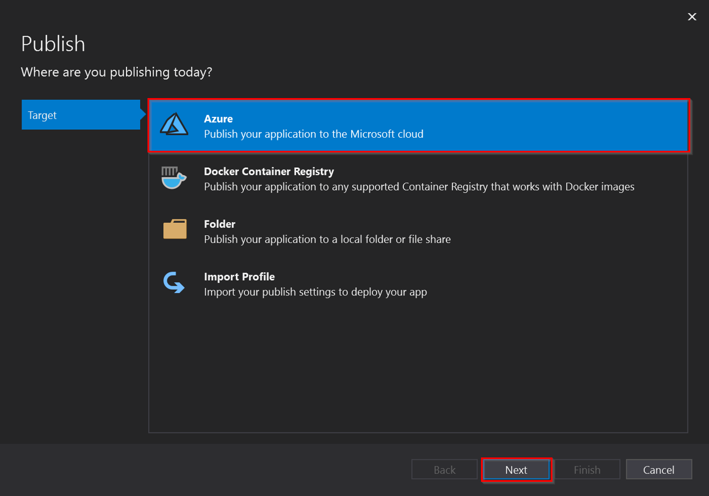
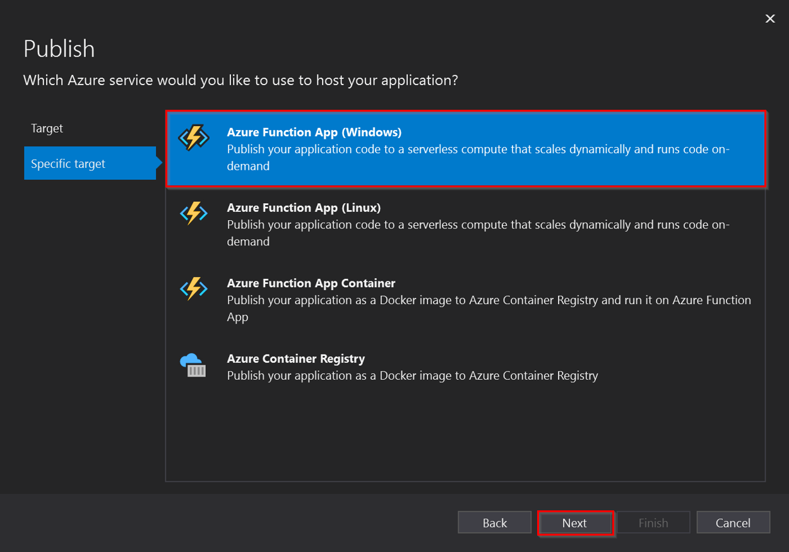
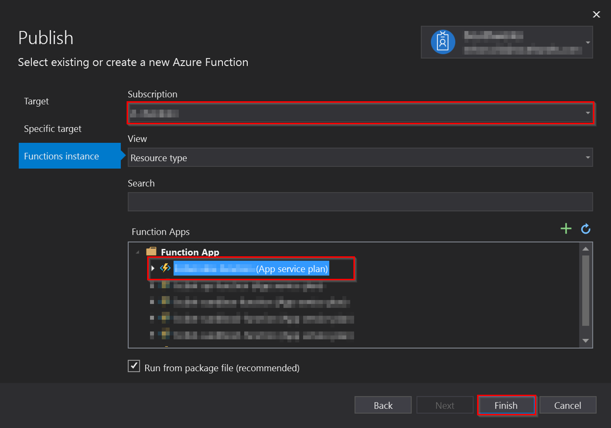
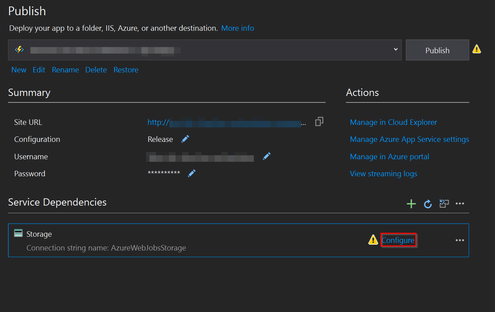
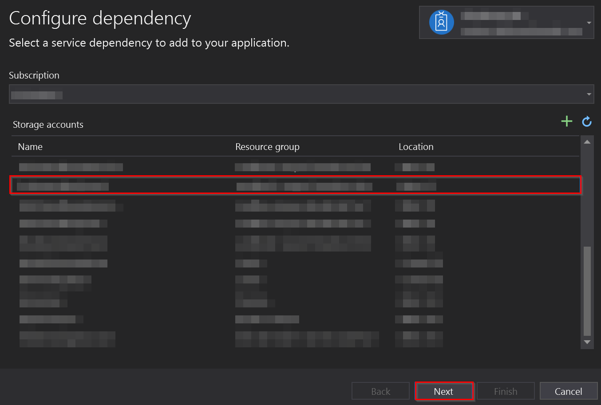
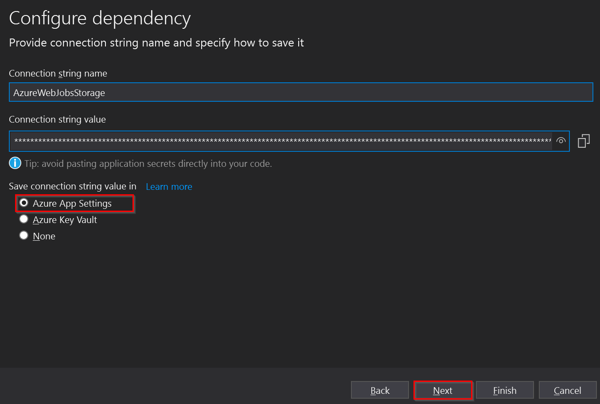
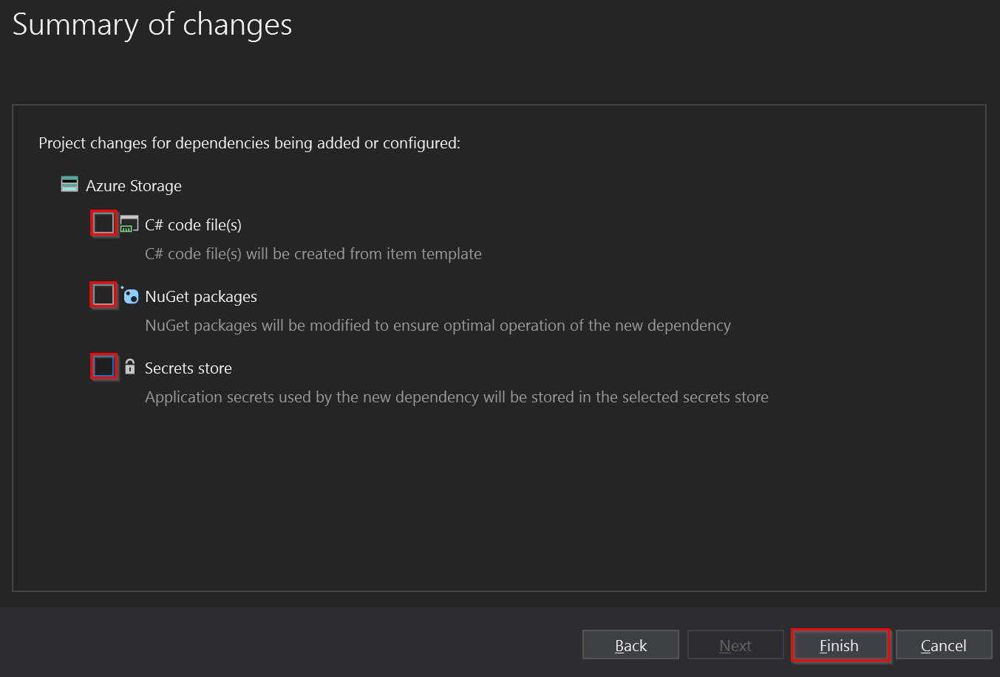
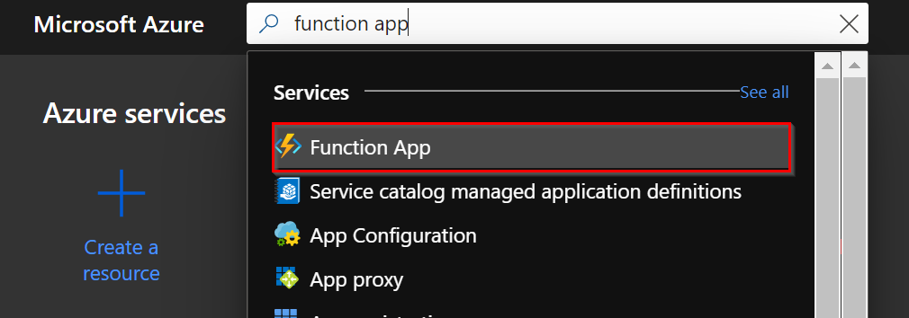
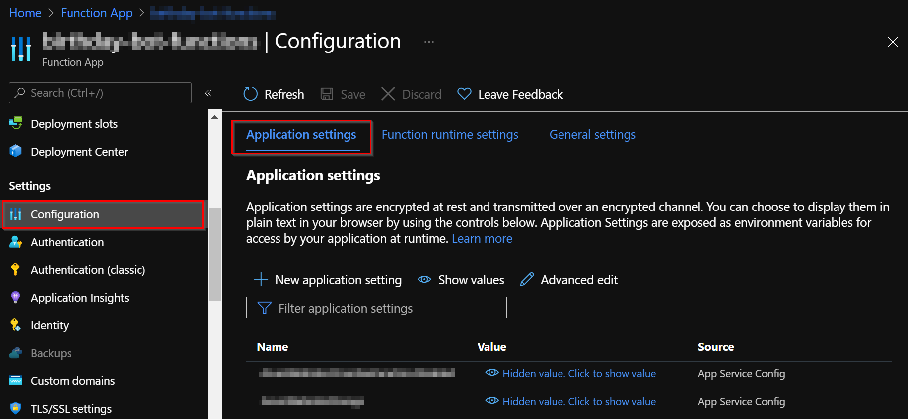
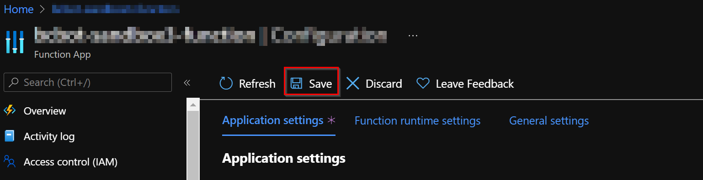

# Deploy the Function App into the Azure Function App Service.

Once the Function App with the corresponding App service plan was successful created, we can deploy the solution build into it. 

## Dependencies
To continue with the Deploy the Function App into the Azure Function App Service documentation, the following dependencies need to be created:

- [Function App](function_app_and_app_service_plan.md).

## Deploying a released version
To deploy a released version of the solution go to the [Releases](https://github.com/microsoft/Broadcast-Development-Kit/releases) page and download the Zip file for the version of the Bot Orchestrator you want to deploy.

Then, using **Azure CLI** (either locally or in the Azure Portal), run the following command to deploy the Zip file:

```
az functionapp deployment source config-zip -g <resource_group> -n <app_name> --src <zip_file_path>
```

## Building and deploying from the source code
To deploy the Function App into the Azure Function App Service created we can follow this steps:
1. Open the solution in **Visual Studio**.
1. In Solution Explorer, right-click in the project `BotOrchestrator` node and choose **Publish**.
1. In **Publish**, select **Azure** and then **Next**.  

1. Choose in the **specific destination** the option Azure App Service (Windows).  

1. Select your subscription and in the **Function Apps** panel, select the Function App that was created from the Azure Portal, and click **Finish**.  

1. Then in the **Service Dependencies** section, in the **Storage Account**, select the option **Configure**.

1. Select your **Subscription** and the [Storage Account](storage_account.md) created in the previous steps, then press the **Next** button.

1. Then check the **Azure App Settings** option and click on the **Next** button.

1. In this section uncheck the **three** Azure Storage options and click on the **Finish** button.

1. To finish, on the **Publish** page, select **Publish**. Visual Studio builds, packages, and publishes the app to Azure.

## Configure app settings
After deploying the **Function App**, it is necessary to set the configuration parameters. These are carried out by following the steps below:

1. In the [Azure portal](http://portal.azure.com/), search for and select Function App, and then select your app.  


1. Select in the app's left menu, select **Configuration** > **Application settings**.  


1. To add a setting in the portal, select **New application setting** and add the new key-value pair.  
It is necessary to create the following application settings:

    | Name                                                        | Value                                                                   |
    |-------------------------------------------------------------|-------------------------------------------------------------------------|
    | AzServicePrincipalConfiguration:ApplicationClientId         | Client Id of the [Azure SDK Service Principal](azure_sdk_service_principal.md) app registration.              |
    | AzServicePrincipalConfiguration:ApplicationClientSecret     | Client secret of the [Azure SDK Service Principal](azure_sdk_service_principal.md) app registration.          |
    | AzServicePrincipalConfiguration:SubscriptionId              | Subscription Id of the [Azure SDK Service Principal](azure_sdk_service_principal.md) app registration.        |
    | AzServicePrincipalConfiguration:TenantId                    | Tenant Id of [Azure SDK Service Principal](azure_sdk_service_principal.md) app registration.                  |
    | AZURE_FUNCTIONS_ENVIRONMENT                                 | Development or Production                                               |
    | BuildVersion                                                | Version number deployed e.g. 0.0.0-test                                 |
    | CosmosDbConfiguration:DatabaseName                          | Database name of the [Cosmos DB](cosmos_db.md) created.                           |
    | CosmosDbConfiguration:EndpointUrl                           | Endpoint URL of the [Cosmos DB](cosmos_db.md) created.                            |
    | CosmosDbConfiguration:PrimaryKey                            | Primary key of the [Cosmos DB](cosmos_db.md) created.                             |

1. Finally, click on the **Save** button.  


[← Back to How to Run the Solution in Azure](README.md#how-to-run-the-solution-in-azure)