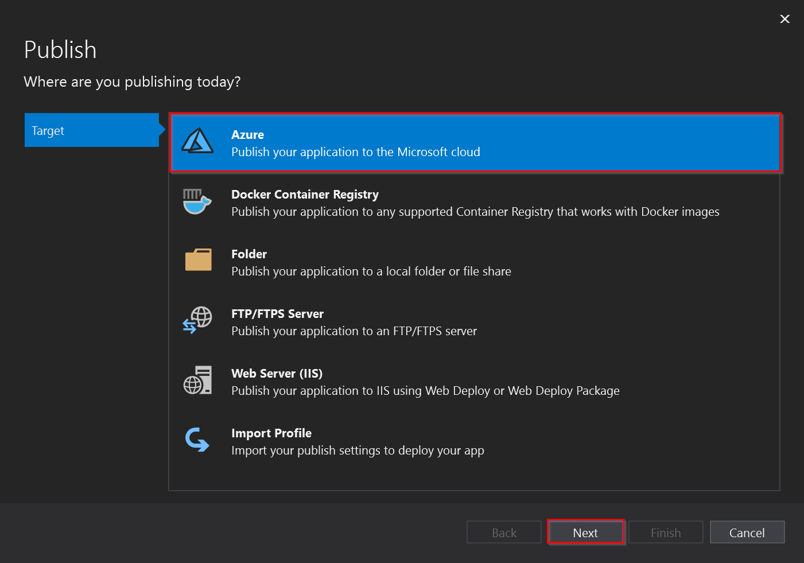
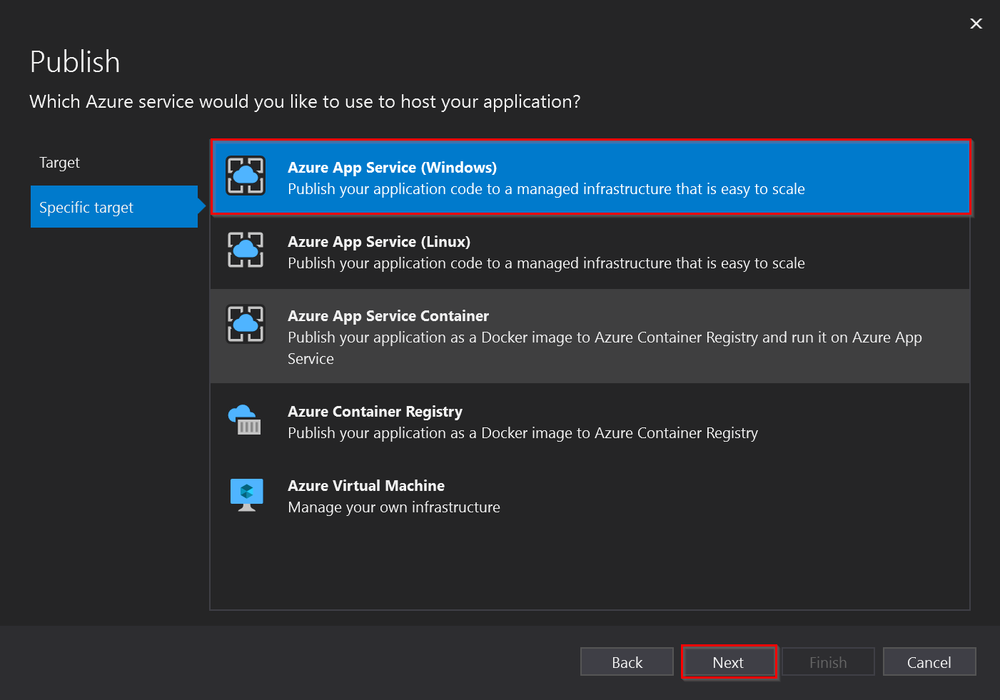
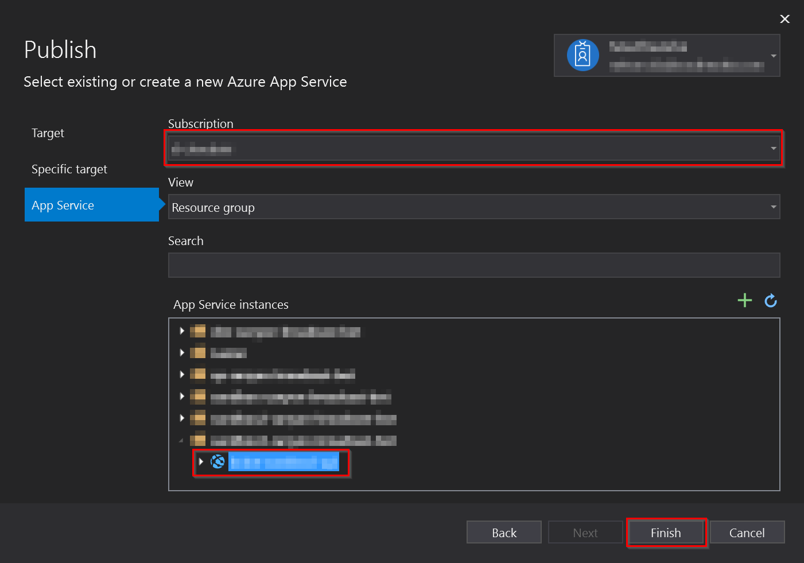
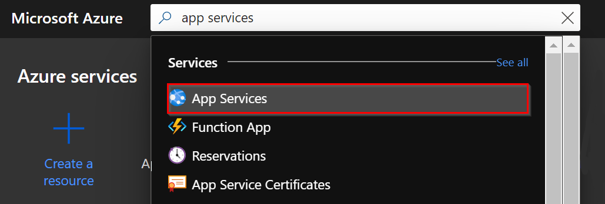
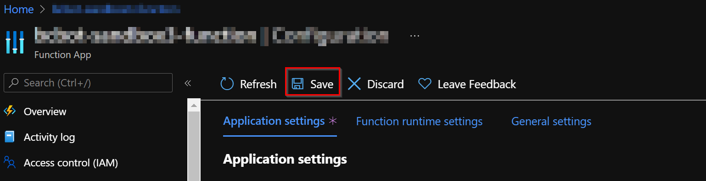

# Deploy the Web App into the Azure App Service.

Once the Web App with the corresponding Azure App service plan was successful created, we can deploy the solution build into it. 

To deploy the Web App into the Web Azure App Service created we can follow this steps:
1. Open the solution in **Visual Studio**.
1. In Solution Explorer, right-click in the project `ManagementApi` node and choose **Publish**.
1. In **Publish**, select **Azure** and then **Next**.  

1. Choose in the **specific destination** the option Azure App Service (Windows).  

1. Select your subscription and in the **Web Apps** panel, select the Web App that was created from the Azure Portal, and click **Finish**.  

1. In the **Publish** page, select **Publish**. Visual Studio builds, packages, and publishes the app to Azure, and then launches the app in the default browser.

## Configure app settings
After deploying the **Web App**, it is necessary to set the configuration parameters. These are carried out by following the steps below:

1. In the [Azure portal](http://portal.azure.com/), search for and select App Services, and then select your app.  

1. Select in the app's left menu, select **Configuration** > **Application settings**.  

1. To add a setting in the portal, select **New application setting** and add the new key-value pair.  
It is necessary to create the following application settings:

    | Name                                                                 | Value                                                                  |
    |----------------------------------------------------------------------|------------------------------------------------------------------------|
    | APPINSIGHTS_INSTRUMENTATIONKEY                                       | Application Insights key of the application insights resource created. |
    | APPINSIGHTS_PROFILERFEATURE_VERSION                                  | disabled                                                               |
    | APPINSIGHTS_SNAPSHOTFEATURE_VERSION                                  | disabled                                                               |
    | ApplicationInsightsAgent_EXTENSION_VERSION                           | ~2                                                                     |
    | DiagnosticServices_EXTENSION_VERSION                                 | disabled                                                               |
    | InstrumentationEngine_EXTENSION_VERSION                              | disabled                                                               |
    | Logging:LogLevel:Default                                             | Information                                                            |
    | Settings:AzServicePrincipalConfiguration:ApplicationClientId         | Client Id of the Azure Service Principal app registration.             |
    | Settings:AzServicePrincipalConfiguration:ApplicationClientSecret     | Client secret of the Azure Service Principal app registration.         |
    | Settings:AzServicePrincipalConfiguration:SubscriptionId              | Subscription Id of the Azure Service Principal app registration.       |
    | Settings:AzServicePrincipalConfiguration:TenantId                    | Tenant Id of Azure Service Principal app registration.                 |
    | ASPNETCORE_ENVIRONMENT                                               | Development                                                            |
    | Settings:AzureAdConfiguration:ClientId                               | Client Id of Azure AD.                                                 |
    | Settings:AzureAdConfiguration:ClientSecret                           | Client secret of Azure AD.                                             |
    | Settings:AzureAdConfiguration:Domain                                 | authDomain                                                             |
    | Settings:AzureAdConfiguration:GroupId                                | Group Id of Azure AD.                                                  |
    | Settings:AzureAdConfiguration:Instance                               | https://login.microsoftonline.com/                                     |
    | Settings:AzureAdConfiguration:TenantId                               | Tenant Id of Azure AD.                                                 |
    | Settings:BotServiceAuthenticationConfiguration:BotServiceApiClientId | Client Id of the Bot Service Api app registration.                     |
    | Settings:BotServiceAuthenticationConfiguration:ClientId              | Client Id of the Bot Service Client app registration.                  |
    | Settings:BotServiceAuthenticationConfiguration:ClientSecret          | Client secret of the Bot Service Client app registration.          |
    | Settings:BuildVersion                                                | 0.3.3-configurable-rtmp-stream-key                                     |
    | Settings:CosmosDbConfiguration:DatabaseName                          | Database name of the cosmos db created.                                |
    | Settings:CosmosDbConfiguration:EndpointUrl                           | Endpoint URL of the cosmos db created.                                 |
    | Settings:CosmosDbConfiguration:PrimaryKey                            | Primary key of the cosmos db created.                                  |
    | Settings:GraphClientConfiguration:ClientId                           | Client Id of the Azure Bot app registration.                           |
    | Settings:GraphClientConfiguration:ClientSecret                       | Client secret of the Azure Bot app registration.                       |
    | Settings:GraphClientConfiguration:TenantId                           | Tenant  Id of the Azure Bot app registration.                          |
    | Settings:StorageConfiguration:AccountKey                             | Key of the Storage created where the config is stored.                 |
    | Settings:StorageConfiguration:AccountName                            | Name of the Storage created where the config is stored.                |
    | Settings:StorageConfiguration:ConfigContainer                        | Key 1 of the Storage created where the config is stored.                 |
    | Settings:StorageConfiguration:ConnectionString                       | Connection string of the Storage created where the config is stored.   |
    | Settings:StorageConfiguration:SasTokenLifetimeMinutes                | 1                                                                      |
    | SnapshotDebugger_EXTENSION_VERSION                                   | disabled                                                               |
    | XDT_MicrosoftApplicationInsights_BaseExtensions                      | disabled                                                               |
    | XDT_MicrosoftApplicationInsights_Mode                                | recommended                                                            |
1. Finally, click on the **Save** button.  

[← Back to Web App and App service plan](web_app_and_app_service_plan.md)