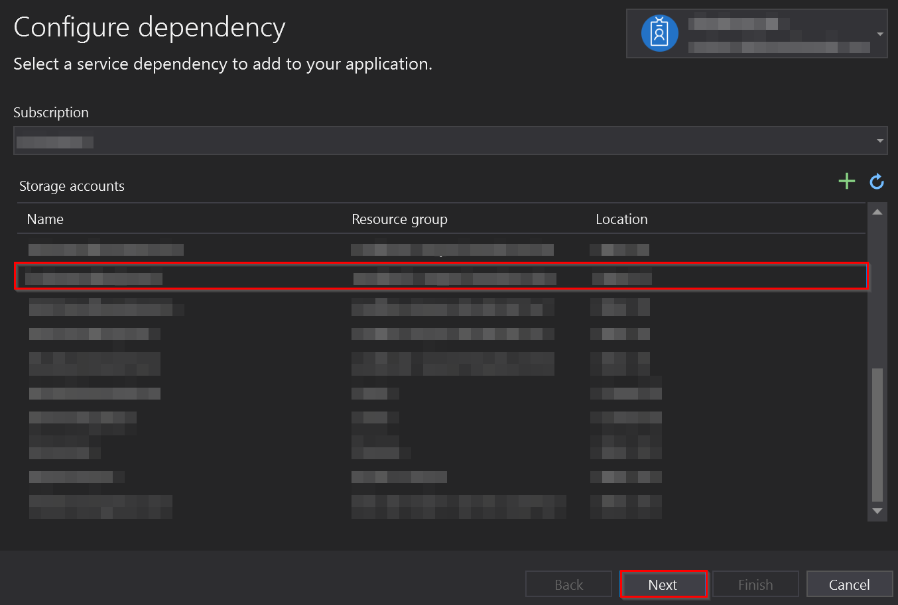
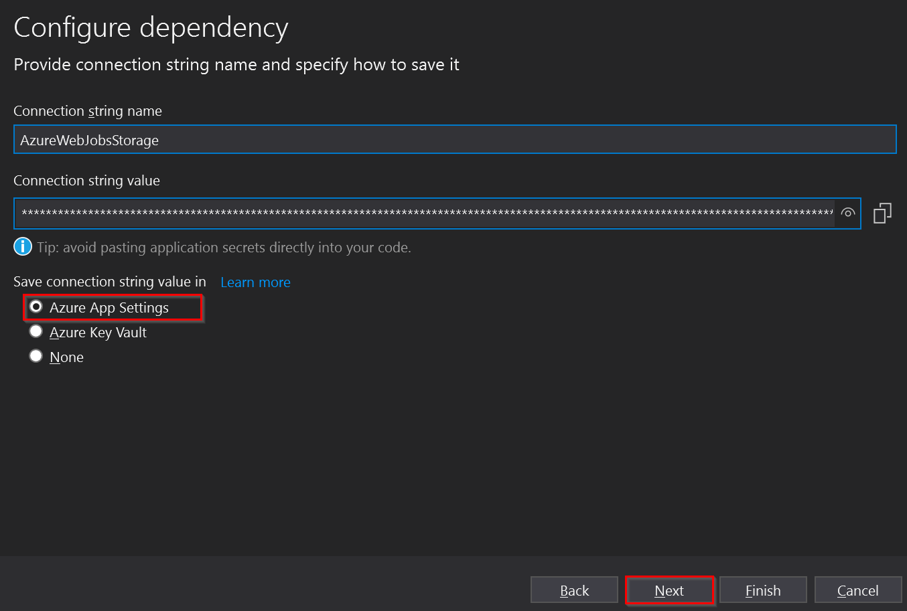
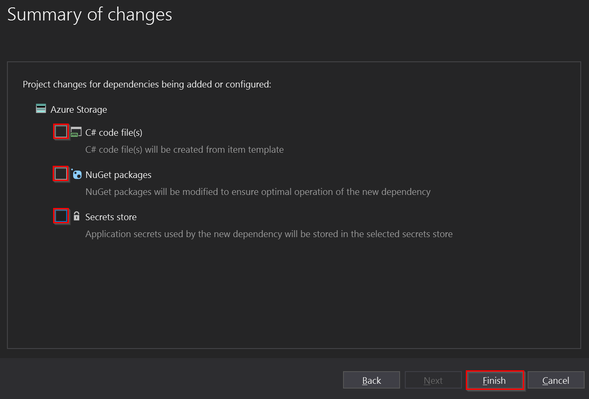
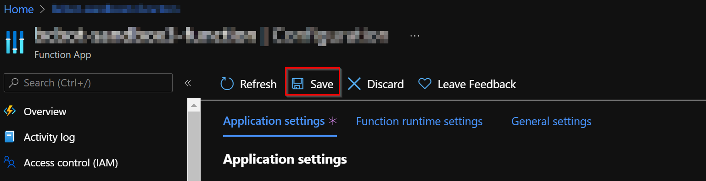

# Function App Deploy

This document describes how to deploy and configure the Function App into the Azure Function App Service.

## Deploying the Function App

To deploy the Function App, you can use one of the released versions or compile the code manually in Visual Studio and use the IDE to deploy it.

### Deploying a released version

To deploy the current released version (0.6.0-dev) of the solution go to the [Releases](https://github.com/microsoft/Broadcast-Development-Kit/releases) page and download the Zip file for the version (0.6.0-dev) of the Management API you want to deploy.

Then, using **Azure CLI** (either locally or in the Azure Portal), run the following command to deploy the Zip file:

``` shell
az functionapp deployment source config-zip -g <resource_group> -n <app_name> --src <zip_file_path>
```

### Building and deploying from the source code

To deploy the Function App into the Azure Function App Service created we can follow this steps:

1. Open the solution in **Visual Studio**.
2. In Solution Explorer, right-click in the project `BotOrchestrator` node and choose **Publish**.
3. In **Publish**, select **Azure** and then **Next**.  


4. Choose in the **specific destination** the option Azure App Service (Windows).  


5. Select your subscription and in the **Function Apps** panel, select the Function App that was created from the Azure Portal, and click **Finish**.  


6. Then in the **Service Dependencies** section, in the **Storage Account**, select the option **Configure**.


7. Select your **Subscription** and the [Storage Account](storage-account.md) created in the previous steps, then press the **Next** button.


8. Then check the **Azure App Settings** option and click on the **Next** button.


9. In this section uncheck the **three** Azure Storage options and click on the **Finish** button.


10. To finish, on the **Publish** page, select **Publish**. Visual Studio builds, packages, and publishes the app to Azure.

### Configuring app settings

After deploying the **Function App**, it is necessary to set the configuration parameters. These are carried out by following the steps below:

1. In the [Azure portal](http://portal.azure.com/), search for and select Function App, and then select your app.  


2. Select in the app's left menu, select **Configuration** > **Application settings**.  


3. To add a setting in the portal, select **New application setting** and add the new key-value pair.  
It is necessary to create the following application settings:
    > NOTE: We use [Key Vault references](https://docs.microsoft.com/en-us/azure/app-service/app-service-key-vault-references) to work with secrets in the Azure App Services. In the table below, you will find values with the format `@Microsoft.KeyVault(VaultName={{keyVaultName}};SecretName={{secretName}})` where `{{keyVaultName}}` is a placeholder that you have to replace with the name of the Azure Key Vault resource you have created in previous steps (and remove the `{{}}`), and `{{secretName}}` will be already specified.

    | Name                                                        | Value                                                                   |
    |-------------------------------------------------------------|-------------------------------------------------------------------------|
    | APPINSIGHTS_INSTRUMENTATIONKEY       |  Key of the [Application Insights](application-insights.md) resource created.              |
    | AzureWebJobsStorage        | **@Microsoft.KeyVault(VaultName=`{{keyVaultName}}`;SecretName=Settings--StorageConfiguration--ConnectionString)**              |
    | AzServicePrincipalConfiguration:ApplicationClientId         | Client Id of the [Azure SDK Service Principal](azure-sdk-app-registration.md) app registration.              |
    | AzServicePrincipalConfiguration:ApplicationClientSecret     | **@Microsoft.KeyVault(VaultName=`{{keyVaultName}}`;SecretName=Settings--AzServicePrincipalConfiguration--ApplicationClientSecret)**          |
    | AzServicePrincipalConfiguration:SubscriptionId              | Subscription Id of the [Azure SDK Service Principal](azure-sdk-app-registration.md) app registration.        |
    | AzServicePrincipalConfiguration:TenantId                    | Tenant Id of [Azure SDK Service Principal](azure-sdk-app-registration.md) app registration.                  |
    | AZURE_FUNCTIONS_ENVIRONMENT                                 | Development or Production                                               |
    | BuildVersion                                                | Version number deployed e.g. 0.0.0-test                                 |
    | CosmosDbConfiguration:DatabaseName                          | Database name of the [Cosmos DB](cosmos-db.md) created.                           |
    | CosmosDbConfiguration:EndpointUrl                           | Endpoint URL of the [Cosmos DB](cosmos-db.md) created.                            |
    | CosmosDbConfiguration:PrimaryKey                            | **@Microsoft.KeyVault(VaultName=`{{keyVaultName}}`;SecretName=Settings--CosmosDbConfiguration--PrimaryKey)**                                   |

4. Finally, click on the **Save** button.  


[← Back to How to run the solution in Azure](README.md#deployments) | [Next: Configure event grid →](README.md#configure-event-gridevent-grid-handler)
