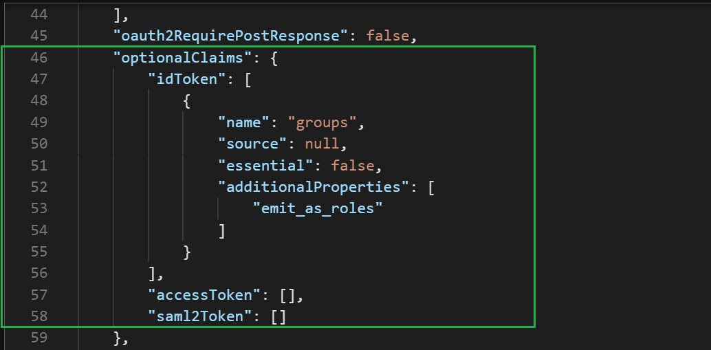
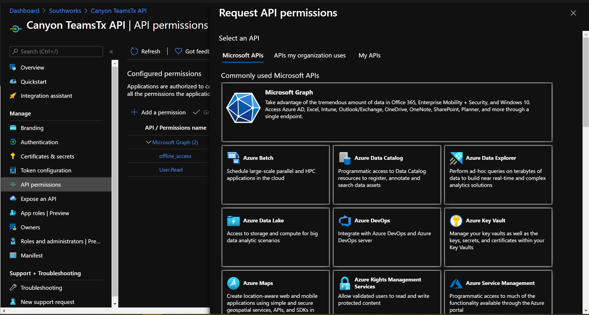
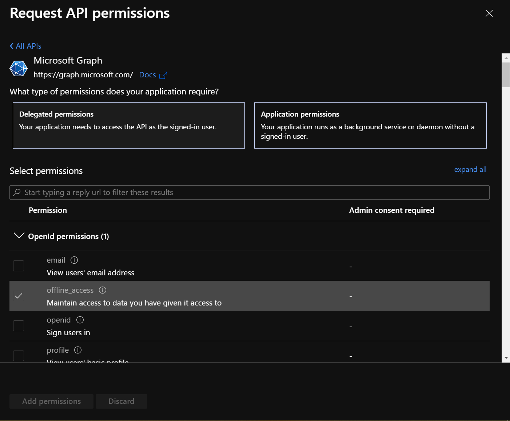
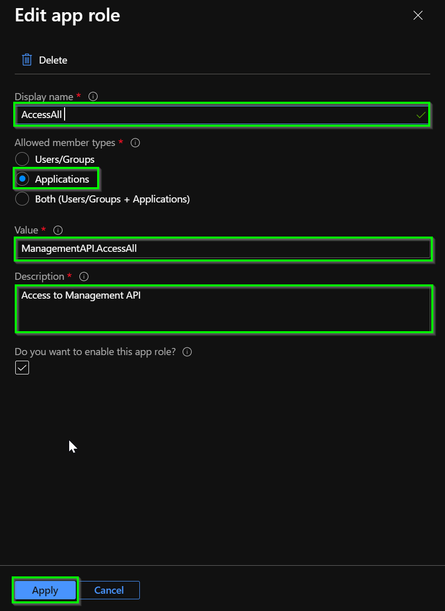
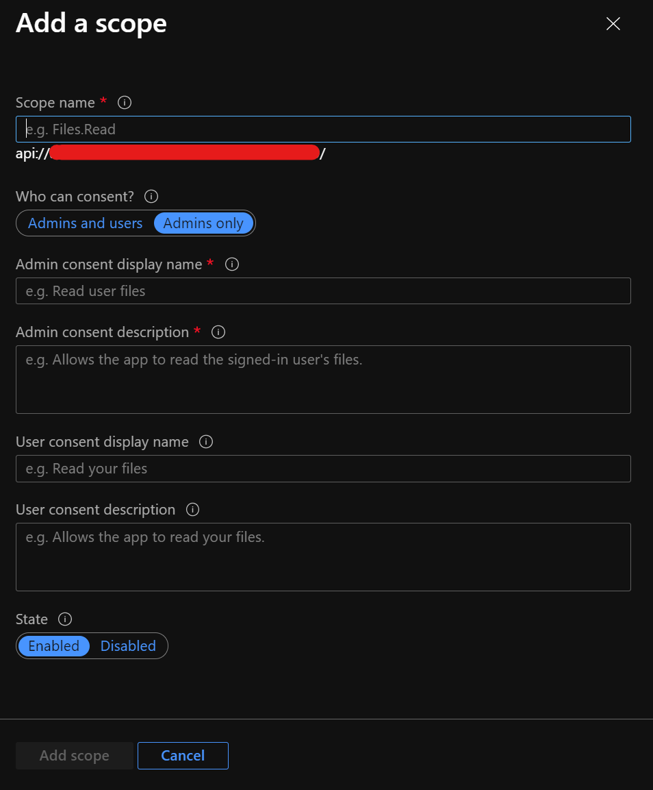

# Management API app registration

This documents explains how to create and configure the Management API app registration to enable Client Credential Authentication between APIs.

## Creation of the app registration

To create the app registrations, review the following [Microsoft documentation](https://docs.microsoft.com/en-us/azure/active-directory/develop/quickstart-register-app#register-an-application) that will explain how to do it, and consider the following settings:

- ***Name:*** Meaningful name.
- ***Supported account types:*** Accounts in this organizational directory only (`your-organization` only - Single tenant).

## Setup of the app registration

### Manifest

In the Management API Application Manifest editor, you need to apply the same change in the manifest as you did for the previous app registration. Change the `accessTokenAcceptedVersion` field from null (which defaults to: 1) to 2 (for v2.0 tokens).

To allow the application to include in the token all the security groups the user belongs, you have to add/modify the following key-values:

```json
"groupMembershipClaims": "SecurityGroup",
"optionalClaims":{
  "idToken": [
    {
      "name":"groups",
      "source": null,
      "essential": false,
      "additionalProperties": [
        "emit_as_roles"
      ]
    }
  ],
  "accessToken":[],
  "saml2Token":[]
}
```



Click the **Save** button to finish.

#### API Graph permissions

From the API app registration view, go to the **API permissions** option that is in the resource blade, click the **Add a permission** button and then ensure that the **Microsoft APIs** tab is selected.



In the Commonly used Microsoft APIs section, click on **Microsoft Graph**. Then click in the **Delegated permissions** section and ensure that the right permissions are checked (`User.Read` and `offline_access`) and click the **Add permissions** button.



#### App Roles

> **NOTE**: Next, we will create a new Role, which will serve as a mechanism to demand authorization from other applications.

From the Management API app registration view, go to the App roles option that is in the resource blade, click the **Create app role** button. Fill the following information with the values suggested.

- ***Display name***: AccessAll.
- ***Allowed member types***: Applications.
- ***Values***: ManagementAPI.AccessAll.
- ***Description***: Meaningful description e.g., Access to Management API.



Finally, click on the Apply button.

#### Expose an API

From the resource blade of the app registration view, go to the **Expose an API** option and click **Set** next to the Application ID URI to generate a URI that is unique for this app (in the form of api://{clientId}). Then click **Add scope**, complete the form following the parameters listed below, and finally click **Add scope** button.

#### Parameters

> **NOTE**: This `Scope` name is going to be used to develop/configure auth in the extension and they must match.

- ***Scope name***: use `access_as_producer`.
- ***Who can consent***: Admin and users.
- Admin consent display name: enter a meaningful name. E.g.: `Access Broadcaster for Teams as producer`.
- **Admin consent description**: enter a meaningful description.
- **User consent display name**: enter a meaningful name. E.g.: `Access Broadcaster for Teams as producer`.
- **User consent description**: enter a meaningful description.
- **State**: Enabled



[← Back to How to run the solution in Azure](README.md#app-registrations) |
[Next: Azure SDK app registration →](azure-sdk-app-registration.md#azure-sdk-app-registration)
