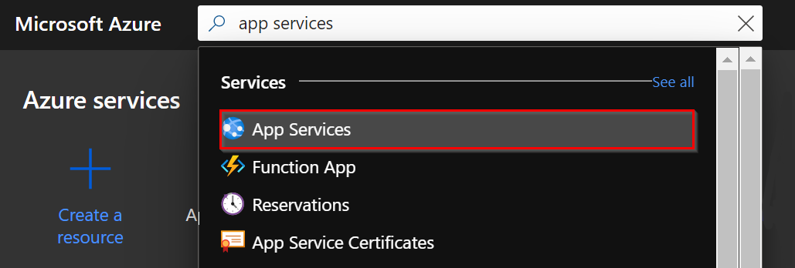

# Management API deploy

This document describes how to deploy and configure the Management API into the Azure App Service.

## Deploying the Management API

To deploy the Management API, you can use one of the released versions or compile the code manually in Visual Studio and use the IDE to deploy it.

### Deploying a released version

To deploy the current released version (0.6.0-dev) of the solution go to the [Releases](https://github.com/microsoft/Broadcast-Development-Kit/releases) page and download the Zip file for the version (0.6.0-dev) of the Management API you want to deploy.

Then, using **Azure CLI** (either locally or in the Azure Portal), run the following command to deploy the Zip file:

``` shell
az webapp deployment source config-zip --resource-group <resource_group> --name <app-name> --src <zip_file_path>
```

### Building and deploying from the source code

To deploy the Web App into the Web Azure App Service created we can follow this steps:

1. Open the solution in **Visual Studio**.
2. In Solution Explorer, right-click in the project `ManagementApi` node and choose **Publish**.
3. In **Publish**, select **Azure** and then **Next**.  

4. Choose in the **specific destination** the option Azure App Service (Windows).  

5. Select your subscription and in the **Web Apps** panel, select the Web App that was created from the Azure Portal, and click **Finish**.  

6. In the **Publish** page, select **Publish**. Visual Studio builds, packages, and publishes the app to Azure, and then launches the app in the default browser.

## Configuring app settings

After deploying the **Web App**, it is necessary to set the configuration parameters.

1. In the [Azure portal](http://portal.azure.com/), search for and select App Services, and then select your app.  

2. Select in the app's left menu, select **Configuration** > **Application settings**.  

3. To add a setting in the portal, select **New application setting** and add the new key-value pair.  
It is necessary to create the following application settings:

    > NOTE: We use [Key Vault references](https://docs.microsoft.com/en-us/azure/app-service/app-service-key-vault-references) to work with secrets in the Azure App Services. In the table below, you will find values with the format `@Microsoft.KeyVault(VaultName={{keyVaultName}};SecretName={{secretName}})` where `{{keyVaultName}}` is a placeholder that you have to replace with the name of the Azure Key Vault resource you have created in previous steps (and remove the `{{}}`), and `{{secretName}}` will be already specified.

    | Name                                                                 | Value                                                                  |
    |----------------------------------------------------------------------|------------------------------------------------------------------------|
    | APPINSIGHTS_INSTRUMENTATIONKEY                                       | Key of the [Application Insights](application-insights.md) resource created. |
    | APPINSIGHTS_PROFILERFEATURE_VERSION                                  | disabled                                                               |
    | APPINSIGHTS_SNAPSHOTFEATURE_VERSION                                  | disabled                                                               |
    | ApplicationInsightsAgent_EXTENSION_VERSION                           | ~2                                                                     |
    | DiagnosticServices_EXTENSION_VERSION                                 | disabled                                                               |
    | InstrumentationEngine_EXTENSION_VERSION                              | disabled                                                               |
    | Logging:LogLevel:Default                                             | Information                                                            |
    | Settings:AzServicePrincipalConfiguration:ApplicationClientId         | Client Id of the [Azure SDK Service app registration](azure-sdk-app-registration.md) app registration.             |
    | Settings:AzServicePrincipalConfiguration:ApplicationClientSecret     | **@Microsoft.KeyVault(VaultName=`{{keyVaultName}}`;SecretName=Settings--AzServicePrincipalConfiguration--ApplicationClientSecret)**     |
    | Settings:AzServicePrincipalConfiguration:SubscriptionId              | Subscription Id of the [Azure SDK app registration](azure-sdk-app-registration.md) app registration.       |
    | Settings:AzServicePrincipalConfiguration:TenantId                    | Tenant Id of [Azure SDK app registration](azure-sdk-app-registration.md) app registration.                 |
    | ASPNETCORE_ENVIRONMENT                                               | Development or Production                                                           |
    | Settings:AzureAdConfiguration:ClientId                                | Id of the [Management API](management-api-app-registration.md) app registration created in Azure  AD.                                                  |
    | Settings:AzureAdConfiguration:GroupId                                | **Optional**: If you don't want to restrict access to the users using a Security Group, leave this field empty. In contrary case, enter the Id of the [Security Group](security-group.md) created in Azure  AD.                                                  |
    | Settings:AzureAdConfiguration:Instance                               | <https://login.microsoftonline.com/>                                     |
    | Settings:AzureAdConfiguration:TenantId                               | Tenant Id of Azure AD.                                                 |
    | Settings:BotServiceAuthenticationConfiguration:BotServiceApiClientId | Client Id of the [Bot Service API](bot-service-api-app-registration.md) app registration.                     |
    | Settings:BotServiceAuthenticationConfiguration:ClientId              | Client Id of the [Bot Service Client](bot-service-client-app-registration.md) app registration.                  |
    | Settings:BotServiceAuthenticationConfiguration:ClientSecret          | **@Microsoft.KeyVault(VaultName=`{{keyVaultName}}`;SecretName=Settings--BotServiceAuthenticationConfiguration--ClientSecret)**                |
    | Settings:BuildVersion                                                | version deployed e.g. 0.0.1-test                                      |
    | Settings:CosmosDbConfiguration:DatabaseName                          | Database name of the [Cosmos DB](cosmos-db.md) created.                                |
    | Settings:CosmosDbConfiguration:EndpointUrl                           | Endpoint URL of the [Cosmos DB](cosmos-db.md) created.                                 |
    | Settings:CosmosDbConfiguration:PrimaryKey                            |  **@Microsoft.KeyVault(VaultName=`{{keyVaultName}}`;SecretName=Settings--CosmosDbConfiguration--PrimaryKey)**                                    |
    | Settings:GraphClientConfiguration:ClientId                           | Client Id of the [Azure Bot](../common/azure-bot.md) app registration.                           |
    | Settings:GraphClientConfiguration:ClientSecret                       | **@Microsoft.KeyVault(VaultName=`{{keyVaultName}}`;SecretName=Settings--GraphClientConfiguration--ClientSecret)**                         |
    | Settings:GraphClientConfiguration:TenantId                           | Tenant  Id of the [Azure Bot](../common/azure-bot.md) app registration.                          |
    | Settings:StorageConfiguration:ConnectionString                       | **@Microsoft.KeyVault(VaultName=`{{keyVaultName}}`;SecretName=Settings--StorageConfiguration--ConnectionString)**     |
    | SnapshotDebugger_EXTENSION_VERSION                                   | disabled                                                               |
    | XDT_MicrosoftApplicationInsights_BaseExtensions                      | disabled                                                               |
    | XDT_MicrosoftApplicationInsights_Mode                                | recommended                                                            |

4. Finally, click on the **Save** button.  


[← Back to How to run the solution in Azure](README.md#deployments) | [Next: Function App deploy →](function-app-deploy.md#function-app-deploy.md)
