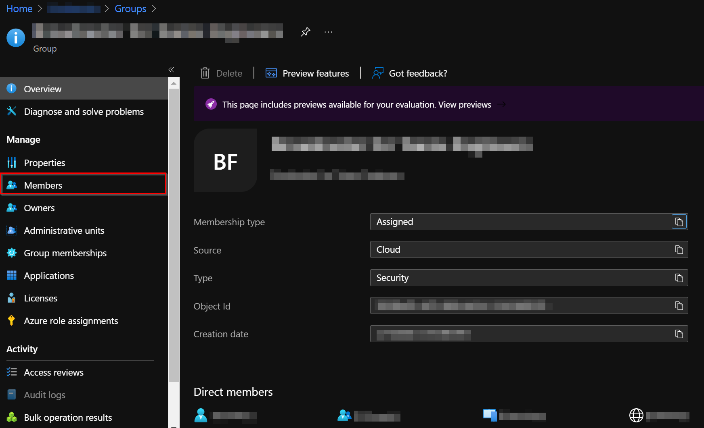

# Security Group

## Getting Started

The Security Group will be used to grant access and permissions to predefined users to the application. 

To create the **Security Group** and **add members**, review the following Microsoft [documentation](https://docs.microsoft.com/en-us/azure/active-directory/fundamentals/active-directory-groups-create-azure-portal#create-a-basic-group-and-add-members).

### Settings:

- ***GroupType:*** Select the group type **Security**. 
- ***Group name:*** A meaningful name. 
- ***Group description:*** A meaningful description (optional).
- ***Membership type:*** Select **Assigned** membership for the group.

> **NOTE:** You will need the `Group Id` later to configure the project, so register it as soon as it is visible from the Azure portal.

## Add Member to the Security Group
Once the **Security Group** has been created, it is necessary to add the members of the group that will be able to operate the solution. To add members, it is suggested to carry out the following steps:
1. Enter the **Security Group** created and select the *Members* option on the left panel.

1. Then click on the **+ Add members** button and start searching for members to add to your group, and click on the **Select** button to add them.

[← Back to How to Run the Solution in Azure](README.md#how-to-run-the-solution-in-azure)