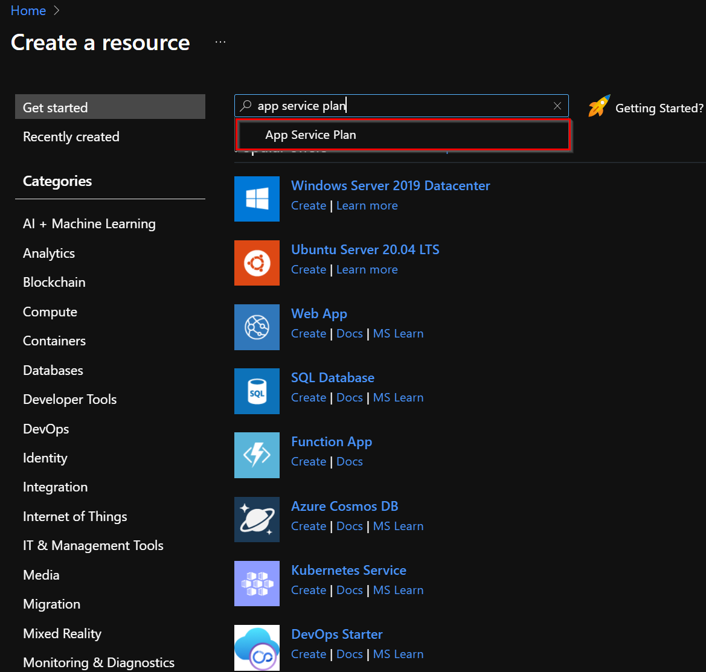
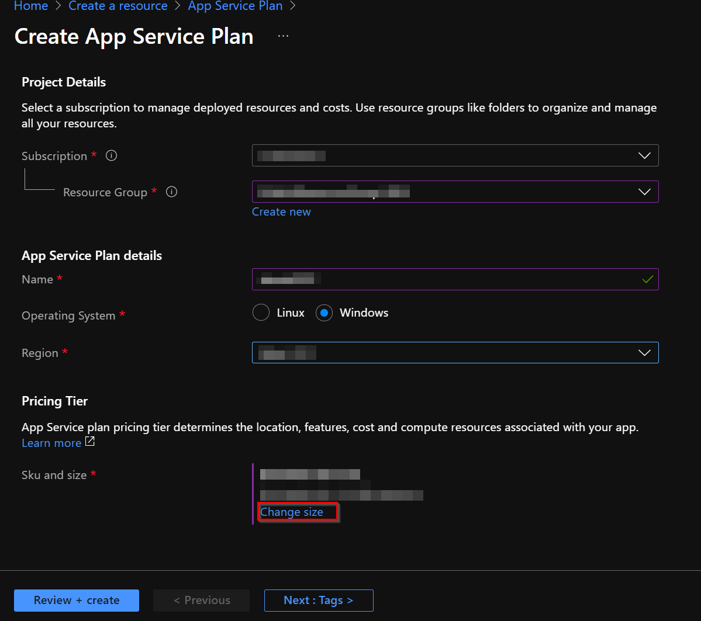
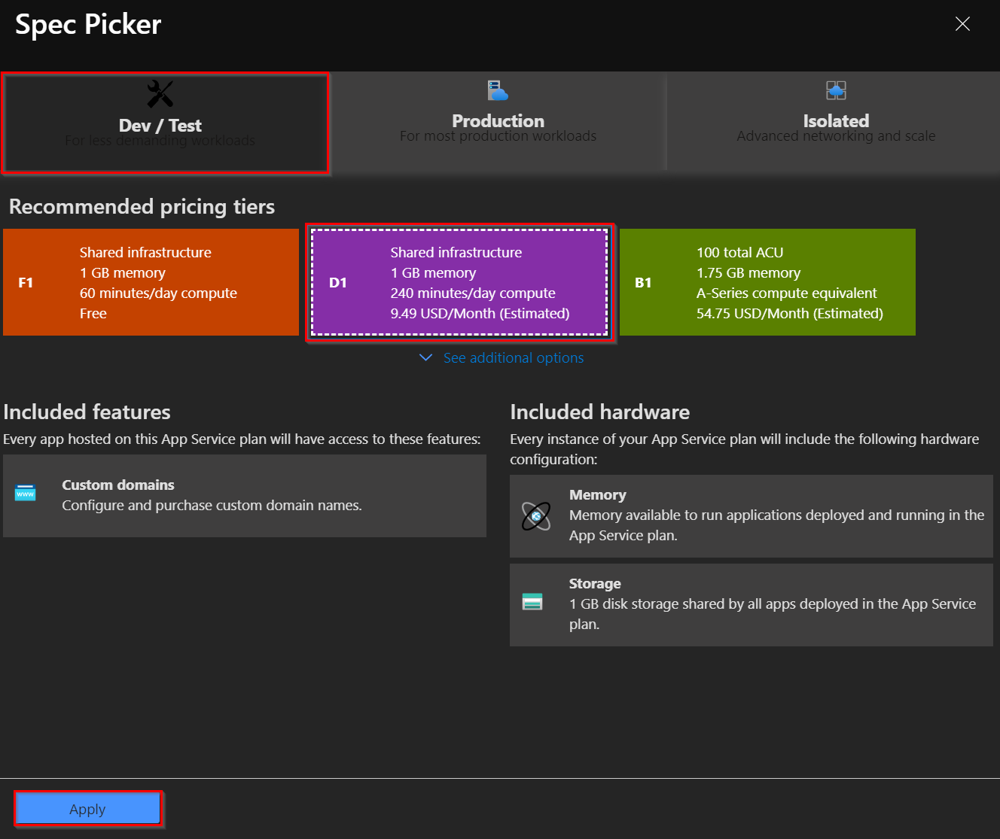
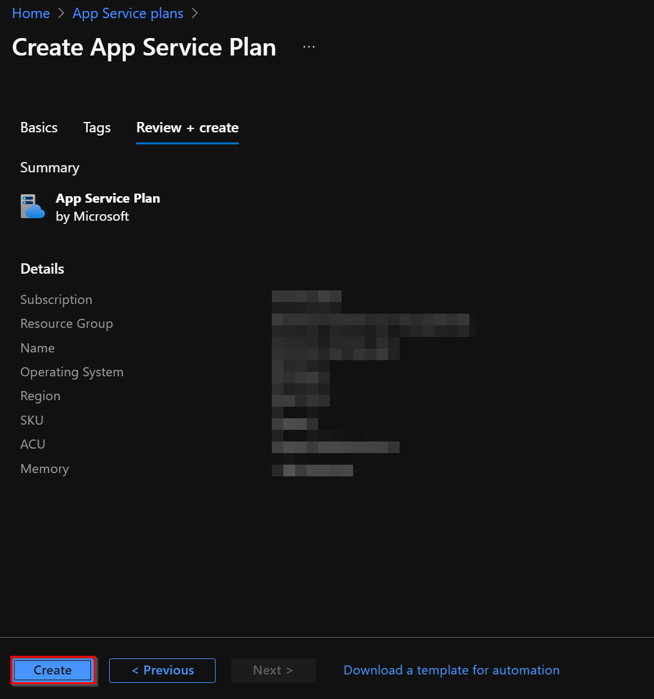

# App Service Plan

## Introduction
An App Service Plan for it must be created to define the set of processing resources for the Apps services to execute.

## Dependencies
To continue with the App Service Plan, the following dependencies need to be created:

- [Resource Group](resource_group.md).

### Settings
Fill the fields in the creation wizard with the following information:

- ***Resource Group:*** Select the [resource group](readme.md#architecture-resource-group) created for the solution architecture.
- ***Name:*** A meaningful name.
- ***Operating System:*** Windows.
- ***Region:*** Same region as the rest of the resources.
- ***Pricing Tier***
    - ***Sku and size:*** Shared D1.
    > **NOTE**: This tier (Shared D1) is to reduce costs during the test. It can be increased if needed.

### Create App Service Plan in Azure.
1. In the [Azure Portal](https://portal.azure.com/), click **Create a resource**, and in the search bar enter **application service plan**. Then click on **Create** button.

    
    
1. Select the subscription and complete the fields following the indications in the previous section. Then in the **Pricing Tier** section click on **Change size**.

    

1. Next, in the **Recommended pricing tiers** panel, select the **Dev/Test** tab, then select the **D1** tier, and click on **Apply**.

    

1. Then press the tab **Create** button to finish with the creation.

    

[← Back to How to Run the Solution in Azure](README.md#how-to-run-the-solution-in-azure)