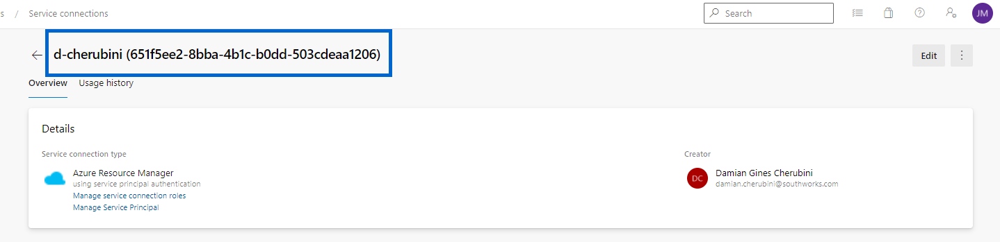
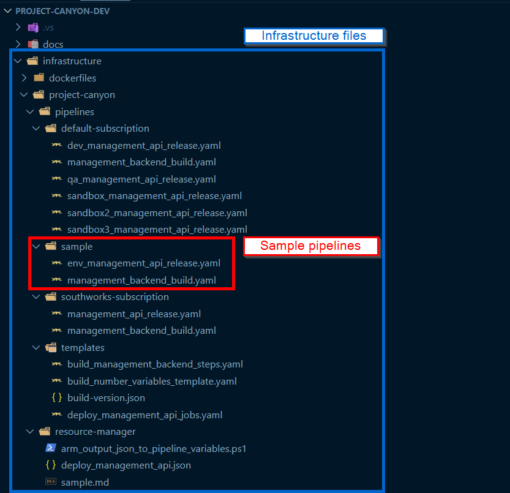
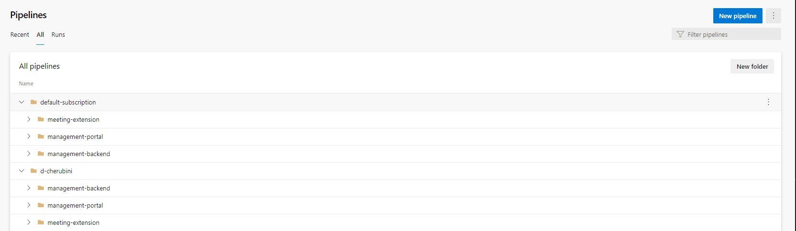
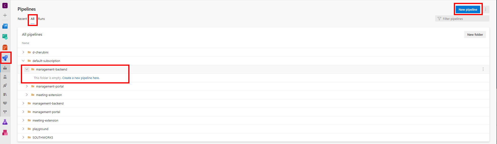
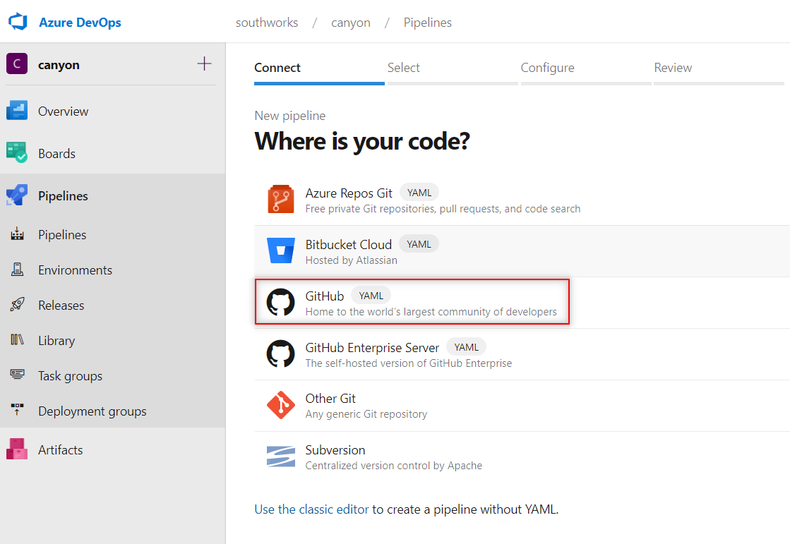
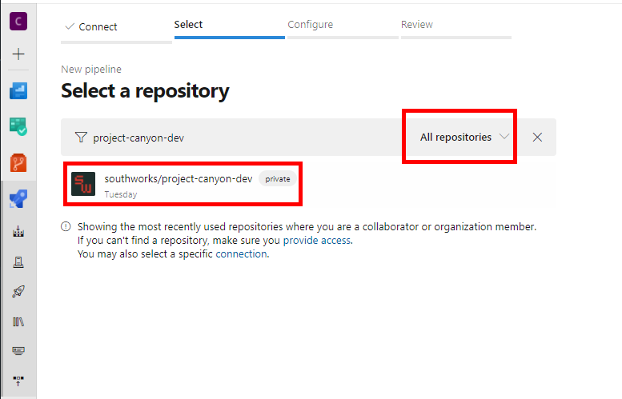
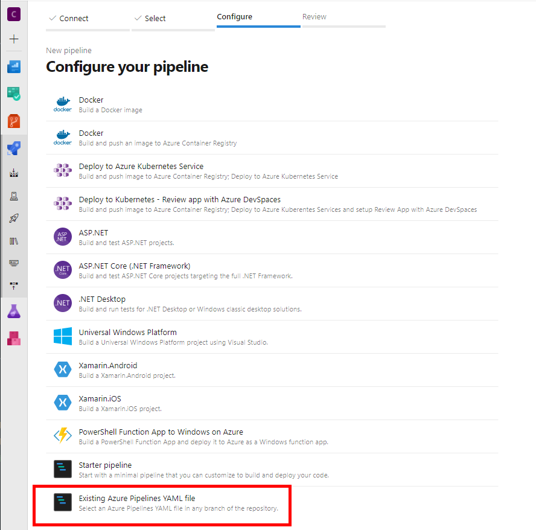
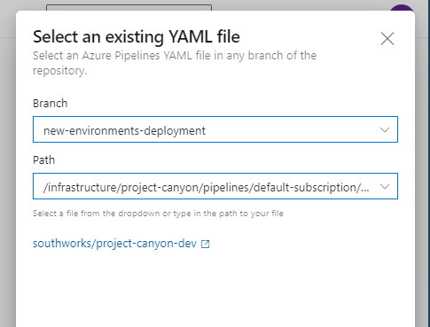

# How to setup Azure DevOps

## Getting Started

With the objective of setting up a cloud environment, this document will list the necessary steps we must follow to setup Azure DevOps.

## Service Connection

The releases pipelines we have in Broadcaster for Teams repositories, create/deploy the resources in Azure by using ARM templates. To allow the pipelines to create the resources in an Azure subscription, we need to create a service connection.

Let's get started creating the service connection by following this [guide](https://docs.microsoft.com/en-us/azure/devops/pipelines/library/service-endpoints?view=azure-devops&tabs=yaml) and taking into account what is mentioned below:

- **Service connection type**: Azure Resource Manager
- **Authentication method**: Service Principal (automatic)
- **Scope level**:  Subscription
- **Subscription**: The Azure subscription where you want to deploy the resources.
- **Resource Group**: empty.
- **Security**: Grant access permissions to all pipelines.

Once you create the service connection, take note of its name, we will need it to configure the pipeline's variable libraries.



## Variable Groups

Using this [guide](https://docs.microsoft.com/en-us/azure/devops/pipelines/library/variable-groups?view=azure-devops&tabs=classic#use-a-variable-group) as a reference, we must create the following variable groups:
- Common Infrastructure Variables.
- Environment Infrastructure Variables (we must have one per environment, e.g.: Development Infrastructure Variables, QA Infrastructure Variables, etc.).

### Common Infrastructure Variables

This group should contain information that will be common to any deployment, independent of the environment.

> **NOTE**: We must create a {{subscription}} common infrastructure variable group per subscription we want to use to deploy.

| Variable Name                    | Description                                                                                                                        |
|----------------------------------|------------------------------------------------------------------------------------------------------------------------------------|
| adoBackendBuildPipeline          | Name of the backend build pipeline that the release pipeline will use to get the latest artifact generated in the build process.   |
| adoMeetingExtensionBuildPipeline | Name of the extension build pipeline that the release pipeline will use to get the latest artifact generated in the build process. |
| adoPortalBuildPipeline           | Name of the portal build pipeline that the release pipeline will use to get the latest artifact generated in the build process.    |
| environmentLocation              | The location where the resources will be deployed (e.g. West US 2)                                                                 |
| environmentSubscription          | The name of the service connection that we need to use to deploy the resources in Azure.                                           |
| environmentSubscriptionId        | The id of the Azure subscription where we are going to deploy the resources.                                                       |

### Environment Infrastructure Variables

This group should contain information that is specific to an environment.

> **NOTE**: We must create a `{{environment}}` infrastructure variable group per environment we want to use to deploy.

| Variable Name                    | Description                                                                                                            |
|----------------------------------|------------------------------------------------------------------------------------------------------------------------|
| authApiClientId                  | The id of the API application registration.                                                                            |
| authApiClientSecret              | The client secret of the API application registration.                                                                 |
| authGroupId                      | The id of the RBAC group id created for authentication.                                                                |
| authSpaClientId                  | The id of the Web Portal application registration.                                                                     |
| authTenantId                     | The tenant id of your azure subscription.                                                                              |
| azServicePrincipalClientId       | The id of the service principal created for the Azure SDK.                                                             |
| azServicePrincipalClientSecret   | The client secret of the service principal created for the Azure SDK.                                                  |
| azServicePrincipalSubscriptionId | The id of azure subscription where the service principal was created (the azure subscription we are using).            |
| azServicePrincipalTenantId       | The tenant id of the Azure subscription where the service principal was created (the azure subscription we are using). |
| azVmName                         | The name of the virtual machine we created to host the Bot Service.                                                    |
| azVmResourceGroup                | The name of the resource group we created to use with the Bot Service virtual machine.                                 |
| graphClientClientId              | The id o the Azure Bot.                                                                                |
| graphClientClientSecret          | The client secret of the Azure Bot.                                                                    |
| graphClientTenantId              | The tenant id where the Azure Bot was created.                                                         |

### Pipelines Definitions

To create the build & release pipelines in ADO, we create them using existing YAML definitions we can find in each component repository:

- Management Backend (link to repo)
- Web Portal (link to repo)
- Meeting Extension (link to repo)

#### Pipelines' basics
Each pipeline (build and release) has its own yaml definitions. Because we can have more than one environment and the build and release processes have their own common steps between environments, we divide the pipeline's definition into two yaml files:

- **Entry point**: here we define the variable groups we want to use to access the info and pass that info as parameters to the core steps. As mentioned in the previous section, we define a Common Infrastructure Variable group per Azure subscription, and an Environment Infrastructure Variable group per environment in a specific subscription.
- **Core steps**: here we define the core steps of the process.

We can find the yaml definitions inside the Infrastructure folder of each repository. This folder has the following structure:

- Infrastructure
    - project-name
        - pipelines
            - sample
            - default-subscription
            - subscription-2
            - subscription-3
            - templates
        - resource-manager

| Path/Folder                                                          | Description                                                                                                                                                                                                                                                                                                                                                                     |
|----------------------------------------------------------------------|---------------------------------------------------------------------------------------------------------------------------------------------------------------------------------------------------------------------------------------------------------------------------------------------------------------------------------------------------------------------------------|
| infrastructure/project-name                                          | Folder with the name of the project that is working on Broadcaster for Teams. Here we are going to find the yaml definitions of that team.                                                                                                                                                                                                                                      |
| infrastructure/project-name/pipelines                                | Here we are going to find the sample yaml definitions, the template folder with the core steps, and the yaml definitions organized by subscription. If we want to deploy the solution in another subscription, we must create a folder under this path for that subscription, and copy and paste the sample pipelines into that folder. Then we are going to give more details. |
| infrastructure/project-name/pipelines/default-subscription           | Here we are going to find the yaml pipelines for the Broadcaster. for Teams core subscription                                                                                                                                                                                                                                                                                   |
| infrastructure/project-name/pipelines/subscription-n (or other name) | Folder with the yaml files to build and deploy to another subscription.                                                                                                                                                                                                                                                                                                         |
| infrastructure/project-name/pipelines/templates                      | Folder with yaml definitions of the build and release core steps.                                                                                                                                                                                                                                                                                                               |
| infrastructure/project-name/pipelines/sample                         | Folder with sample yaml files that we need to use to create our yaml templates.                                                                                                                                                                                                                                                                                                 |
| infrastructure/resource-manager                                      | Folder with the ARM template and other stuff we use to define the resources we want to create in Azure.                                                                                                                                                                                                                                                                         |

**Location of the pipelines in the project**



### Sample entry point pipelines
The sample pipelines are yaml definitions you will need to copy and use (one or both) depending on the scenario. Before explaining the scenarios, we will show you the templates with the placeholders you need to replaces.

#### env_managment_api_release.yaml

```yaml
trigger: none ## Update trigger

pr: none

variables:
- group: '{{commonInfrastructureVariableGroupName}}'


stages:

- stage: '{{environmentName}}'
  displayName: 'Deploy to {{environmentName}}'
  variables:
  - group: '{{environmentInfrastructureVariableGroupName}}'
  jobs:
  - template: '../templates/deploy_management_api_jobs.yaml'
    parameters:
      adoBuildPipeline: '$(adoBackendBuildPipeline)'
      aspnetcoreEnvironment: 'Development'
      environmentLocation: '$(environmentLocation)'
      environmentName: '{{environmentName}}'
      envType: 'dev'
      environmentSubscription: '$(environmentSubscription)'
      environmentSubscriptionId: '$(environmentSubscriptionId)'
      graphClientTenantId: '$(graphClientTenantId)'
      graphClientClientId: '$(graphClientClientId)'
      graphClientClientSecret: '$(graphClientClientSecret)'
      azServicePrincipalClientId: "$(azServicePrincipalClientId)"
      azServicePrincipalClientSecret: "$(azServicePrincipalClientSecret)"
      azServicePrincipalSubscriptionId: "$(azServicePrincipalSubscriptionId)"
      azServicePrincipalTenantId: "$(azServicePrincipalTenantId)"
      azVmResourceGroup: "$(azVmResourceGroup)"
      azVmName: "$(azVmName)"
      authDomain: "$(authDomain)"
      authApiClientId: "$(authApiClientId)"
      authApiClientSecret: "$(authApiClientSecret)"
      authTenantId: "$(authTenantId)"
      authGroupId: "$(authGroupId)"
      authSpaClientId: "$(authSpaClientId)"
```

- `{{commonInfrastructureVariableGroupName}}`: Replace it with the name of the variable group you created.
- `{{environmentName}}`: Replace it with the name of the environment you want to use, this value is used by the core steps  to create the name of the resource group and azure resources (it must not include special characters nor empty spaces).
- `{{environmentInfrastructureVariableGroupName}}`: Replace it with the name of the variable group you created for the specific environment.

#### management_backend_build.yaml

```yaml


pool:
  vmImage: 'windows-latest'

variables:
- template: ../templates/build_number_variables_template.yaml
- name: 'buildPlatform'
  value: 'x64'
- name: 'buildConfiguration'
  value: 'Release'
- group: '{{commonInfrastructureVariableGroupName}}'

name: 'ManagementBackend-$(Build.SourceBranchName).$(Major).$(Minor).$(Patch)'
stages:
- stage: 'build'
  displayName: 'Build management backend'
  jobs:
  - job: 'build'
    displayName: 'Build management backend'
    variables:
      buildVersion: '$(Major).$(Minor).$(Patch)-$(Build.SourceBranchName)'
    steps:
    - template: '../templates/build_management_backend_steps.yaml'
      parameters:
        buildPlatform: '$(buildPlatform)'
        buildConfiguration: '$(buildConfiguration)'
```
- `{{commonInfrastructureVariableGroupName}}`: Replace it with the name of the variable group you created.

#### Scenarios

- **New deployment process**: If it's a new deployment process, we must consider if it is in the default subscription (just a new environment) or if it is in a different subscription.
    - **New environment in default subscription**: we must create a copy of `sample/env_management_api_release.yaml` in the default-subscription folder and replace the placeholders.
    - **New environment in a different subscription**: we must create a copy of the sample folder and rename it with the subscription name. E.g.: In southworks-subscription we can find the yaml definitions we are using to deploy Broadcaster for Teams in Zip's subscription.
- **Infrastructure-related feature**: If we want to implement a new feature, e.g.: modify the pipelines and ARM templates to support the parameters for authentication, we must analyze the requirement and check which yaml definitions we need to modify. If we need to apply changes in the core steps, we must modify the yaml definitions inside `project-canyon/pipelines/templates` (for core steps modifications) and `project-canyon-pipelines/default-subscription`.

> **IMPORTANT**: There are some necessary changes to implement in the pipelines to avoid naming collision conflicts. In the meantime we give you the following advice:

For the environment resource group, we follow the naming convention e`nvName-environmentResourceGroupSuffix`, so if you need to deploy Broadcaster for Teams in a different subscription, and you are going to use common names for the **envName** as **dev**, **qa**, etc., add to your **env_management_api_release.yaml** definition the parameter **environmentResourceGroupSuffix** to override the default suffix **canyon-broadcast-bot** and avoid collisions.

For the resources we create inside the resource group, we follow the naming convention **serviceName-envName-resourceType**, e.g.: bcbot-dev-api, so if you need to deploy Broadcaster for Teams in a different subscription, add to your **env_management_api_release.yaml** definition the parameter **serviceName** to override the default service name **bcbot** (without slashes or spaces, just letters).

### Create pipelines in Azure DevOps

Once we applied the necessary changes and committed them to each component GitHub repository, we can create the pipelines in Azure DevOps using those yaml definitions.

As we saw in the previous sections, each component/project has two pipelines, one for build the solution and generate the artifacts and the other to release/deploy the artifacts to Azure.

The process described below is the same for both pipelines.

> **NOTE**: As a first step, we strongly recommend creating the pipelines in separated folders by subscription and by component.



#### How to create a pipeline

To create the pipeline, navigate to **Pipelines**, click **All** and select the folder where you want to create the pipeline. e.g.: default-subscription/management-backend.



You can create it by clicking on the **New Pipeline** button or by doing a right-click in the folder where you want to create it (this is recommended so you can avoid moving the pipeline)

In the **"Where is your code?"** page we must select: GitGub (YAML)



In the **"Select a repository"** page, the default filter is in "my repositories" you might change it to All repositories and filter by the project repository you want to create the pipelines. E.g.: If you want to create the pipelines from the backend, filter by project-canyon-dev.



In the **"Configure your pipeline"** page, select **Existing Azure Pipelines YAML file** option.



In the "**Select an existing YAML file"** drawer, select the branch where you created the yaml definitions and path of the pipeline you want to create (e.g.:  i`nfrastructure/project-canyon/pipelines/default-subscription/management_backend_build.yaml`)



Finally, in the **"Review your pipeline YAML"**, save the pipeline instead of run it, and once is created, rename it and move it to the corresponding folder if necessary.

[← Back to How to Run the Solution in Azure](README.md#how-to-run-the-solution-in-azure)