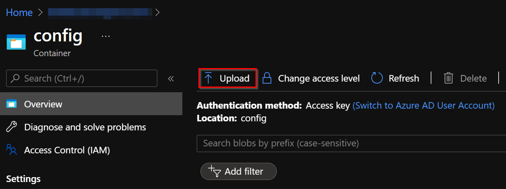
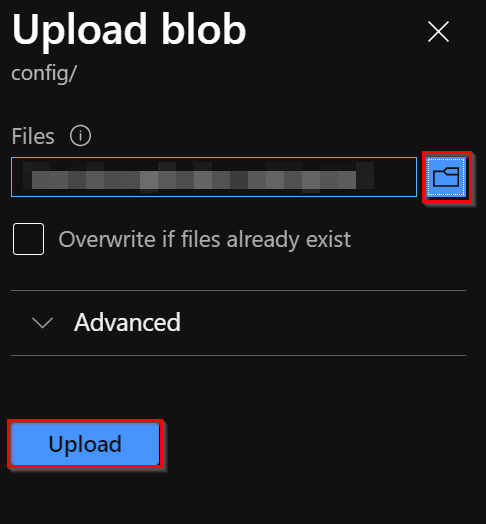

# Storage Account

## Getting Started

This document shows how to create and configure the Storage account for the solution core components. This Storage account will be used to store the environment settings in `json` format and the queues that are consumed by the Azure Functions. If you want to delegate the installation of the wildcard SSL certificate to the Bot Service, you will also store the certificate in `pfx` format in this storage account.

To create a Storage account in Azure, please review the following Microsoft [documentation](https://docs.microsoft.com/en-us/azure/storage/common/storage-account-create?tabs=azure-portal).

## Dependencies
Although there are no dependencies with other Azure resources to create this resource, note that some configuration values from other resources will be required.

The following list shows the resources required to complete the configuration of this Storage account:

- [Azure Bot app registration](../prerequisites/azure_bot.md).
- [Cosmos DB](cosmos_db.md).
- [SSL Certificate](../prerequisites/readme.md).
- [Azure Virtual Machine (where the bot service is hosted)](virtual_machine.md).
- [Management API](web_app_and_app_service_plan.md).
- [Bot Service API app registration](app_registrations.md#how-to-setup-bot-service-api-app-registration).
- [Application Insights](application_insights.md).

### Settings
Create this storage account with the following settings:
- ***Resource Group:*** Select the [resource group](readme.md#architecture-resource-group) created for the solution architecture.
- ***Storage account Name***: A meaningful name.
- ***Region***: Same region as the rest of the resources.
- ***Performance***: Standard.
- ***Redundancy***: Locally-redundant storage (LRS).

> **NOTE:** You will need the **Access keys** (`key1` and `Connection string`) later to configure the project, so register them as soon as it is visible from the Azure portal.

Leave the rest of the settings as-is.

Once this Storage account is created, create a new container with the following settings: 

- ***Name***: config.
- ***Public access level***: private.

To create a new Container, please review the following Microsoft [documentation](https://docs.microsoft.com/en-us/azure/storage/blobs/storage-quickstart-blobs-portal#create-a-container)

Once the config container is created, upload the Bot Service settings in it. If you plan to delegate the installation of the certificate to the Bot Service, will need to upload the wildcard SSL certificate files to it too.

### Environment ***.json*** file settings example:
Below there is a json file template with placeholders values you need to complete and upload to storage account before using the bot for the first time.

```json
{
 "Logging": {
    "LogLevel": {
      "Default": "Information",
      "Microsoft": "Warning",
      "Microsoft.Hosting.Lifetime": "Information"
    }
  },
  "AllowedHosts": "*",
	"HttpServer":{
          "Endpoints":{
              "Http":{
                  "Host": "{{virtualMachineDnsCname}}",
                  "Port": 80,
                  "Scheme": "http"
              },
              "Https":{
                  "Host": "{{virtualMachineDnsCname}}",
                  "Port": 443,
                  "Scheme": "https"
              }
          }
    },
  "Settings": {
    "GraphClientConfiguration": {
      "TenantId": "{{tenantIdAzureBotAppRegistration}}",
      "ClientId": "{{clientIdAzureBotAppRegistration}}",
      "ClientSecret": "{{clientSecretAzureBotAppRegistration}}"
    },
    "CosmosDbConfiguration": {
      "EndpointUrl": "{{cosmosDbEndpointUrl}}",
      "PrimaryKey": "{{cosmosDbPrimareyKey}}",
      "DatabaseName": "{{cosmosDbDatabaseName}}",
    },
    "BotConfiguration": {
      "ServiceDnsName": "{{virtualMachineDnsCname}}",
      "ServiceCname": "{{virtualMachineDnsCname}}",
      "PlaceCallEndpointUrl": "https://graph.microsoft.com/beta",
      "AadAppId": "{{clientIdAzureBotAppRegistration}}",
      "AadAppSecret": "{{clientSecretAzureBotAppRegistration}}",
      "NumberOfMultiviewSockets": 3,
      "InstanceInternalPort": 8445,
      "InstancePublicPort": 8445,
      "ServiceFqdn": "{{virtualMachineDnsCname}}",
      "CertificatePassword": "{{pfxCertificatePassword}}",
      "CertificateThumbprint":"{{pfxCertificateThumbprint}}",
      "MainApiUrl":"{{managementApiURl}}",
      "VirtualMachineName": "{{virtualMachineName}}"
    },
    "AzureAdConfiguration": {
      "Instance": "https://login.microsoftonline.com/",
      "TenantId": "{{tenantIdAzureBotServiceApiClientId}}"
    },
    "BotServiceAuthenticationConfiguration": {
      "BotServiceApiClientId": "{{botServiceApiClientId}}",
    }
  },
  "APPINSIGHTS_INSTRUMENTATIONKEY": "{{appInsightsKey}}"
}
```
> **NOTE:** The Bot Service appsettings will be completed in later steps.

### Placeholder specification table

| Placeholder                            | Description                                                                         |
|----------------------------------------|-------------------------------------------------------------------------------------|
| virtualMachineDnsCname                 | Full domain name assigned to the virtual machine where the bot service is hosted. E.g.: If your wildcard certificate is for *.domain.co and you added the cname botservicevm to the IP address of the virtual machine, the domain name will be botservicevm.domain.co. |
| tenantIdAzureBotAppRegistration        | Tenant Id of the [Azure Bot](../prerequisites/azure_bot.md) app registration.       |
| clientIdAzureBotAppRegistration        | Client Id of the [Azure Bot](../prerequisites/azure_bot.md) app registration.       |
| clientIdAzureBotAppRegistration        | Client secret of the [Azure Bot](../prerequisites/azure_bot.md) app registration.   |
| cosmosDbEndpointUrl                    | Endpoint URL of the [Cosmos DB](cosmos_db.md) created.                              |
| cosmosDbPrimareyKey                    | Primary key of the [Cosmos DB](cosmos_db.md) created.                               |
| cosmosDbDatabaseName                   | Database name of the [Cosmos DB](cosmos_db.md) created.                             |
| pfxCertificatePassword                 | **Only needed if you want to delegate the installation of your certificate to the Bot Service**. Password of the wildcard certificate uploaded to the Storage account.               |
| pfxCertificateThumbprint               | Thumbprint of the wildcard certificate uploaded to the Storage account.             |
| managementApiURl                       | URL of the [Management API](web_app_and_app_function.md) (without https:// prefix). |
| tenantIdAzureBotServiceApiClientId     | Tenant Id of the app registration for the [Bot Service API](app_registrations.md#how-to-setup-bot-service-api-app-registration).          |
| botServiceApiClientId                  | Client Id of the app registration for the [Bot Service API](app_registrations.md#how-to-setup-bot-service-api-app-registration). |
| appInsightsKey                         | Application Insights key of the [Application Insights](application_insights.md) resource. |

## Upload file to container
Here's explains how to upload the `json file` into the container that was created.

1. From the container created, click on **Upload**.

    

1. You must select the `json file` that we created in previous step, and then to finish the upload, click on **Upload**.

    

## Generate SAS Token
 In order to get access to the container created from the Bot Service API we need to generate a Shared access signature, please review the following Microsoft [documentation](https://docs.microsoft.com/en-us/azure/cognitive-services/translator/document-translation/create-sas-tokens?tabs=Containers)

Create this SAS tokens with the following settings:
- ***Signing method*** Account key.
- ***Signing key***: Key 1.
- ***Permissions***: Read.
- ***Start and expiry data/time***: Select the Time zone for the Start and Expiry date and time (default is Local).
- ***Redundancy***: Locally-redundant storage (LRS).
- ***Allowed protocols:*** HTTPS only.

> **NOTE:** You will need the `Blob SAS token` later to configure the project, so register it as soon as it is visible from the Azure portal.

[← Back to How to Run the Solution in Azure](README.md#how-to-run-the-solution-in-azure)
