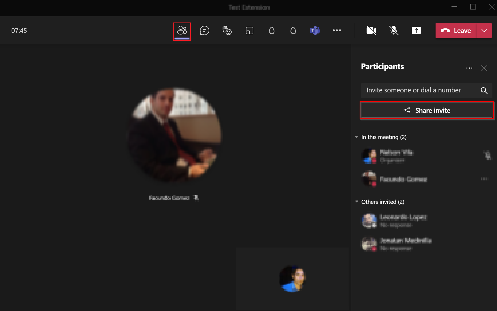
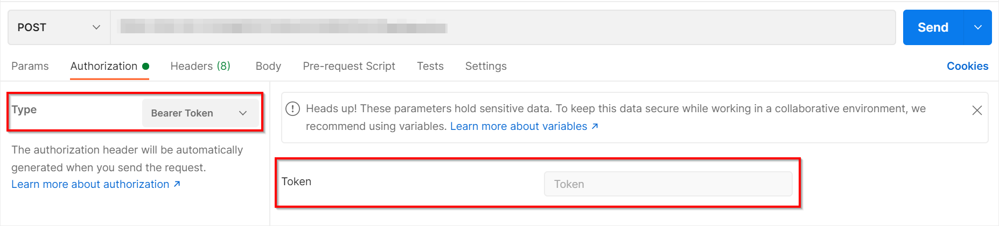
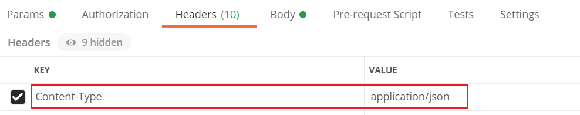
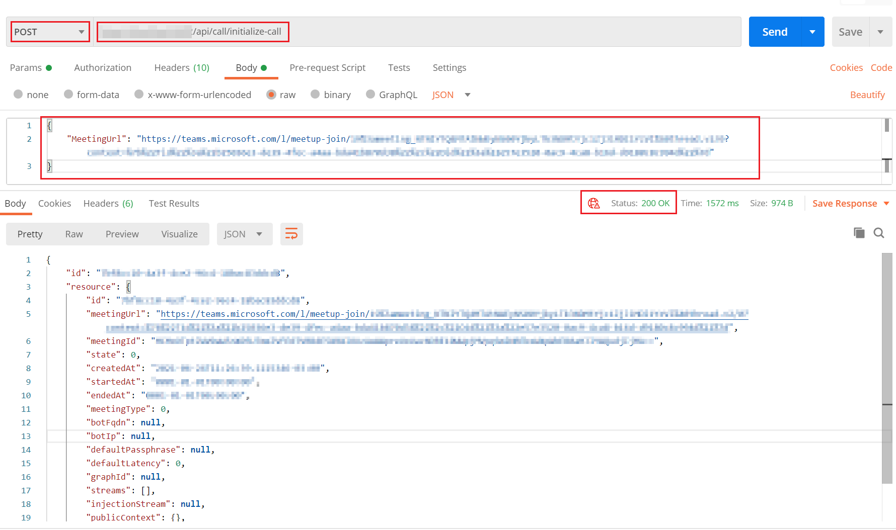

# How to test the Management API

To verify that the **Management API** is running properly we will use [Postman](https://identity.getpostman.com/signup?continue=https%3A%2F%2Fgo.postman.co%2Fbuild) to join the bot to a Microsoft Teams meeting.

1. [Create](https://support.microsoft.com/en-us/office/schedule-a-meeting-in-teams-943507a9-8583-4c58-b5d2-8ec8265e04e5) a new Microsoft Teams meeting and join it.

    
2. Once you have joined the meeting **copy** the invitation link from the meeting and we will use it to join the bot to that meeting.
3. Open **Postman** and create a new POST request pointing to the following address: `https://{{webAppUrl}}/api/call/initialize-call`.
    > **NOTE:** Replace the placeholder `{{webAppUrl}}` with the URL of the [Web App](web_app_and_app_service_plan.md) created in previous steps.

4. You must now obtain the token that allows validation to use the **Management API** endpoints. Check the following [documentation](authorization_token.md), which explains how to obtain the token.
5. Once the token is obtained, in the authorization tab, select `Bearer Token` for `Type` and add the authorization token in the corresponding input.
    

6. In the header tab, add (if it does not exist) a new key `Content-Type` with the value `application/json`.
    

7. In the **Body** tab select **raw** and complete by copying the following:

    ```json
    {
        "MeetingUrl": "{{microsoftTeamsInviteLink}}"
    }
    ```

    | Placeholder              | Description                  |
    |--------------------------|------------------------------|
    | microsoftTeamsInviteLink | Microsoft Teams invite link. |

8. Click on the **Send** button and the request will be sent to the solution, you should receive a response with status `200 Ok` and after a few seconds the bot should join the Microsoft Teams meeting.

    

[← Back to How to Run the Solution in Azure](README.md#how-to-run-the-solution-in-azure)
