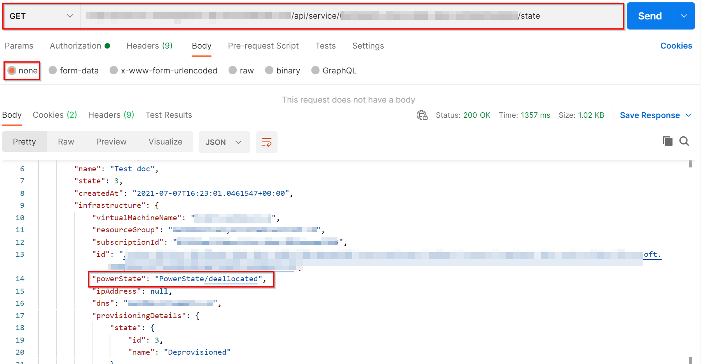
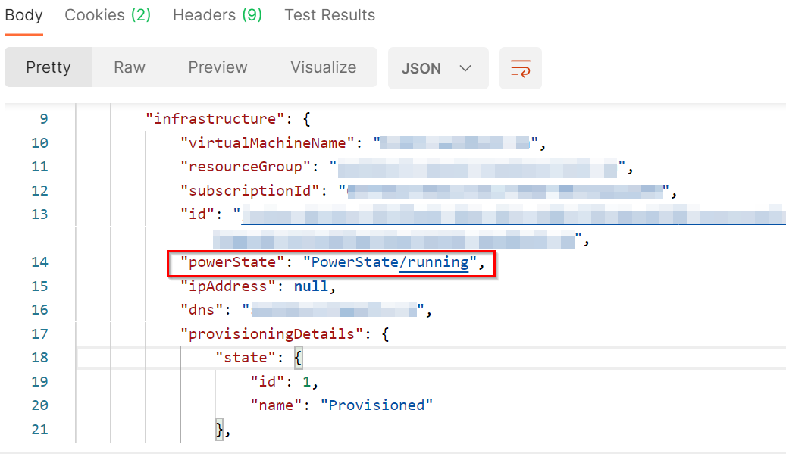
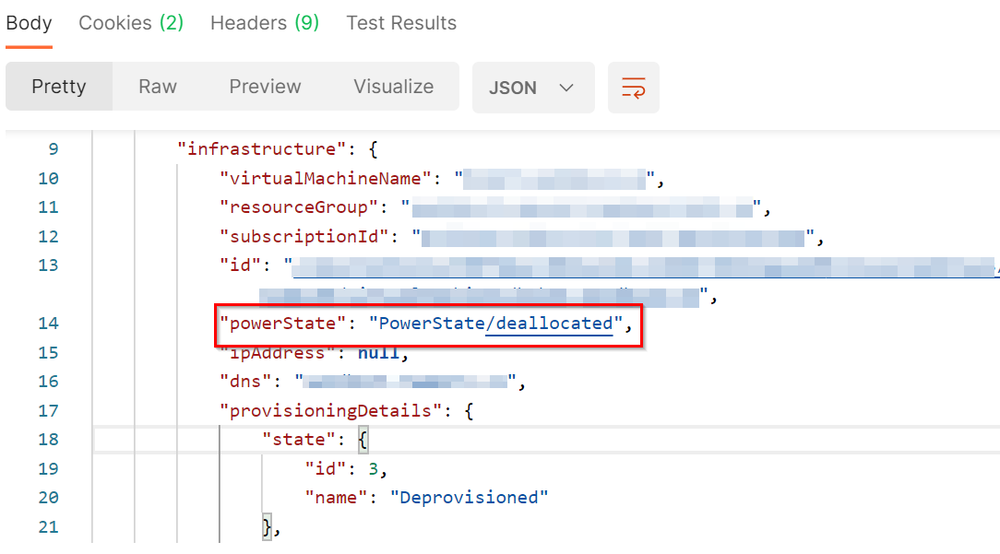
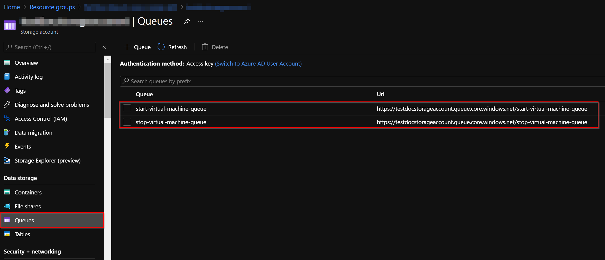

# How to test the Orchestrator Function

## Getting Started

To verify that the **Orchestrator Function** is executing correctly, we will use [Postman](https://identity.getpostman.com/signup?continue=https%3A%2F%2Fgo.postman.co%2Fbuild) using endpoints of the **Management API** to consult the state of the service, start/stop service, where the calls will place a message in the queue of the [Storage Account](storage_account.md) created in the previous steps, and this will trigger the corresponding function (`start-virtual-machine` and `stop-virtual-machine`). 

### Check Service State

1. Open **Postman** and create a new **GET** request pointing to the following address: `https://{{webAppUrl}}/api/service/{{serviceId}}/state`.
    > **NOTE:** Replace the placeholder `{{webAppUrl}}` with the URL of the [Web App](web_app_and_app_service_plan.md) created in the previous steps.For the placeholder `serviceId`, enter the id of the [Service](add_service.md) obtained in the previous steps.
1. You must now obtain the token that allows validation to use the **Management API** endpoints. Check the following [documentation](authorization_token.md), which explains how to obtain the token.
1. Once the token is obtained, in the authorization tab, select `Bearer Token` for `Type` and add the authorization token in the corresponding input.

    
1. In the header tab, add (if it does not exist) a new key `Content-Type` with the value `application/json`.

    
1. In the **Body** tab select **none**.

1. Then click the button **Send** and the request will be sent to the API, you should receive a response with the status `200` Ok and in the property `powerState` of the **json** response you can see the current service status.

    

### Start Service
1. You must create **New tab**, within Postman go to **File** > **New Tab**.

1. Create a new **POST** request pointing to the following address: `https://{{webAppUrl}}/api/service/{{serviceId}}/start`.
    > **NOTE:** Replace the placeholder `{{webAppUrl}}` with the URL of the [Web App](web_app_and_app_service_plan.md) created in the previous steps.For the placeholder `serviceId`, enter the id of the [Service](add_service.md) obtained in the previous steps.

1. Use the same authorization and content-type configurations from the [Check Service State](#check-service-state) section (from steps **2** to **5**).

1. Then click the button **Send** and the request will be sent to the API, you should receive a response with the status `200` OK. If we wait a few minutes and you go back to [check Service state](#check-service-state), you will notice that in the property` powerState` of the **json** returned it will be `PowerState/running`, which indicates that the Service is started.

    

### Stop Service

1. You must create **New tab**, within Postman go to **File** > **New Tab**.

1. Create a new **POST** request pointing to the following address: `https://{{webAppUrl}}/api/service/{{serviceId}}/stop`.
    > **NOTE:** Replace the placeholder `{{webAppUrl}}` with the URL of the [Web App](web_app_and_app_service_plan.md) created in the previous steps.For the placeholder `serviceId`, enter the id of the [Service](add_service.md) obtained in the previous steps.

1. Use the same authorization and content-type configurations from the [Check Service State](#check-service-state) section (from steps **2** to **5**).

1. Then click the button **Send** and the request will be sent to the API, you should receive a response with the status `200` OK. If we wait a few minutes and you go back to [check Service state](#check-service-state), you will notice that in the property` powerState` of the **json** returned it will be `PowerState/deallocated`, which indicates that the Service is stopped.

    

### Queue Creations after having started and stoped the Service

Once the endpoints have been called to **start** and **stop** the Service, within our Storage Account in the **Queues** section, we can verify that two queues were created (`start-virtual-machine-queue` and `stop-virtual-machine-queue`) corresponding to each action. They are empty since the messages were dequeued when they were triggered by the corresponding function.

[← Back to How to Run the Solution in Azure](README.md#how-to-run-the-solution-in-azure)