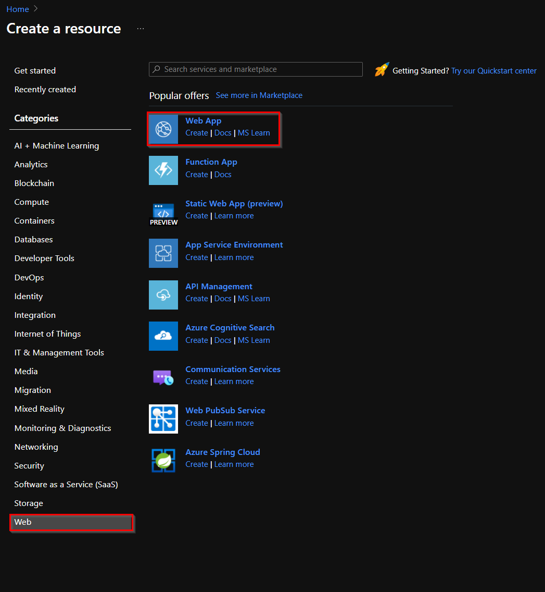
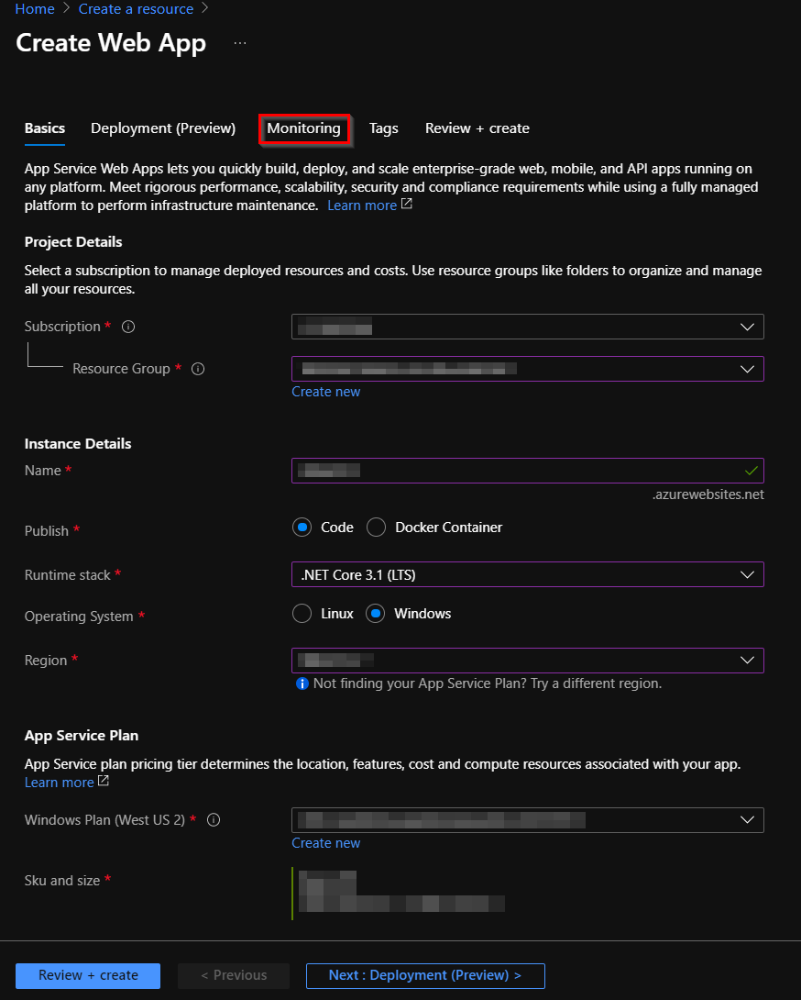
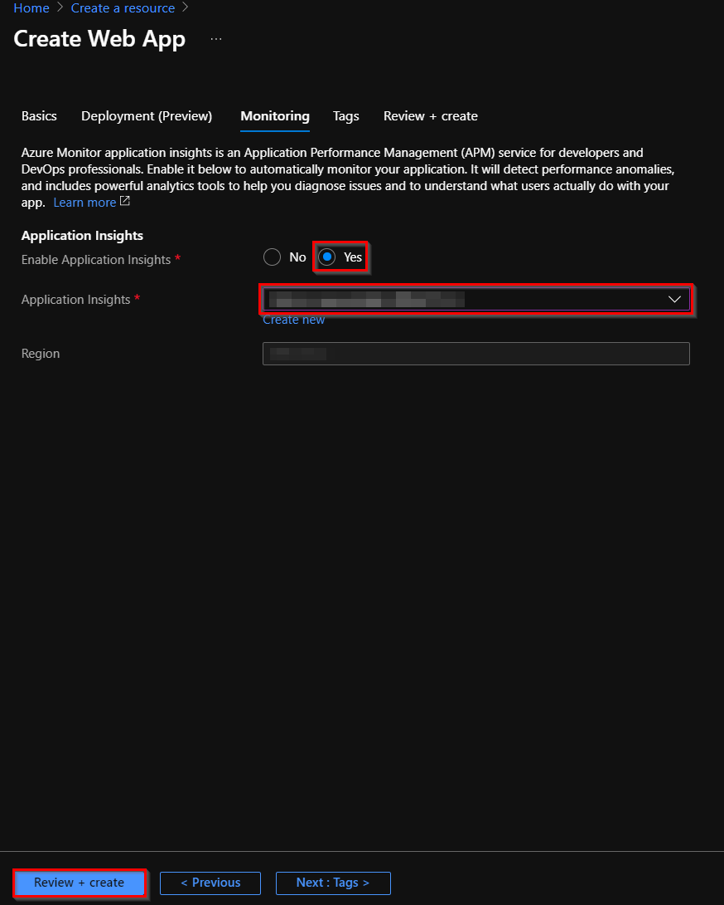

# Web App

## Introduction
In order to host the Management API, a Web App service must be created. This document is intend to show, how to create a Web App in the resource group created for the architecture solution.

## Dependencies
To create the Web App needed to deploy the Management API, the following resources must be already created:

- [App Service Plan](service_plan.md).
- [Application Insight](application_insights.md). 

### Settings
Fill the fields in the creation wizard with the following information: 

- ***Basic:***
    - ***Resource Group:*** Select the [resource group](./readme.md#architecture-resource-group) created for the solution architecture.
    - ***Name:*** A meaningful name.
    - ***Publish:*** Code.
    - ***Runtime stack:*** .NET Core 3.1 (LTS).
    - ***Operating System:*** Windows.
    - ***Region:*** Same region as the rest of the resources.
    - ***App Service Plan:*** 
        - ***Windows plan:*** Select the [App Service plan](service_plan.md) created in the previous steps. 
    
- ***Monitoring:*** Enable [application insights](./application_insights.md) and select the instance that was created in a previous step.

### Create Web App in Azure
1. In the [Azure Portal](https://portal.azure.com/), click **Create a resource** > **Web** > **Web App**.

    
1. Select the subscription and complete the fields following the indications in the previous section, and then press the tab **Monitoring**.
    
    
1. Enable the Application Insights by checking the option **Yes**, and select the Application Insights created in previous steps, then press the button **Review + create**.

    
1. Verify the information created and click on the **Create** button to finish with the creation.

[← Back to How to Run the Solution in Azure](README.md#how-to-run-the-solution-in-azure)