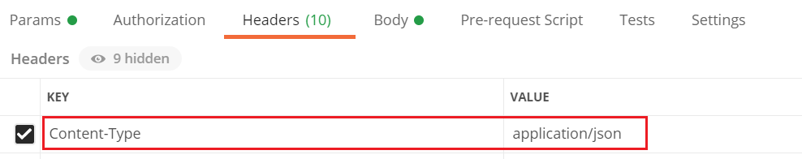

# How to run the solution locally

## About
This document details the required software to be installed and the necessary steps you must follow to configure and run the solution locally.

## Getting Started

- [Requirements](#requirements)
  - [Microsoft Azure Storage Emulator](#microsoft-azure-storage-emulator)
  - [Visual Studio 2019](#visual-studio-2019)
  - [Cosmos DB Emulator](#cosmos-db-emulator)
  - [GStreamer](#gstreamer)
  - [Ngrok](#ngrok)
  - [Domain Certificate](#domain-certificate)
- [Configure the Backend Solution to run locally](#configure-the-backend-solution-to-run-locally)
  - [Configure Bot Orchestrator](#configure-bot-orchestrator)
  - [Configure Management Api](#configure-management-api)
  - [Configure BotService](#configure-botservice)
  - [Configure Solution](#configure-solution)
- [Run the solution](#run-the-solution)
- [Testing the application](#testing-the-application)

## Requirements
### Microsoft Azure Storage Emulator
Download and Install [Azure Storage Emulator](https://docs.microsoft.com/en-us/azure/storage/common/storage-use-emulator#get-the-storage-emulator)

### Visual Studio 2019
Download and Install [Visual Studio Community 2019](https://visualstudio.microsoft.com/thank-you-downloading-visual-studio/?sku=Community)

* [.NET Core SDK 3.1](https://dotnet.microsoft.com/download/dotnet-core/3.1) (should be already included with VS)
* [Microsoft Visual C++ 2015-2019 Redistributable](https://support.microsoft.com/en-us/help/2977003/the-latest-supported-visual-c-downloads) (x64) (should be already included with VS)

### Cosmos DB Emulator
Download [Azure Cosmos DB emulator](https://docs.microsoft.com/en-us/azure/cosmos-db/local-emulator?tabs=ssl-netstd21) and install.

Open the Azure Cosmos DB emulator, it will open a new browser tab and will show the `Quickstart` view.

||
|:--:|
|*Cosmos DB Emulator Data Explorer*|

> Copy the value of the primary key, you will use it later.

### GStreamer
Download and Install [GStreamer MinGW 64-bit 1.18.4](https://gstreamer.freedesktop.org/download/#windows) selecting the `Complete` installation mode.

||
|:--:|
|*GStreamer Installer: Select Complete Mode*|

Once GStreamer is installed you need to verify and copy the path to the bin directory where gstreamer was installed. For example if GStreamer was installed on the C drive the path would look like this: "C:\gstreamer\1.0\mingw_x86_64\bin".

||
|:--:|
|*Copy the Gstreamer bin Path*|

After that, you need to add the path of the gstreamer bin directory to the environment variables path. To do so, select the `edit the system environment variables` option in the control panel or press the windows start button, type `environment variables` and select the respective option.

||
|:--:|
|*Edit System Environment Variables Option*|

Click on the `environment variables` button near the bottom of the window. A new window will open where you must select the path variable and click on the `edit` button.

||
|:--:|
|*Environment Variables window*|

Once the window to edit the environment variable is open, click on the `new` button and add the path to the GStreamer bin directory you copied earlier.

||
|:--:|
|*Add the GStreamer bin path value to the Path Environment Variable*|

> It is not necessary to repeat this procedure every time you are going to run the solution locally, it should only be done before run it for the first time.

### Ngrok

To run the solution locally you will need to use [Ngrok](https://dashboard.ngrok.com/signup) so it is necessary to create a free account and [download](https://www.ngrok.com/download) it.

Once downloaded, unzip the exe file in a new directory `C:\ngrok`.

Login to Ngrok account and in the left menu, in the `Getting Started` section, select the option `Your Authtoken` and copy it. You will use this token to configure your instance of ngrok.

||
|:--:|
|*Copy the Ngrok Authtoken*|

Go to the directory `C:\ngrok` where you unzipped ngrok and create a new file named `ngrok.yml`. To create the config file you can use your editor of preference, in this example we will use [Visual Studio Code (vscode)](https://code.visualstudio.com/).

### Creating config file

1. Open vscode
2. Go to File -> New file (or press Ctrl+N)


||
|:--:|
|*Create new file*|

3. Select yaml as language

||
|:--:|
|*Select language*|

4. Copy the following configuration into the yaml file and replace the text `{{PUT YOUR AUTHTOKEN HERE}}` with the value of the authtoken copied earlier from the Ngrok dashboard.

```json
authtoken: {{PUT YOUR AUTHTOKEN HERE}}
tunnels:
 signaling:
  addr: 9441
  proto: http
 media:
  addr: 8445
  proto: tcp
```

||
|:--:|
|*Config file example*|

5. Go to File -> Save (or press Ctrl+S), enter the name of your file (ngrok.yml in this example) and save it in ngrok's folder

||
|:--:|
|*Save file*|

||
|:--:|
|*Example result*|

>You only need to perform this initial configuration of ngrok the first time you configure the solution, then you do not need to repeat it again.

### Run Ngrok

To run ngrok, go to the `C:\ngrok` directory and open a terminal in that location and run the following command (or open your terminal of preference and navigate to the ngrok's folder):

`ngrok start --all --config ngrok.yml`

> You can open a taerminal window by holding down the shift key and clicking on an empty area of the window and selecting the option "Open PowerShell window here".
>||
>|:--:|
>|*How to open a console in a directory*|

Once this command is executed a message like the following will be displayed, this window should not be closed while using the solution.

||
|:--:|
|*Ngrok running on the console*|

>You must run ngrok every time that you want to run the solution locally by executing the command mentioned before.

> ***OPTIONAL:*** Add `C:\ngrok` path where the .exe file is located to the Path environment variable. If you add it, you will not have to change the directory in the terminal every time you want to run ngrok.

### Domain Certificate
Having the [pfx certificate mentioned in the prerequisites](../prerequisites/readme.md) double click on it to run the certificate import wizard.

On the first screen, select `Local machine` as the Store Location and click `Next` (Windows may ask for administrator rights).

||
|:--:|
|*Certificate Import Wizard*|

Click `Next` on the File to import step.

In the Privacy Key Protection step, the wizard will ask for the password to read the certificate's private key, complete it and leave the rest of the settings as-is and click next.

||
|:--:|
|*Complete the password to read the certificate*|

Finally, in the Certificate Store selection, click on `Browse` and select `Personal`. Then continue with the rest of the wizard.

Later it will be necessary to obtain the certificate thumbprint to complete the botservice configuration. To obtain it press Win+R keys, complete the input with `certlm.msc` and press `Ok`.

||
|:--:|
|*Complete the input and press Ok*|

Navigate to `Certificates - Local Computer\Personal\Certificates`, search for the name of the certificate and open it (Either by double clicking or left click and open).

||
|:--:|
|*Search the certificate and open it*|

Go to details tab and search for Thumbprint field, select it, and copy its value, you will use it later.

||
|:--:|
|*Copy the thumbprint of the certificate*|

## Configure the Backend Solution to run locally

The solution is composed by 3 main projects:
- **BotOrchestrator:** The Azure Functions used to execute some of the features in the solution.
- **ManagementApi:** The project containing the management API that is used to interact with the solution.
- **BotService:** A self-hosted API/application-hosted media bot that hosts the media session. As part of its core componentes, it includes  the GStreamer pipelines that are in charge of processing the media and devliver it in SRT/RTMP.


Each of the three projects have configuration files that must be updated separately in order to run the solution locally. To do so, run Visual Studio 2019 as administrator, right click on the Visual Studio icon and click the `Run as administrator` option. It is very important to open it as administrator otherwise the solution will not run correctly.

||
|:--:|
|*Select 'Run as administrator' option*|

In the Visual Studio menu select `"File" > "Open" > "Project / Solution"` and select the `Broadcaster.sln` file in the src folder of the solution.

### Configure Bot Orchestrator

In the solution explorer, go to the `BotOrchestrator` project (under `src/applications`) and create a new configuration file with the name `local.settings.json` 

```json
{
  "IsEncrypted": false,
  "Values": {
    "AzureWebJobsStorage": "UseDevelopmentStorage=true",
    "FUNCTIONS_WORKER_RUNTIME": "dotnet",
    "BROADCASTER_ENVIRONMENT": "local",
    "APPINSIGHTS_INSTRUMENTATIONKEY": "{{appInsightInstrumentationKey}}",
    "BuildVersion": "local-Api",
    "CosmosDbConfiguration:EndpointUrl": "https://localhost:8081",
    "CosmosDbConfiguration:DatabaseName": "{{cosmosDbDatabaseName}}",
    "CosmosDbConfiguration:PrimaryKey": "{{cosmosDbPrimaryKey}}",
    "AzServicePrincipalConfiguration:ApplicationClientId": "",
    "AzServicePrincipalConfiguration:ApplicationClientSecret": "",
    "AzServicePrincipalConfiguration:SubscriptionId": "",
    "AzServicePrincipalConfiguration:TenantId": "",
    "AzureAdConfiguration:Instance": "https://login.microsoftonline.com/",
    "AzureAdConfiguration:TenantId": "",
    "BotServiceAuthenticationConfiguration:BotServiceApiClientId": "",
    "BotServiceAuthenticationConfiguration:ClientId": "",
    "BotServiceAuthenticationConfiguration:ClientSecret": ""
  }
}
```

Placeholder | Description 
---------|----------
appInsightInstrumentationKey | ***`Optional:`*** by default leave it empty. If you want to store the logs and have an instance of Application Insights you can enter its instrumentation key.
cosmosDbPrimaryKey | [Azure Cosmos DB Emulator primary key, can be found in the data explorer of the emulator](#cosmos-db-emulator).
cosmosDbDatabaseName | Name of the database that the solution will create in Cosmos DB Emulator. E.g.: `BroadcastDevelopmentKitDb`

### Configure Management Api

In the solution explorer, go to the `ManagementApi` project (under `src/applications`), open the `Properties` folder and replace the `launchSettings.json` with the following configuration.

```json
{
  "profiles": {
    "ManagementApi": {
      "commandName": "Project",
      "launchBrowser": true,
      "environmentVariables": {
        "ASPNETCORE_ENVIRONMENT": "local",
        "BROADCASTER_ENVIRONMENT": "local"
      },
      "applicationUrl": "https://localhost:8442;http://localhost:8441"
    }
  }
}
```

Then, in the root of the project, create a new configuration file with the name `appsettings.local.json` and copy the following configuration into it.

```json
{
  "Logging": {
    "LogLevel": {
      "Default": "Information",
      "Microsoft": "Warning",
      "Microsoft.Hosting.Lifetime": "Information"
    }
  },
  "APPINSIGHTS_INSTRUMENTATIONKEY": "{{appInsightInstrumentationKey}}",
  "Settings": {
    "BuildVersion": "local-Api",
    "GraphClientConfiguration": {
      "TenantId": "{{tenantIdAzureBotAppRegistration}}",
      "ClientId": "{{clientIdAzureBotAppRegistration}}",
      "ClientSecret": "{{clientSecretAzureBotAppRegistration}}"
    },
    "CosmosDbConfiguration": {
      "EndpointUrl": "https://localhost:8081",
      "PrimaryKey": "{{cosmosDbPrimaryKey}}",
      "DatabaseName": "{{cosmosDbDatabaseName}}"
    },
    "StorageConfiguration": {
      "ConnectionString": "UseDevelopmentStorage=true",
    }
  }
}
```

Placeholder | Description 
---------|----------
appInsightInstrumentationKey | ***`Optional:`*** by default leave it empty or if you have an instance of Application Insights you can store the log messages by entering an instrumentation key.
tenantIdAzureBotAppRegistration | Tenant Id of Azure Bot [app registration](../prerequisites/azure_bot.md).
clientIdAzureBotAppRegistration | Client Id of Azure Bot [app registration](../prerequisites/azure_bot.md).
clientSecretAzureBotAppRegistration | Client secret of Azure bot [app registration](../prerequisites/azure_bot.md).
cosmosDbPrimaryKey | [Azure Cosmos DB Emulator primary key, can be found in the data explorer of the emulator](#cosmos-db-emulator).
cosmosDbDatabaseName | Name of the database that the solution will create in Cosmos DB Emulator.  E.g.: `BroadcastDevelopmentKitDb`


### Configure BotService

In the solution explorer, go to the `BotService` project (under `src/applications`), open the `Properties` folder and replace the `launchSettings.json` with the following configuration.

```json
{
  "profiles": {
    "BotService": {
      "commandName": "Project",
      "launchBrowser": true,
      "environmentVariables": {
        "BROADCASTER_ENVIRONMENT": "local",
        "ASPNETCORE_ENVIRONMENT": "Development",
        "CERTIFICATE_FILE_NAME": "{{certificateName}}",
        "GST_DEBUG": "3"
      },
      "applicationUrl": "https://localhost:9442;http://localhost:9441"
    }
  }
}
```

Placeholder | Description
---------|----------
certificateName | Name of the installed Certificate (e.g: `certificate.co.pfx`) 

Then, in the root of the project, create a new configuration file with the name `appsettings.local.json` and copy the following configuration into it.

```json
{
  "Logging": {
    "LogLevel": {
      "Default": "Information",
      "Microsoft": "Warning",
      "Microsoft.Hosting.Lifetime": "Information"
    }
  },
  "AllowedHosts": "*",
  "HttpServer": {
    "Endpoints": {
      "Http": {
        "Host": "localhost",
        "Port": 9441,
        "Scheme": "http"
      },
      "Https": {
        "Host": "localhost",
        "Port": 9442,
        "Scheme": "https"
      }
    }
  },
  "Settings": {
    "GraphClientConfiguration": {
      "TenantId": "{{tenantIdAzureBotAppRegistration}}",
      "ClientId": "{{clientIdAzureBotAppRegistration}}",
      "ClientSecret": "{{clientSecretAzureBotAppRegistration}}"
    },
    "CosmosDbConfiguration": {
      "EndpointUrl": "https://localhost:8081",
      "PrimaryKey": "{{cosmosDbPrimaryKey}}",
      "DatabaseName": "{{cosmosDbDatabaseName}}"
    },
    "BotConfiguration": {
      "ServiceDnsName": "{{ngrokUrl}}",
      "ServiceCname": "{{ngrokUrl}}",
      "PlaceCallEndpointUrl": "https://graph.microsoft.com/beta",
      "AadAppId": "{{clientIdAzureBotAppRegistration}}",
      "AadAppSecret": "{{clientSecretAzureBotAppRegistration}}",
      "NumberOfMultiviewSockets": 3,
      "InstanceInternalPort": 8445,
      "InstancePublicPort": "{{instancePublicPort}}",
      "ServiceFqdn": "{{serviceFqdn}}",
      "CertificatePassword": "{{certificatePassword}}",
      "CertificateThumbprint": "{{certificateThumbprint}}",
      "MainApiUrl": "localhost:8442"
    }
  },
  "APPINSIGHTS_INSTRUMENTATIONKEY": "{{appInsightInstrumentationKey}}"
}
```

Placeholder | Description
|-|-|
botServiceHttpsPort | BotService Https port configured in botService launchsettings
botServiceHttpPort | BotService Http port configured in botService launchsettings
tenantIdAzureBotAppRegistration | Tenant Id of the [app registration](../prerequisites/azure_bot.md).
clientIdAzureBotAppRegistration | Client Id of the [app registration](../prerequisites/azure_bot.md).
clientSecretAzureBotAppRegistration | Client secret of the [app registration](../prerequisites/azure_bot.md).
cosmosDbPrimaryKey | [Azure Cosmos DB Emulator primary key, can be found in the data explorer of the emulator](#cosmos-db-emulator).
cosmosDbDatabaseName | Name of the database that the solution will create in Cosmos DB Emulator.  E.g.: `BroadcastDevelopmentKitDb`
certificatePassword | Password of the  installed certificate.
certificateThumbprint | Thumbprint of the installed certificate.
appInsightInstrumentationKey | ***`Optional:`*** by default leave it empty or if you have an instance of Application Insights you can store the log messages by entering an instrumentation key.

 To finish Configure the configuration file you have to use ngrok. The following image serves as a guide to know in a simple way where to take the values.

| |
|:--:|
|*Where to take the values from Ngrok*|

Placeholder | Description
|-|-|
ngrokUrl | Fill both values of NgrokHttp with the red marked value (1) from the ngrok console (e.g: `66c0b316671d.ngrok.io`)
instancePublicPort | Complete with the value of the port marked in yellow (2) in the ngrok console (e.g: `16186`)
serviceFqdn | Complete with value with value marked with green (3) in the ngrok console and the domain name. (e.g: `4.domain.co`) It is necessary to  add a DNS record pointing to ngrok's TCP Url. (e.g: 4.domain.co -> 4.tcp.ngrok.io).

> Since we suggest to use a free ngrok account, you will need to update the Ngrok settings in this file every time you start a new instance of ngrok. Also, you will need to modify the DNS record.

### Configure solution

In the standard Visual Studio toolbar, click on the down arrow next to the start button and select `Set Startup Projects...`.

||
|:--:|
|*Select "Set Startup Projects..."*|

A new window will open, select `Multiple startup projects:` option and change the action of the following projects from `None` to `Start`:
- ManagementApi
- BotOrchestrator
- BotService

||
|:--:|
|*Update Actions properties to Start*|

In the solution explorer, right click on the `Botservice` project inside `src\applications` and click on the properties option. A New window will open and in the left menu, select `debug` and verify that the `Launch` configuration is set as `Project`. Verify also the `Launch` settings of the `ManagementApi` project

Make sure that [Cosmos DB](#cosmos-db-emulator) is running and press the `Start` Button in the Visual Studio Standard Toolbar.

||
|:--:|
|*Start button on Standard Toolbar*|

This first start-up will create the database with the name specified in the configuration files and the necessary containers. The start of the solution will fail with an error message displayed in the BotService console saying that the service is not found, so you have to proceed and add this record in the database.

||
|:--:|
|*BotService Error Message*|

Open Cosmos DB Data Explorer and in the left menu select explorer and then select the database created to run the solution.

||
|:--:|
|*Selec in the Service Container and then add a new Item*|

Select the `Service` container and then click on the `New Item` button and copy the following settings and click on `Save` button

```json
{
    "CallId": null,
    "Name": "Fake VM",
    "State": 1,
    "CreatedAt": "2021-06-09T11:05:37.2778107-03:00",
    "Infrastructure": {
        "VirtualMachineName": "localhost",
        "ResourceGroup": "",
        "SubscriptionId": "",
        "Id": "localhost",
        "PowerState": "PowerState/run",
        "IpAddress": "localhost:9442",
        "Dns": "localhost:9442",
        "ProvisioningDetails": {
            "Message": "",
            "State": {
                "Id": 1,
                "Name": "Provisioned"
            }
        }
    },
    "id": "00000000-0000-0000-0000-000000000000"
}
```

Press the `Start` button again and wait until all projects start. If the Solution does not start successfully, review the initial settings.

## Run the solution

Each time you are going to run the solution you need to perform the following steps:
- ***Run Azure cosmos DB emulator***: you can check that cosmos DB is run by verifying that the crosmos db logo is in the windows taskbar.
- ***Run Ngrok:*** It is necessary to have an instance of ngrok run in order to execute the solution. Once initialized, it is necessary to update the `appsettings.local.json` file of the `BotService` with the new values of the ngrok instance.
- ***NGINX*** *`Optional`*: If you want to perform locally RTMP injection into Microsoft Teams Meeting, you need to install and configure [NGINX](../common/install_and_configure_nginx_with_rtmp_module_on_windows.md)

Finally, run Visual Studio as administrator, open the solution and click the `Start` button on the standard Visual Studio toolbar and wait for all projects to start.

>Both the Management API and the BotService API should open a console windows and also browser windows (with no content in them). Check the port numbers in the browser windows as they should match with the ports configured in previous steps. If not, the incorrect profile might be selected in one of the projects.

## Testing the application

To verify that the solution is properly running we suggest to use [Postman](https://identity.getpostman.com/signup?continue=https%3A%2F%2Fgo.postman.co%2Fbuild) to join the bot to a Microsoft Teams meeting.

[Create](https://support.microsoft.com/en-us/office/schedule-a-meeting-in-teams-943507a9-8583-4c58-b5d2-8ec8265e04e5) a new Microsoft Teams meeting and join it.

||
|:--:|
|*Steps to copy the invite Link from Microsoft Teams*|

Once you have joined the meeting, copy the invitation link from the meeting.

Open postman and create a new POST request pointing to the following address: `https://localhost:8442/api/call/initialize-call` (is the same domain you have configured in the launchSettings of the managementApi)

In the header tab, add (if it does not exist) a new key `Content-Type` with the value `application/json`.

||
|:--:|
|*Postmant content-Type header*|

In the body tab select raw and complete by copying the following
```json
{
    "MeetingUrl": "{{microsoftTeamsInviteLink}}"
}
```

Placeholder | Description
---------|----------
 microsoftTeamsInviteLink | Microsoft Teams invite link 

 Click on the `Send` button and the request will be sent to the solution, you should receive a response with status `200 Ok` and after a few seconds the bot should join the Microsoft Teams meeting.

||
|:--:|
|*Test the solution with postman*|

