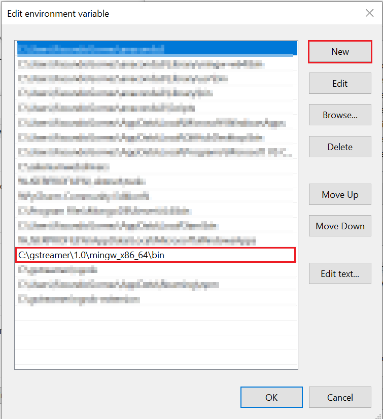

# GStreamer

Download and Install [GStreamer MinGW 64-bit 1.18.6](https://gstreamer.freedesktop.org/download/#windows) selecting the `Complete` installation mode.

||
|:--:|
|*GStreamer Installer: Select Complete Mode*|

Once GStreamer is installed you must add the bin directory to the `PATH` environment variable. To do so, you have two approaches:

- [GStreamer](#gstreamer)
  - [Using Powershell](#using-powershell)
    - [Output](#output)
  - [Manually](#manually)
  
## Using Powershell

If GStreamer was installed in the default location `C:\gstreamer\1.0\mingw_x86_64\bin` then open Powershell and run:

```sh
  .\scripts\Add-GStreamer-Path.ps1
```

If GStreamer was installer in a different location (e.g. `C:\Software\gstreamer\1.0\mingw_x86_64\bin`) then open Powershell and run:

```sh
  .\scripts\Add-GStreamer-Path.ps1 -GStreamPath "C:\Software\gstreamer\1.0\mingw_x86_64\bin"
```

### Output

```sh
  Added 'c:\gstreamer\1.0\mingw_x86_64\bin\' to PATH environment variable
```

## Manually

Once GStreamer is installed you need to verify and copy the path to the bin directory where gstreamer was installed. For example if GStreamer was installed on the C drive the path would look like this: "C:\gstreamer\1.0\mingw_x86_64\bin".

||
|:--:|
|*Copy the GStreamer bin Path*|

After that, you need to add the path of the gstreamer bin directory to the environment variables path. To do so, select the `edit the system environment variables` option in the control panel or press the windows start button, type `environment variables` and select the respective option.

||
|:--:|
|*Edit System Environment Variables Option*|

Click on the `environment variables` button near the bottom of the window. A new window will open where you must select the path variable and click on the `edit` button.

||
|:--:|
|*Environment Variables window*|

Once the window to edit the environment variable is open, click on the `new` button and add the path to the GStreamer bin directory you copied earlier.

||
|:--:|
|*Add the GStreamer bin path value to the Path Environment Variable*|

> It is not necessary to repeat this procedure every time you are going to run the solution locally, it should only be done before run it for the first time.

[← Back to How to run the solution locally](README.md#gstreamer) | [Next: NGINX →](README.md#nginx)
