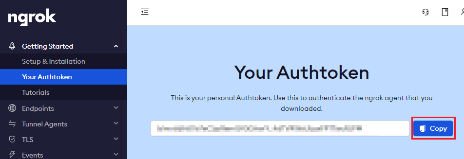
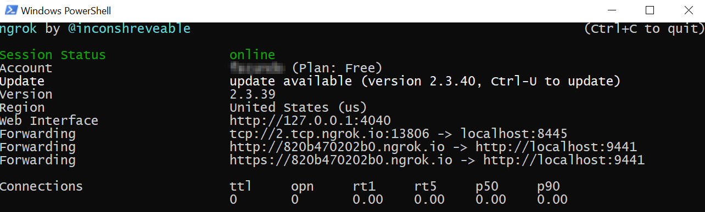

# Ngrok

Go to [Ngrok](https://dashboard.ngrok.com/signup) to create a free account and [download](https://www.ngrok.com/download) it.

## Get Authtoken

Login to Ngrok account and in the left menu, in the `Getting Started` section, select the option `Your Authtoken` and copy it. You will use this token to configure your instance of ngrok.

||
|:--:|
|*Copy the Ngrok Authtoken*|

## Install Ngrok

Unzip the .zip file that you downloaded in a new directory like `C:\ngrok`.

> ***OPTIONAL:*** Add `C:\ngrok` path where the .exe file is located to the Path environment variable. If you add it, you will not have to change the directory in the terminal every time you want to run ngrok.

## Setting up Ngrok

Go to the directory `C:\ngrok` where you unzipped ngrok and create a new file named `ngrok.yml`. To create the config file you can use your editor of preference, in this example we will use [Visual Studio Code (vscode)](https://code.visualstudio.com/).

Open the `.yml` file and copy the following configuration. Then replace the placeholder `{{PUT YOUR AUTHTOKEN HERE}}` with the value of the authtoken copied earlier from the Ngrok dashboard, and save changes.

```json
authtoken: {{PUT YOUR AUTHTOKEN HERE}}
tunnels:
 signaling:
  addr: 9441
  proto: http
 media:
  addr: 8445
  proto: tcp
```

>You only need to perform this initial configuration of ngrok the first time you configure the solution, then you do not need to repeat it again.

## Run Ngrok

To run ngrok, go to the `C:\ngrok` directory and open a terminal in that location and run the following command (or open your terminal of preference and navigate to the ngrok's folder):

`ngrok start --all --config ngrok.yml`

Once this command is executed a message like the following will be displayed, this window should not be closed while using the solution.

||
|:--:|
|*Ngrok running on the console*|

> NOTE: You must run ngrok every time that you want to run the solution locally by executing the command mentioned before. Free ngrok account does not provide static tunnels. Tunnels change every time a tunnel is created. So, if using free account, it is recommended to not close ngrok until it's use is completed.

[← Back to How to run the solution locally](README.md#ngrok) | [Next: Domain Certificate →](README.md#domain-certificate)
