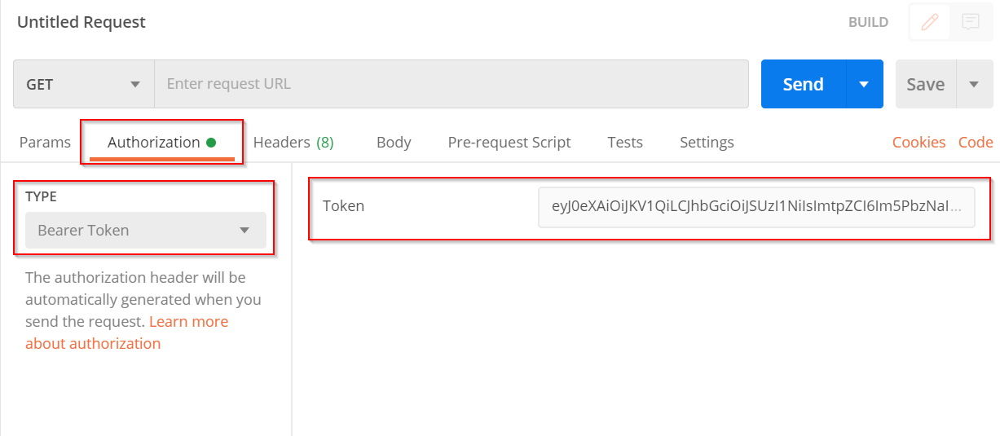

# [WIP] How to use the Backend solution
## Introduction
## Prerequisites
- Have the backend running (link to docs)  
- Download Postman

## Authorization
As endpoints in the solution are securitized in order to make requests to the API it is necessary to generate a bearer token and use it in the header of the requests, Otherwise, the API will respond to requests with HTTP error code 401 (Unauthorized).

## Client Credential Flow
### Create an App Registration


### How to generate a bearer token
Once the App registration is created, follow the steps below to generate the `access token` from **Postman**:

1. Open **Postman** and create a new **GET** request.

1. In the **Authorization** tab, selected the type **OAuth2**.

1. Then in the **Configure New Token** section  enter the parameters that are highlighted.

    ||
    |:--:|
    |*Configure New Token in Postman with Client Credentials*|

    | Placeholder | Description |
    |-------------|-------------|
    | Grant Type     |  Select the **Client Credentials** option.|
    | callbackUrl     | URL set in the [SPA](https://github.com/microsoft/Broadcast-Development-Kit-Web-UI/tree/main/docs/how-to-run-the-solution-in-azure#configure-the-app-registration). |
    | authUrl | https://login.microsoftonline.com/`{{tenantId}}`/oauth2/v2.0/token`|
    | tenantId |  Tenant Id of the subscription. |
    | clientId    |   Client Id of the App registration created for testing |
    | scope   |     api://`{{clientIdManagementAPI}}`/.default |
    | clientIdManagementAPI |  Client Id of the [App Registration](./how-to-run-the-solution-in-azure/app_registrations.md#how-to-setup-management-api-app-registration) of the ManagementApi. |
    
1. Next, to generate the token, click on the **Get New Access Token** button. After a few seconds the pop-up window **Manage Access Tokens** will be displayed, which shows the generated `access token`. To use this token, click on the button **Use Toekn**, this will allow adding this `access token` for the calls of the APIs.

    ||
    |:--:|
    |*Management Access Tokens*|

## Implicit Flow
## How to generate a bearer token
> NOTE: It is necessary to use a App registration SPA to generate the access token, please review the following [documentation]().

In order to call the APIs of the **Management API**, it is necessary to generate an ``access token`` that authorizes communication with the endpoints. To generate the ``access token``, it is suggested to follow the following steps:
 
1. Open **Postman** and create a new **GET** request.

1. In the **Authorization** tab, selected the type **OAuth2**.

1. Then in the **Configure New Token** section  enter the parameters that are highlighted.

    ||
    |:--:|
    |*Configure New Token in Postman*|

    | Placeholder | Description |
    |-------------|-------------|
    | Grant Type     |  Select the **Implicit** option.|
    | callbackUrl     |  https://{{callbackUrl}}:3000|
    | authUrl | https://login.microsoftonline.com/`{{tenantId}}`/oauth2/v2.0/authorize`|
    | tenantId |  Tenant Id of the subscription. |
    | clientId    |   Client Id of the App registration created for testing |
    | scope   |     api://`{{clientIdManagementAPI}}`/access_as_producer |

1. Next, to generate the token, click on the **Get New Access Token** button. After a few seconds the pop-up window **Manage Access Tokens** will be displayed, which shows the generated `access token`. To use this token, click on the button **Use Toekn**, this will allow adding this `access token` for the calls of the APIs.

    ||
    |:--:|
    |*Management Access Tokens*|

## How to use tokens in API requests

||
|:--:|
|*Configure authorization in Postman*|

To use the token generated in postman when creating a new request:
1. Select `Bearer Token` as `type` in the `Authorization` section
2. Fill in the `Token` field with the `access_token` obtained in the previous step.

From now on, every time this request is sent, the generated token will be used to authorize to the API. After one hour the token will expire and it will be necessary to re-generate the bearer token and replace the old one. 


# Call Flow
The communication between the API and the Bot is based on creating and processing messages in a Queue and fire and forget request. In general, the API sends a message or made a request without waiting for the bot’s response and returns 200 (OK) transient state.

Before trying to invite the bot into a Microsoft Teams Meeting, we need to start the virtual machine where the bot will run (Start Virtual Machine). After requested the VM initialization, we must poll the Get Virtual Machine State endpoint several times until the PowerState is "PowerState/running". Once the VM starts running, to invite the bot into a meeting we must use the Initialize Call endpoint. The request will return a call with state equals to 0 (Establishing). Then, we must poll the Get Call Details endpoint until the state of the call is 1 (Established) and the Participants are available. After that, we are able to start streams. 

After the bot usage is done, it can be terminated using the Stop Virtual Machine endpoint. As before with starting, to make sure that the VM has been stopped, we must poll the Get Virtual Machine State endpoint several times until the PowerState is "PowerState/deallocated". 

# Operations
The following instructions are the steps necessary to start the service, join the bot to the meeting and start an extraction or injection. 

It is necessary to have a [scheduled meeting](https://support.microsoft.com/en-us/office/schedule-a-meeting-in-teams-943507a9-8583-4c58-b5d2-8ec8265e04e5) in Microsoft Teams to join the bot in it and also to have already configured the bearer token in Postman in order to follow the instructions.

## Join the bot into a meeting
1. **Get service state**: We need to verify the state of the service before join the bot into the meeting, if the service is available or not. If it is not we need to start it

**Method**: `GET`  
**Endpoint**: `https://{{appServiceUrl}}/api/service/{{serviceId}}/state`

| Placeholder | Description |
|-------------|-------------|
| appServiceUrl | AppService Url|
| serviceId | Service Id|


**Response:** 

``` json 
{
    "id": "serviceId",
    "resource": {
        "id": "serviceId",
        "callId": null,
        "name": "serviceName",
        "state": 3,
        "createdAt": "",
        "infrastructure": {
            "virtualMachineName": "",
            "resourceGroup": "",
            "subscriptionId": "",
            "id": "",
            "powerState": "PowerState/deallocated",
            "ipAddress": "",
            "dns": "",
            "provisioningDetails": {
                "state": {
                    "id": 3,
                    "name": "Deprovisioned"
                },
                "message": "Service serviceName deprovisioned."
            }
        }
    }
```
if the provisioningDetalils is deprovisioned we need to start the service by calling the start endpoint.

2. **Start Service**:

**Method**: `POST`  
**Endpoint**: `https://{{appServiceUrl}}/api/service/{{serviceId}}/start`

| Placeholder | Description |
|-------------|-------------|
| appServiceUrl | AppService URL|
| serviceId | Service Id|

**Response:**

```json
{
    "id": "serviceId",
    "resource": {
        "id": "serviceId",
        "callId": null,
        "name": "serviceName",
        "state": 0,
        "createdAt": "",
        "infrastructure": {
            "virtualMachineName": "",
            "resourceGroup": "",
            "subscriptionId": "",
            "id": "",
            "powerState": "PowerState/deallocated",
            "ipAddress": "",
            "dns": "",
            "provisioningDetails": {
                "state": {
                    "id": 0,
                    "name": "Provisioning"
                },
                "message": "Provisioning service serviceName."
            }
        }
    }
}
````
 
After calling the start endpoint the service will start provisioning, it is necessary to check the status until the provisioningDetails changes to `Provisioned`

3. **Initialize Call:** To join the bot into the meeting we will call the initialize-call endpoint with the Teams meeting URL

**Method**: `POST`  
**Endpoint**: `https://{{appServiceUrl}}/api/call/initialize-call`  

| Placeholder | Description |
|-------------|-------------|
| appServiceUrl | AppService Url|

**Headers**: Verify the `Content-type` key has as value `application/json`  
**Body**: `raw`

Complete the body in Postman with the following: 
```json
{ 
    "MeetingUrl": "{{teamsMeetingUrl}}" 
} 
```

| Placeholder | Description |
|-------------|-------------|
| teamsMeetingUrl | Teams Meeting URL|

[DESCRIBE HOW TO GET THE MEETING URL]

*Example of Teams meeting URL: https://teams.microsoft.com/l/meetup-join/19%3ameeting_OWQ3OTViYzEtOGYyMy00NTcyLWFiMzAtZGMwNzI1YTZlYTJh%40thread.v2/0?context=%7b%22Tid%22%3a%22b25036e3-de39-4fec-aa-bda41b870d38%22%2c%22Oid%22%3a%22e31e9f27-5423-4841-a179-fe8bb206614a%22%7d*

**Response:**
```json
{
    "id": "callId",
    "resource": {
        "id": "callId",
        "meetingUrl": "teamsMeetingUrl",
        "meetingId": "meetingId",
        "state": 0,
        "createdAt": "2021-08-03T16:17:57.4086259+00:00",
        "startedAt": "0001-01-01T00:00:00",
        "endedAt": "0001-01-01T00:00:00",
        "meetingType": 0,
        "botFqdn": "",
        "botIp": null,
        "defaultPassphrase": null,
        "defaultLatency": 0,
        "graphId": null,
        "streams": [],
        "injectionStream": null,
        "publicContext": {},
        "privateContext": {
            "streamKey": "hJw5wZxAETkyExVhqdtw"
        }
    }
}
```
The returned status is equals 0 (Establishing) means that the bot is joining the call. To be able to start a stream, the call has to be in Established (1) state. You can use the Get Call Details operation to verify the status of the call. The returned `Id` value must to be copied for the following steps. 

4. **Get call details:** The call details endpoind will retrieve call and participants information. If the state of the call is 1 (Established) the bot must be joined to the call.

**Method**: `POST`  
**Endpoint**: `https://{{appServiceUrl}}/api/call/{{callId}}`  

| Placeholder | Description |
|-------------|-------------|
| callId | Call Id obtained as response in the previous step|

**Response:**
```json
{
    "id": "callId",
    "meetingUrl": "",
    "meetingId": "meetingId",
    "state": 1,
    "createdAt": "2021-08-03T16:17:57.4086259+00:00",
    "startedAt": "2021-08-03T16:18:05.9058345Z",
    "endedAt": "0001-01-01T00:00:00",
    "meetingType": 0,
    "botFqdn": "",
    "botIp": null,
    "defaultPassphrase": null,
    "defaultLatency": 0,
    "graphId": "graphId",
    "streams": [
        {
            "id": "streamId",
            "aadId": null,
            "callId": "callId",
            "participantGraphId": "participantScreenGraphId",
            "displayName": "Screen Share",
            "photoUrl": null,
            "type": 0,
            "state": 0,
            "isHealthy": true,
            "healthMessage": null,
            "audioMuted": false,
            "isSharingAudio": false,
            "isSharingVideo": false,
            "isSharingScreen": false,
            "details": {
                "streamUrl": null,
                "audioDemuxed": false,
                "passphrase": null,
                "keyLength": 0,
                "latency": 0,
                "previewUrl": null
            },
            "createdAt": "0001-01-01T00:00:00",
            "leftAt": null,
            "error": null
        },
        {
            "id": "streamId",
            "aadId": null,
            "callId": "callId",
            "participantGraphId": "participantSpeakerGraphId",
            "displayName": "Primary Speaker",
            "photoUrl": null,
            "type": 1,
            "state": 0,
            "isHealthy": true,
            "healthMessage": null,
            "audioMuted": false,
            "isSharingAudio": false,
            "isSharingVideo": false,
            "isSharingScreen": false,
            "details": {
                "streamUrl": null,
                "audioDemuxed": false,
                "passphrase": null,
                "keyLength": 0,
                "latency": 0,
                "previewUrl": null
            },
            "createdAt": "0001-01-01T00:00:00",
            "leftAt": null,
            "error": null
        },
        {
            "id": "streamId",
            "aadId": "aadId",
            "callId": "callId",
            "participantGraphId": "participant1GraphId",
            "displayName": "Participant 1 Name",
            "photoUrl": "photoUrl",
            "type": 2,
            "state": 0,
            "isHealthy": true,
            "healthMessage": "",
            "audioMuted": true,
            "isSharingAudio": true,
            "isSharingVideo": false,
            "isSharingScreen": false,
            "details": {
                "streamUrl": null,
                "audioDemuxed": false,
                "passphrase": null,
                "keyLength": 0,
                "latency": 0,
                "previewUrl": null
            },
            "createdAt": "0001-01-01T00:00:00",
            "leftAt": null,
            "error": null
        },
        {
            "id": "streamId",
            "aadId": "aadId",
            "callId": "callId",
            "participantGraphId": "participant2GraphId",
            "displayName": "Participant 2 Name",
            "photoUrl": "photoUrl",
            "type": 2,
            "state": 0,
            "isHealthy": true,
            "healthMessage": "",
            "audioMuted": true,
            "isSharingAudio": true,
            "isSharingVideo": true,
            "isSharingScreen": false,
            "details": {
                "streamUrl": null,
                "audioDemuxed": false,
                "passphrase": null,
                "keyLength": 0,
                "latency": 0,
                "previewUrl": null
            },
            "createdAt": "0001-01-01T00:00:00",
            "leftAt": null,
            "error": null
        }
    ],
    "injectionStream": null,
    "publicContext": {},
    "privateContext": {
        "streamKey": "hJw5wZxAETkyExVhqdtw"
    }
}
```

The list of the participants joined to the call is listed in the streams property of the response.

1. **Start Stream**: To start the extraction of a participant it is necessary to check if the isSharingVideo property of the participant is true. In previous step request response we can see that participant 2 is sharing video.

**Method**: `POST`  
**Endpoint**: `https://{{appServiceUrl}}/api/call/{{callId}}/stream/start-extraction`  

| Placeholder | Description |
|-------------|-------------|
| callId | Call Id|

**Headers**: Verify the `Content-type` key has as value `application/json`  
**Body**: `raw`

Complete the body in Postman with the following: 