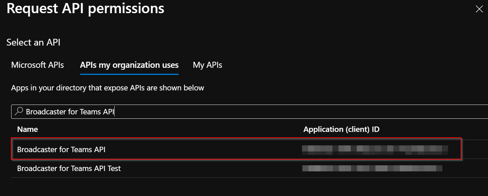
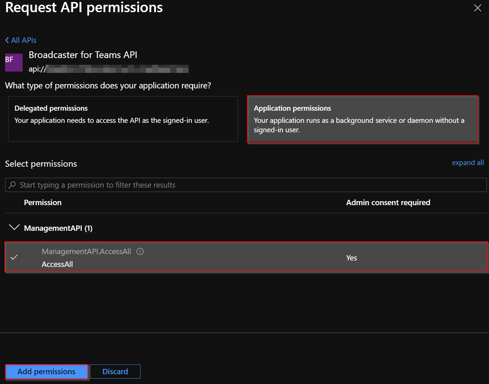
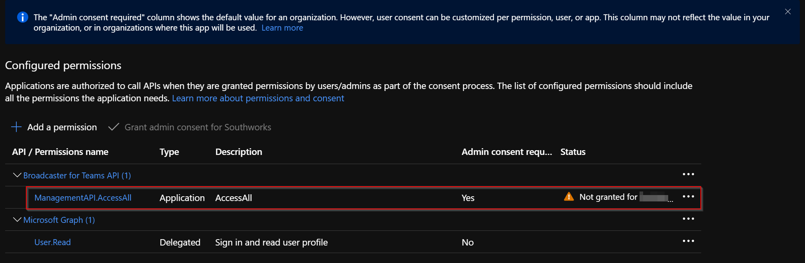
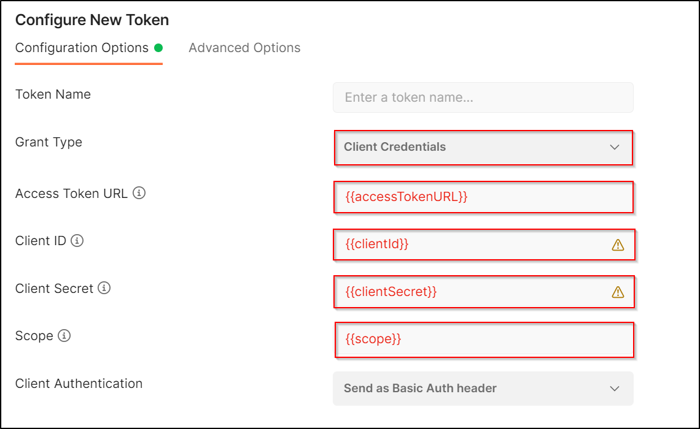
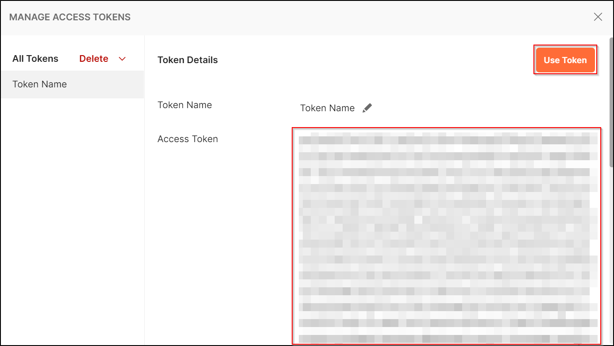
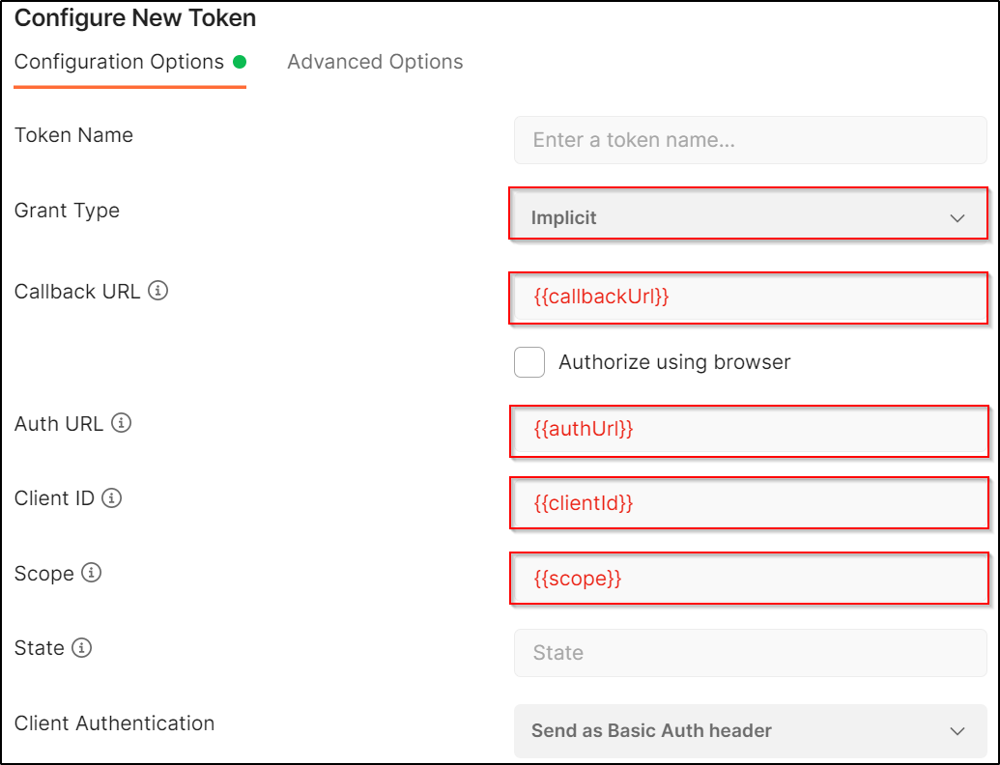
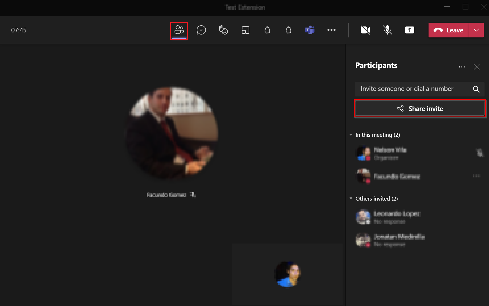

# How to use the Management API

## Getting Started
This document contains the instructions to operate the Broadcast Development Kit (BDK) using Postman. This includes:

  - [Getting Started](#getting-started)
  - [Prerequisites](#prerequisites)
  - [Authorization](#authorization)
    - [Client Credential Flow](#client-credential-flow)
      - [Create an App Registration](#create-an-app-registration)
        - [API permissions](#api-permissions)
      - [How to generate an access token](#how-to-generate-an-access-token-with-client-credential-grant-type)
    - [Implicit Flow](#implicit-flow)
      - [How to generate an access token](#how-to-generate-an-access-token-with-implicit-grant-type)
  - [Call Flow](#call-flow)
  - [Operations](#operations)
    - [Start the service](#start-the-service)
    - [Join the bot into a meeting](#join-the-bot-into-a-meeting)
    - [Start an extraction](#start-an-extraction)
    - [Start an Injection](#start-an-injection)
    - [Disconnect Call:](#disconnect-call)
    - [Stop service](#stop-service)
  
## Prerequisites
- Download and Install [Postman](https://www.postman.com/)

## Authorization
As endpoints in the solution are securitized in order to make requests to the API it is necessary to generate an access token and use it in the header of the requests, otherwise, the API will respond to requests with HTTP error code 401 (Unauthorized).

In this section we describe how to generate an access token using the app registration used for the SPA or by creating a new one for the client credential flow and use it in each request.

### Client Credential Flow
#### Create an App Registration
Create a new App registration to be able to configure it and thus be able to obtain the `access token`. Review the following Microsoft [documentation](https://docs.microsoft.com/en-us/azure/active-directory/develop/quickstart-register-app#register-an-application) that will explain how to do it, and consider the following settings:

- ***Name:*** Meaningful name.
- ***Supported account types:*** Accounts in this organizational directory only (`your-organization` only - Single tenant).

Once you've registered the app registration you must [add a client secret](https://docs.microsoft.com/en-us/azure/active-directory/develop/quickstart-register-app#add-a-client-secret), copy the value and save it together with the application client id in a secure place, we will need them for future steps.

#### API permissions
From the App registration created view, go to the **API permissions** option that is in the `Manage` menu, click the **Add a permission** button and then ensure the **APIs my organization uses**  tab is selected. Search for the App Registration created for the [Management API](../how-to-run-the-solution-in-azure/app_registrations.md#how-to-setup-management-api-app-registration) and click on the search result.



Then inside App registration created, select **AccessAll** and click on **Add permissions**.



> **NOTE**: If your user does not have the necessary permissions to enable the add-on permission. You must ask a user with the required permission to enable it.



#### How to generate an access token with client credential grant type
Once the App registration is created, follow the steps below to generate the `access token` from **Postman**:

1. Open **Postman** and create a new request.

2. In the **Authorization** tab, select the type **OAuth2**.

3. Then in the **Configure New Token** section  enter the parameters that are highlighted.

    ||
    |:--:|
    |*Configure New Token in Postman with Client Credentials*|

    | Placeholder | Description |
    |-------------|-------------|
    | Grant Type     |  Select the **Client Credentials** option.|
    | accessTokenURL | https://login.microsoftonline.com/`{{tenantId}}`/oauth2/v2.0/token`|
    | tenantId |  Tenant Id of the subscription. |
    | clientId    |   Client Id of the App registration created. |
    | clientSecret    |   Client Secret of the App registration created. |
    | scope   |     api://`{{clientIdManagementAPI}}`/.default |
    | clientIdManagementAPI |  Client Id of the [App Registration](../how-to-run-the-solution-in-azure/app_registrations.md#how-to-setup-management-api-app-registration) of the ManagementApi. |
    
4. Next, to generate the token, click on the **Get New Access Token** button, a new window will be displayed, and then it will show the generated `access token`. To use this token, click on the button **Use Token**, this will use the `access token` in the created request.

    ||
    |:--:|
    |*Management Access Tokens*|

### Implicit Flow
#### How to generate an access token with implicit grant type
> NOTE: It is necessary to use the App registration of the SPA to generate the access token, please review the following [documentation](https://github.com/microsoft/Broadcast-Development-Kit-Web-UI/tree/main/docs/how-to-run-the-solution-in-azure#create-a-new-app-registration).

To generate the access token with implicit grant type, the following steps are suggested:
 
1. Open **Postman** and create a new request.

2. In the **Authorization** tab, select the type **OAuth2**.

3. Then in the **Configure New Token** section  enter the parameters that are highlighted.

    ||
    |:--:|
    |*Configure New Token in Postman*|

    | Placeholder | Description |
    |-------------|-------------|
    | Grant Type     |  Select the **Implicit** option.|
    | callbackUrl     |  https://{{spaRedirectUrl}}|
    | spaRedirectUrl     | [Spa redirect URL](../how-to-run-the-solution-in-azure#configure-the-app-registration) configured. |
    | authUrl | https://login.microsoftonline.com/`{{tenantId}}`/oauth2/v2.0/authorize`|
    | tenantId |  Tenant Id of the subscription. |
    | clientId    |   Client Id of the App registration created. |
    | scope   |     api://`{{clientIdManagementAPI}}`/access_as_producer |
    | clientIdManagementAPI |  Client Id of the [App Registration](../how-to-run-the-solution-in-azure/app_registrations.md#how-to-setup-management-api-app-registration) of the ManagementApi. |

4. Next, to generate the token, click on the **Get New Access Token** button. Login, and after a few seconds, a pop-up window **Manage Access Tokens** will be displayed, which shows the generated `access token`. To use this token, click on the button **Use Token**, this will use the `access token` in the created request.

    ||
    |:--:|
    |*Management Access Tokens*|

## Call Flow
The life cycle of a call follows these steps:

1. First, we need to start the service (i.e. the VM) that host the bot using the `Start Service` endpoint. 
2. After requesting the provisioning of the service, we must poll the `Get Service State` endpoint several times until the service is `Provisioned`.
3. Once the service is provisioned, to invite the bot into a meeting we must use the `Initialize Call` endpoint. The request will return a call with state equals to `0` (Establishing). 
4. Then, we must poll the `Get Call Details` endpoint until the state of the call is `1` (Established) and the Participants are available. 
5. After that, we are able to start and stop the streams we want to capture.
6. Once the service is not longer needed in the call and all streams are stopped, we can disconnect it using the `Delete Call` endpoint.
7. After the bot usage is done, it can be terminated using the `Stop Service` endpoint. 
8. To make sure that the VM has been stopped, we must poll the `Get Service State` endpoint several times until the service is `Deprovisioned`. 

## Operations
The following instructions are the steps necessary to start the service, join the bot into the meeting, start an extraction or injection, disconnect the call and stop the service. 

It is necessary to have a [scheduled meeting](https://support.microsoft.com/en-us/office/schedule-a-meeting-in-teams-943507a9-8583-4c58-b5d2-8ec8265e04e5) in Microsoft Teams to join the bot in it and also to have already configured the access token in Postman in order to follow the instructions.

### Start the service
1. **Get service state**: We need to verify the state of the service before join the bot into the meeting, if the service is available or not. If it is not we need to start it

    **Method**: `GET`  
    **Endpoint**: `https://{{appServiceUrl}}/api/service/{{serviceId}}/state`

    | Placeholder | Description |
    |-------------|-------------|
    | appServiceUrl | AppService Url |
    | serviceId | Service Id (the default id is `00000000-0000-0000-0000-000000000000`)|


    **Response:** 

    ``` json 
    {
        "id": "serviceId",
        "resource": {
            "id": "serviceId",
            "callId": null,
            "name": "serviceName",
            "state": 3,
            "createdAt": "2021-08-02T11:26:13.7519720+00:00",
            "infrastructure": {
                "virtualMachineName": "test-vm",
                "resourceGroup": "test-bot-vm",
                "subscriptionId": "a874b409-c14a-448b-935d-296ac546e568",
                "id": "/subscriptions/a874b409-c14a-448b-935d-296ac546e568/resourcegroups/test-bot-vm/providers/microsoft.compute/virtualmachines/test-vm",
                "powerState": "PowerState/deallocated",
                "ipAddress": "21.120.170.210",
                "dns": "domain.co",
                "provisioningDetails": {
                    "state": {
                        "id": 3,
                        "name": "Deprovisioned"
                    },
                    "message": "Service serviceName deprovisioned."
                }
            }
        }
    ```
    if the provisioningDetails is deprovisioned we need to start the service by calling the start endpoint.

2. **Start Service**:

    **Method**: `POST`  
    **Endpoint**: `https://{{appServiceUrl}}/api/service/{{serviceId}}/start`

    | Placeholder | Description |
    |-------------|-------------|
    | appServiceUrl | AppService URL |
    | serviceId | Service Id (the default id is `00000000-0000-0000-0000-000000000000`)|

    **Response:**

    ```json
    {
        "id": "serviceId",
        "resource": {
            "id": "serviceId",
            "callId": null,
            "name": "serviceName",
            "state": 0,
            "createdAt": "2021-08-02T11:26:13.7519720+00:00",
            "infrastructure": {
                "virtualMachineName": "test-vm",
                "resourceGroup": "test-bot-vm",
                "subscriptionId": "a874b409-c14a-448b-935d-296ac546e568",
                "id": "/subscriptions/a874b409-c14a-448b-935d-296ac546e568/resourcegroups/test-bot-vm/providers/microsoft.compute/virtualmachines/test-vm",
                "powerState": "PowerState/deallocated",
                "ipAddress": "21.120.170.210",
                "dns": "domain.co",
                "provisioningDetails": {
                    "state": {
                        "id": 0,
                        "name": "Provisioning"
                    },
                    "message": "Provisioning service serviceName."
                }
            }
        }
    }
    ```
    
    After calling the start endpoint the service will start provisioning, it is necessary to check the status until the provisioningDetails changes to `Provisioned`

### Join the bot into a meeting
1. **Initialize Call:** To join the bot into the meeting we will call the initialize-call endpoint with the Teams meeting URL. The service needs to be `Provisioned` to join the bot to the call.

    **Method**: `POST`  
    **Endpoint**: `https://{{appServiceUrl}}/api/call/initialize-call`  

    | Placeholder | Description |
    |-------------|-------------|
    | appServiceUrl | AppService Url|

    **Headers**: Verify the `Content-type` key has as value `application/json`  
    **Body**: `raw`

    Complete the body in Postman with the following: 
    ```json
    { 
        "MeetingUrl": "{{teamsMeetingUrl}}" 
    } 
    ```

    | Placeholder | Description |
    |-------------|-------------|
    | teamsMeetingUrl | Teams meeting URL|

    To obtain the Teams meeting URL, join a Microsoft Teams meeting, press the **Show participants** button, then press **Share invite** and copy the link.

    ||
    |:--:|
    |*Steps to get the Teams meeting URL*|

    **Response:**
    ```json
    {
        "id": "callId",
        "resource": {
            "id": "callId",
            "meetingUrl": "teamsMeetingUrl",
            "meetingId": "meetingId",
            "state": 0,
            "createdAt": "2021-08-03T16:17:57.4086259+00:00",
            "startedAt": "0001-01-01T00:00:00",
            "endedAt": "0001-01-01T00:00:00",
            "meetingType": 0,
            "botFqdn": "domain.co",
            "botIp": null,
            "defaultPassphrase": null,
            "defaultLatency": 0,
            "graphId": null,
            "streams": [],
            "injectionStream": null,
            "publicContext": {},
            "privateContext": {
                "streamKey": "hJw5wZxAETkyExVhqdtw"
            }
        }
    }
    ```
    The returned status is equals `0` (Establishing) means that the bot is joining the call. To be able to start a stream, the call state has to be in `1` (Established). You can use the `Get Call Details` operation to verify the status of the call. The returned `Id` value must to be copied to be used in the following steps. 

2. **Get call details:** The call details endpoind will retrieve call and participants information. If the state of the call is `1` (Established), it means that the bot is joined in the call.

    **Method**: `POST`  
    **Endpoint**: `https://{{appServiceUrl}}/api/call/{{callId}}`  

    | Placeholder | Description |
    |-------------|-------------|
    | callId | Call Id obtained as response in the previous step|

    **Response:**
    ```json
    {
        "id": "callId",
        "meetingUrl": "",
        "meetingId": "meetingId",
        "state": 1,
        "createdAt": "2021-08-03T16:17:57.4086259+00:00",
        "startedAt": "2021-08-03T16:18:05.9058345Z",
        "endedAt": "0001-01-01T00:00:00",
        "meetingType": 0,
        "botFqdn": "domain.co",
        "botIp": null,
        "defaultPassphrase": null,
        "defaultLatency": 0,
        "graphId": "graphId",
        "streams": [
            {
                "id": "screnShareId",
                "aadId": null,
                "callId": "callId",
                "participantGraphId": "screenShareGraphId",
                "displayName": "Screen Share",
                "photoUrl": null,
                "type": 0,
                "state": 0,
                "isHealthy": true,
                "healthMessage": null,
                "audioMuted": false,
                "isSharingAudio": false,
                "isSharingVideo": false,
                "isSharingScreen": false,
                "details": {
                    "streamUrl": null,
                    "audioDemuxed": false,
                    "passphrase": null,
                    "keyLength": 0,
                    "latency": 0,
                    "previewUrl": null
                },
                "createdAt": "0001-01-01T00:00:00",
                "leftAt": null,
                "error": null
            },
            {
                "id": "primarySpeakerId",
                "aadId": null,
                "callId": "callId",
                "participantGraphId": "primarySpeakerGraphId",
                "displayName": "Primary Speaker",
                "photoUrl": null,
                "type": 1,
                "state": 0,
                "isHealthy": true,
                "healthMessage": null,
                "audioMuted": false,
                "isSharingAudio": false,
                "isSharingVideo": false,
                "isSharingScreen": false,
                "details": {
                    "streamUrl": null,
                    "audioDemuxed": false,
                    "passphrase": null,
                    "keyLength": 0,
                    "latency": 0,
                    "previewUrl": null
                },
                "createdAt": "0001-01-01T00:00:00",
                "leftAt": null,
                "error": null
            },
            {
                "id": "participant1Id",
                "aadId": "aadId1",
                "callId": "callId",
                "participantGraphId": "participant1GraphId",
                "displayName": "Participant 1 Name",
                "photoUrl": "https://appServiceUrl/api/participant/photo/00000000-0000-0000-0000-000000000000",
                "type": 2,
                "state": 0,
                "isHealthy": true,
                "healthMessage": "",
                "audioMuted": true,
                "isSharingAudio": true,
                "isSharingVideo": false,
                "isSharingScreen": false,
                "details": {
                    "streamUrl": null,
                    "audioDemuxed": false,
                    "passphrase": null,
                    "keyLength": 0,
                    "latency": 0,
                    "previewUrl": null
                },
                "createdAt": "0001-01-01T00:00:00",
                "leftAt": null,
                "error": null
            },
            {
                "id": "participant2Id",
                "aadId": "aadId2",
                "callId": "callId",
                "participantGraphId": "participant2GraphId",
                "displayName": "Participant 2 Name",
                "photoUrl": "https://appServiceUrl/api/participant/photo/00000000-0000-0000-0000-000000000000",
                "type": 2,
                "state": 0,
                "isHealthy": true,
                "healthMessage": "",
                "audioMuted": true,
                "isSharingAudio": true,
                "isSharingVideo": true,
                "isSharingScreen": false,
                "details": {
                    "streamUrl": null,
                    "audioDemuxed": false,
                    "passphrase": null,
                    "keyLength": 0,
                    "latency": 0,
                    "previewUrl": null
                },
                "createdAt": "0001-01-01T00:00:00",
                "leftAt": null,
                "error": null
            }
        ],
        "injectionStream": null,
        "publicContext": {},
        "privateContext": {
            "streamKey": "hJw5wZxAETkyExVhqdtw"
        }
    }
    ```

    The list of the participants joined to the call is listed in the streams property of the response.

### Start an extraction
1. **Start extraction stream**: To start the extraction of a participant it is necessary to check if the `isSharingVideo` property of the participant is true. In previous step request response we can see that participant 2 is sharing video.

    **Method**: `POST`  
    **Endpoint**: `https://{{appServiceUrl}}/api/call/{{callId}}/stream/start-extraction`  

    | Placeholder | Description |
    |-------------|-------------|
    | callId | Call Id|

    **Headers**: Verify the `Content-type` key has as value `application/json`  
    **Body**: `raw`

    #### Body for RTMP

    Complete the body in Postman with the following: 
    ```json
    {  
    "participantId": "{{participantId}}",  
    "participantGraphId": "{{participantGraphId}}",  
    "resourceType": {{resourceType}}, 
    "protocol": {{protocol}}, 
    "mode": {{mode}},
    "streamUrl": "{{streamUrl}}",  
    "streamKey": "{{streamKey}}", 
    "timeOverlay": {{timeOverlay}},
    "enableSsl" : {{enableSSl}}
    } 
    ```

    | Placeholder | Description |
    |-------------|-------------|
    | participantId | Participant Id |
    | participantGraphId | Participant Graph Id |
    | resourceType | Select a value from ResourceType [table](#table-of-availables-resourcetypes) |
    | protocol | Use `1` for RTMP extraction protocol|
    | mode | Use: `1` is Pull, `2` is Push |
    | streamUrl | RTMP in `Push` mode, use `null` if is `Pull` mode |
    | streamKey | Stream key or passphrase is in `Push` mode, use `null` if is `Pull` mode|
    | timeOverlay | `True` or `False` |
    | enableSsl | Enable SSL: `True` or `False` is in `Pull` mode, use `false` if is `Push` mode|

    #### Body for SRT

    Complete the body in Postman with the following: 
    ```json
    {  
    "participantId": "{{participantId}}",  
    "participantGraphId": "{{participantGraphId}}",  
    "resourceType": {{resourceType}}, 
    "protocol": {{protocol}}, 
    "mode": {{mode}},
    "streamUrl": "{{streamUrl}}",  
    "streamKey": "{{streamKey}}", 
    "timeOverlay": {{timeOverlay}},
    "keyLength": {{keyLength}},
    "latency": {{latency}}
    } 
    ```

    | Placeholder | Description |
    |-------------|-------------|
    | participantId | Participant Id |
    | participantGraphId | Participant Graph Id |
    | resourceType | Select a value from ResourceType [table](#table-of-availables-resourcetypes) |
    | protocol | Use `0` for SRT extraction protocol |
    | mode | Use: `1` is Caller, `2` is Listener. |
    | streamUrl | streamUrl for extraction if SRT is in `Caller` mode, use `null` if is Listener |
    | streamKey | use a passphrase or `null`|
    | timeOverlay | `True` or `False` |
    | keyLength | Allowed values: `0`, `16`, `24`, `32`|
    | latency | Latency for SRT (eg: `750`)|
    
    #### Table of Availables ResourceTypes

    |ResourceType | Value |
    |-------------|-------------|
    | Screen Share | `0` |
    | PrimarySpeaker | `1` |
    | Participant | `2` |
    | TogetherMode  | `3` |
    | LargeGallery | `4` |
    | LiveEvent  | `5` |

    **Response:**

    ```json
    {
        "id": "participant2Id",
        "resource": {
            "id": "participant2Id",
            "aadId": "aadId2",
            "callId": "callId",
            "participantGraphId": "participant2GraphId",
            "displayName": "Participant 2 Name",
            "photoUrl": "https://appServiceUrl/api/participant/photo/00000000-0000-0000-0000-000000000000",
            "type": 2,
            "state": 2,
            "isHealthy": true,
            "healthMessage": "",
            "audioMuted": true,
            "isSharingAudio": true,
            "isSharingVideo": true,
            "isSharingScreen": false,
            "details": {
                "streamUrl": "rtmps://domain:2940/secure-extraction/hJw5wZxAETkyExVhqdtw?callId=callid",
                "audioDemuxed": false,
                "passphrase": "hJw5wZxAETkyExVhqdtw",
                "keyLength": 0,
                "latency": 0,
                "previewUrl": null
            },
            "createdAt": "0001-01-01T00:00:00",
            "leftAt": null,
            "error": null
        }
    }
    ```

    When started the extraction in SRT Listener mode or in RTMP Pull mode, you can use the `streamUrl` in the `details` of the response to consume the extraction with a player as VLC

2. **Stop extraction stream:**

    **Method**: `POST`  
    **Endpoint**: `https://{{appServiceUrl}}/api/call/{{callId}}/stream/stop-extraction` 

    **Headers**: Verify the `Content-type` key has as value `application/json`  
    **Body**: `raw`

    Complete the body in Postman with the following: 
    ```json
    { 
      "participantId": "{{participantId}}", 
    "participantGraphId": "{{participantGraphId}}",
    "resourceType": {{resourceType}}, 
    } 
    ```
    | Placeholder | Description |
    |-------------|-------------|
    | participantId | Participant Id |
    | participantGraphId | Participant Graph Id |
    | resourceType | For participant extraction use `2` |

    **Response:**
    ```json
    {
        "id": "participant2Id",
        "resource": {
            "id": "participant2Id",
            "aadId": "aadId2",
            "callId": "callId",
            "participantGraphId": "participant2GraphId",
            "displayName": "Participant 2 Name",
            "photoUrl": "https://appServiceUrl/api/participant/photo/00000000-0000-0000-0000-000000000000",
            "type": 2,
            "state": 0,
            "isHealthy": true,
            "healthMessage": "",
            "audioMuted": false,
            "isSharingAudio": true,
            "isSharingVideo": true,
            "isSharingScreen": false,
            "details": {
                "streamUrl": null,
                "audioDemuxed": false,
                "passphrase": null,
                "keyLength": 0,
                "latency": 0,
                "previewUrl": null
            },
            "createdAt": "0001-01-01T00:00:00",
            "leftAt": null,
            "error": null
        }
    }
    ```

### Start an Injection
1. **Start injection stream**: 

    **Method**: `POST`  
    **Endpoint**: `https://{{appServiceUrl}}/api/call/{{callId}}/stream/start-injection`  

    | Placeholder | Description |
    |-------------|-------------|
    | callId | Call Id|

    **Headers**: Verify the `Content-type` key has as value `application/json`  
    **Body**: `raw`

    #### Body for RTMP
    ```json
    {
        "protocol": {{protocol}},
        "mode": {{mode}},
        "streamUrl": "{{streamUrl}}",
        "streamKey": "{{streamKey}}",
        "enableSSl": {{enableSsl}}
    }
    ```

    | Placeholder | Description |
    |-------------|-------------|
    | protocol | Use `1` for RTMP injection protocol|
    | mode | Use: `1` for Pull, `2` for Push |
    | streamUrl | RTMP in `Pull` mode or `null` |
    | streamKey | Stream key or passphrase or `null`|
    | enableSsl | Enable SSL: `True` or `False` used when mode is `Push`|

    #### Body for SRT
    ```json
    {
        "protocol": {{protocol}},
        "mode": {{mode}},
        "streamUrl": "{{streamUrl}}",
        "streamKey": "",
        "latency": "{{latency}}",
        "keyLength": "0,16,24,32",
    }
    ```

    | Placeholder | Description |
    |-------------|-------------|
    | protocol | Use `0` for SRT extraction protocol |
    | mode | Use: `1` is Caller, `2` is Listener. |
    | streamUrl | streamUrl for extraction if SRT is in `Caller` mode, use `null` if is Listener |
    | streamKey | use a passphrase or `null`|
    | latency | Latency (eg: `750`)|
    | keyLength | Allowed values: `0`, `16`, `24`, `32`|


    **Response**:

    ```json
    {
        "id": "streamId",
        "resource": {
            "id": "streamId",
            "callId": "callId",
            "injectionUrl": "rtmps://domain.co:2936/secure-ingest/streamkey?callId=callid",
            "passphrase": "streamkey",
            "latency": 0,
            "keyLength": 0,
            "state": 2,
            "startingAt": "2021-08-04T15:41:37.9975386Z",
            "startedAt": "2021-08-04T15:41:38.1097951Z",
            "endingAt": "0001-01-01T00:00:00",
            "endedAt": "0001-01-01T00:00:00",
            "protocol": 1,
            "streamMode": 2,
            "error": null
        }
    }
    ```
    The id of the response should be copied for later use when stopping the injection.

2. **Stop injection stream**: 

    **Method**: `POST`  
    **Endpoint**: `https://{{appServiceUrl}}/api/call/{{callId}}/stream/{{streamId}}/stop-injection`  

    | Placeholder | Description |
    |-------------|-------------|
    | callId | Call Id|
    | streamId | Obtained Stream Id when started the injection |

    **Response**
    ```json
    {
        "id": "streamId",
        "resource": {
            "id": "streamId",
            "callId": "callId",
            "injectionUrl": "rtmps://domain.co:2936/secure-ingest/streamkey?callId=callid",
            "passphrase": "streamkey",
            "latency": 0,
            "keyLength": 0,
            "state": 0,
            "startingAt": "2021-08-04T16:01:22.4798097Z",
            "startedAt": "2021-08-04T16:01:22.7420745Z",
            "endingAt": "2021-08-04T16:03:36.9824056Z",
            "endedAt": "2021-08-04T16:03:37.0222905Z",
            "protocol": 1,
            "streamMode": 2,
            "error": null
        }
    }
    ```

### Disconnect Call:
1. **Disconnect the bot from the call**:  
   
    **Method**: `DELETE`  
    **Endpoint**: `https://{{appServiceUrl}}/api/call/{{callId}}` 

    **Response:**
    ```json
    {
        "id": "callid",
        "resource": {
            "id": "callid",
            "meetingUrl": "teamsMeetingUrl",
            "meetingId": "meetingId",
            "state": 2,
            "createdAt": "2021-08-03T16:17:57.4086259+00:00",
            "startedAt": "2021-08-03T16:18:05.9058345Z",
            "endedAt": "0001-01-01T00:00:00",
            "meetingType": 0,
            "botFqdn": "domain.co",
            "botIp": null,
            "defaultPassphrase": null,
            "defaultLatency": 0,
            "graphId": "graphId",
            "streams": [],
            "injectionStream": null,
            "publicContext": {},
            "privateContext": {
                "streamKey": "hJw5wZxAETkyExVhqdtw"
            }
        }
    }
    ```

### Stop service
1. **Stop the service**:

    **Method**: `POST`  
    **Endpoint**: `https://{{appServiceUrl}}/api/service/{{serviceId}}/stop` 

    | Placeholder | Description |
    |-------------|-------------|
    | appServiceUrl | AppService URL |
    | serviceId | Service Id (the default id is `00000000-0000-0000-0000-000000000000`)|

    **Response:**
    ```json
    {
        "id": "serviceId",
        "resource": {
            "id": "serviceId",
            "callId": null,
            "name": "serviceName",
            "state": 3,
            "createdAt": "2021-06-07T15:44:16.6961976+00:00",
            "infrastructure": {
                "virtualMachineName": "test-vm",
                "resourceGroup": "test-bot-vm",
                "subscriptionId": "a874b409-c14a-448b-935d-296ac546e568",
                "id": "/subscriptions/a874b409-c14a-448b-935d-296ac546e568/resourcegroups/test-bot-vm/providers/microsoft.compute/virtualmachines/test-vm",
                "powerState": "PowerState/running",
                "ipAddress": "21.120.170.210",
                "dns": "domain.co",
                "provisioningDetails": {
                    "state": {
                        "id": 2,
                        "name": "Deprovisioning"
                    },
                    "message": "Deprovisioning service serviceName"
                }
            }
        }
    }
    ```