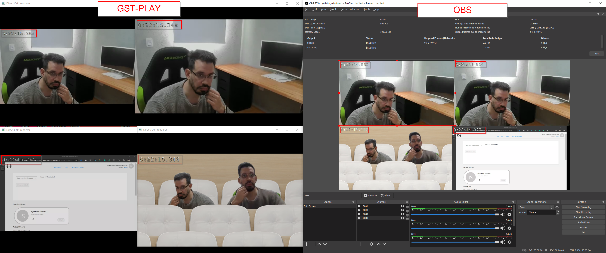
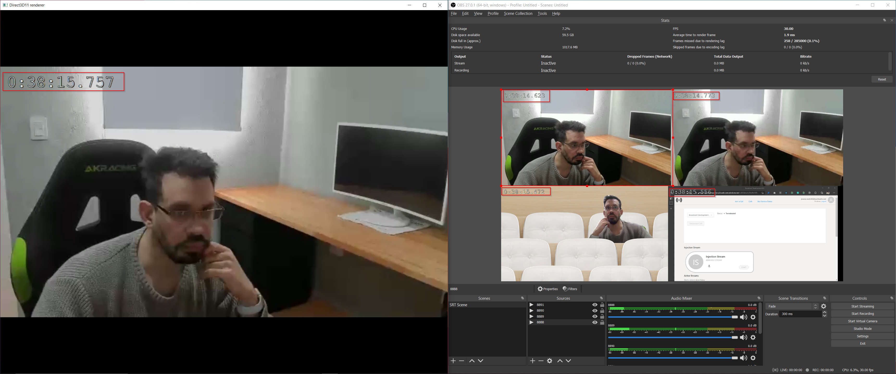

# Media synchronization

## Getting Started

The GStreamer pipelines (where BDK relies on to extract the participants' camera feed) share the same internal clock and base time in order to keep the streams in sync. This base time is set with the current system time of the first extraction and then is shared with the next extractions.

In this document we will explain how we tested the synchronization between different streams, some expected results, and findings.

## Setup

**Tools**

* _gst-play_
* _OBS Studio_

**Client PC**

* i7 8700 non-k (6 cores - 12 threads)
* 16 Gb of RAM
* RTX 2080 8 GB VRAM (to take advantage of hardware decoding through GPU for reproducing the streams)

**BDK Host**

* Azure virtual machine with *Standard F16s_v2* sku (16 vCPUs, 32 Gb of RAM)

## Tests

To test the synchronization between different streams, we started 4 SRT extractions (with same default latency) and played those streams using _gst-play_ as player and _OBS Studio_ also as player and as a composition tool. We left the streams running during a period of time and took screenshots at different times to compare the running time overlay of the streams.

### Latency configuration

To set default latency, we did a ping to the BDK host server and took the average round time trip (or RTT for short). During our tests this was 216ms. Then we followed this [guide](https://www.haivision.com/blog/all/how-to-configure-srt-settings-video-encoder-optimal-performance/) to calculate SRT latency.

**SRT Latency = RTT multiplier * RTT**

Because we don't have a tool to calculate the bandwidth overhead needed to pick the RTT multiplier, we used the highest RTT multiplier from the guide and calculated a latency of 1296ms (6 * 216ms).

### Streams

* Primary Speaker
* Participant
* Together Mode (the user must enable it inside the meeting)
* Screen Share (the user must share his screen)

### Gst-play results

To test the synchronization between the four streams, we opened four terminals and ran _gst-play_ with the SRT url of each stream provided by the Broadcast Development Kit.

**Example of command**

```sh
gst-play "srt://your-bdk-vm-url:8888?mode=caller&latency=1296"
```

We left the players running for 45 minutes approximately and took screenshots at different times to compare the running time difference in milliseconds between the streams.

**First Screenshot (beginning of the stream)**

| Stream | Running Time|
| ------------- | ------------- |
| Participant (top-left) | 0:09:51.165 |
| Primary Speaker (bottom-left) | 0:09:51.163 |
| Together Mode (top-right) | 0:09:51.160 |
| Screenshare (bottom-right) | 0:09:51.032 |

||
|:--:|
|*First screenshot*|

**Second Screenshot (7 minutes after the beggining of the stream)**

| Stream | Running Time|
| ------------- | ------------- |
| Participant (top-left) | 0:16:26.527 |
| Primary Speaker (bottom-left) | 0:16:26.524 |
| Together Mode (top-right) | 0:16:26.555   |
| Screenshare (bottom-right) | 0:16:26.427 |

||
|:--:|
|*Second screenshot*|

**Third Screenshot (47 minutes after the beginning of the stream)**

| Stream | Running Time|
| ------------- | ------------- |
| Participant (top-left) | 0:56:39.637 |
| Primary Speaker (bottom-left) | 0:56:39.635 |
| Together Mode (top-right) | 0:56:39.666   |
| Screenshare (bottom-right) | 0:56:39.571 |

||
|:--:|
|*Third screenshot*|

As we can see in the three stages of the test run, the maximum difference between all the streams was 119 ms average, and always was between the screenshare and one of the other streams. Excepting the screenshare stream, the difference was 23 ms average.

Also, if we compare in all the screenshots the difference between the stopwatch on the Microsoft Teams feed and one of the streams, the difference is constant (3.7 seconds approximately). Note that this time can be reduced if you have a lower latency between BDK and your composition tool or player.

| Stage | MS Teams Feed | Stream | Difference |
| ------------- | ------------- | ------------- | ------------- |
| Beginning of the stream | 00:14.27 | 00:10.57 | 00:03.7 | 
| 7 minutes after | 00:05.52 | 00:01.82 | 00:03.7 | 
| 47 minutes after | 00:8.96   | 00:05.25 | 00:03.71 | 

### OBS Studio results

To test the synchronization between the four streams with OBS, we added a media source per stream to a scene. To know how to configure a media source please follow this [OBS guide](https://obsproject.com/wiki/Streaming-With-SRT-Protocol).

**Media source settings**

* Local File: unchecked
* Network Buffering: 0 MB
* Input: SRT stream url (E.g.: srt://your-bdk-vm-url:8888?mode=caller&latency=2000)
* Input Format: mpegts
* Use hardware decoding when available: checked

We left OBS running for 40 minutes approximately, but compared to _gst-play_ the results weren't consistent. We saw that the media sources started to introduce a delay at different rates, increasing the difference saw between each stream inside the OBS scene. Note that this delay was introduced inside OBS, not in the output of the BDK. We had to increase the latency of the streams and disable/enable the media sources in OBS to restart the streams in the scene to try to keep them in sync. While _gst-play_ relies on _GStreamer_ to process the SRT stream, OBS media sources rely on ffmpeg. We don't know how ffmpeg is used on OBS's media sources, but there seems to be some kind of buffering or delay when reproducing the SRT streams that causes this drift between streams.

**First Screenshot (beginning of the stream)**

| Stream | Running Time|
| ------------- | ------------- |
| Participant (top-left) | 0:00:57.021 |
| Primary Speaker (top-right) | 0:00:56.237 |
| Together Mode (bottom-left) | 0:00:56.268 |
| Screenshare (bottom-right) | 0:00:56.298 |

The highest desynchronization difference was about 784 ms, between the participant and primary speaker.

|
|:--:|
|*First screenshot (beginning of the stream)*|

**Second Screenshot (after 30 seconds approximately.)**

| Stream | Running Time|
| ------------- | ------------- |
| Participant (top-left) | 0:01:25.483 |
| Primary Speaker (top-right) | 0:01:24.866 |
| Together Mode (bottom-left) | 0:01:24.897 |
| Screenshare (bottom-right) | 0:01:24.927 |

|
|:--:|
|*Second Screenshot (after 30 seconds approximately.)*|

The highest desynchronization difference was about 617 ms, between the participant and primary speaker.

**Third Screenshot (after restarting participant media source)**

| Stream | Running Time|
| ------------- | ------------- |
| Participant (top-left) | 0:05:15.546 |
| Primary Speaker (top-right) | 0:05:15.496 |
| Together Mode (bottom-left) | 0:05:15.460 |
| Screenshare (bottom-right) | 0:05:15.490 |

|
|:--:|
|*Third screenshot - after restarting participant media source in OBS*|

After restarting the participant media source in OBS, the highest desynchronization difference was about 86 ms, between the participant and together mode.

**Fourth Screenshot (after 19 minutes approximately)**

**OBS**

| Stream | Running Time|
| ------------- | ------------- |
| Participant (top-left) | 0:19:57.494 |
| Primary Speaker (top-right) | 0:19:57.577 |
| Together Mode (bottom-left) | 0:19:58.309 |
| Screenshare (bottom-right) | 0:19:58.193 |

**gst-play**

| Stream | Running Time|
| ------------- | ------------- |
| Participant (top-left) | 0:19:58.328 |
| Primary Speaker (top-right) | 0:19:58.345 |
| Together Mode (bottom-right) | 0:19:58.509 |
| Screenshare (bottom-left) | 0:19:58.427 |

|
|:--:|
|*Fourth Screenshot (after 19 minutes approximately)*|

After 19 minutes approximately, we can see how the streams become desynchronized again. This time, the highest unsynch difference was about 815 ms. If we compare the _OBS_ results with the _gst-play_ ones, the highest desynchronization difference was about 181 ms. For some reason, the participant and primary speaker streams had more delay in OBS.

**Fifth Screenshot (after restarting the media sources)**

**OBS**

| Stream | Running Time|
| ------------- | ------------- |
| Participant (top-left) | 0:22:14.898 |
| Primary Speaker (top-right) | 0:22:14.914 |
| Together Mode (bottom-left) | 0:22:15.112 |
| Screenshare (bottom-right) | 0:22:14.997 |

**gst-play**

| Stream | Running Time|
| ------------- | ------------- |
| Participant (top-left) | 0:22:15.365 |
| Primary Speaker (top-right) | 0:22:15.348 |
| Together Mode (bottom-right) | 0:22:15.346 |
| Screenshare (bottom-left) | 0:22:15.264 |

|
|:--:|
|*Fifth Screenshot (after 22 minutes approximately)*|

After restarting the media sources in _OBS_, the highest desynchronization difference was about 214 ms. If we compare the _OBS_ results with the _gst-play_ ones, the highest desynchronization difference was about 101 ms. For an unknown reason, the participant and primary speaker streams have more delay in OBS.

**Sixth Screenshot (after 38 minutes approximately)**

| Stream | Running Time|
| ------------- | ------------- |
| Participant (top-left) | 0:38:14.623 |
| Primary Speaker (top-right) | 0:38:14.773 |
| Together Mode (bottom-left) | 0:38:15.472 |
| Screenshare (bottom-right) | 0:38:15.556 |

|
|:--:|
|*Sixth screenshot - after 38 minutes approximately*|

After 38 minutes, we can see how the streams become desynchronized again. This time, the highest desynchronization difference was about 933 ms. If we compare the running time of the participant stream in _OBS_ (the one with the lowest running time) with the running time of _gst-play_, the latter is ahead in time.

### Other results

Here we show some examples with _VLC_ and _gst-play_ playing multiple streams at the same time. We can observe that the running time of each stream is different, but the biggest difference between them is below 300 ms.

|
|:--:|
|*Example of multiple streams with VLC (273 ms of difference)*|

|
|:--:|
|*Example of multiple streams with VLC (292 ms of difference)*|

|
|:--:|
|*Example of multiple streams with gst-play (141 ms of difference)*|

|
|:--:|
|*Example of multiple streams with gst-play (288 ms of difference)*|

### Findings

* The results we shared above may vary between different executions, depending on factors like player, network condition, BDK virtual machine CPU consumption.
* Using SRT and _OBS Studio_, we couldn't achieve the results we achieved with _gst-play_. We don't know how OBS is using ffmpeg, but we had to increase the latency of the streams and had to disable/enable the media sources in OBS to restart the streams to try to keep them synchronized.
* From the different tests and comparisons between _OBS_ and _gst-play_, we can observe that when we restart the streams, they recover their current running time. This indicates that the pipelines are synchronized, but the players/tools have issues to play them synchronized.
