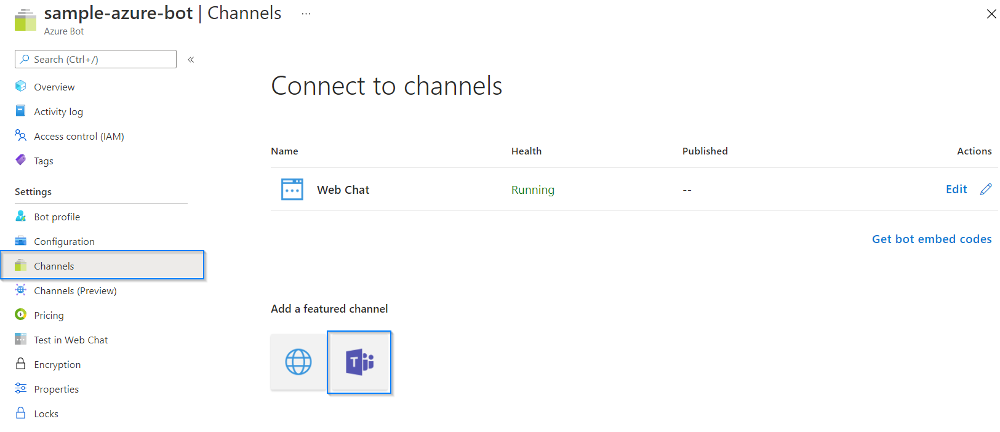
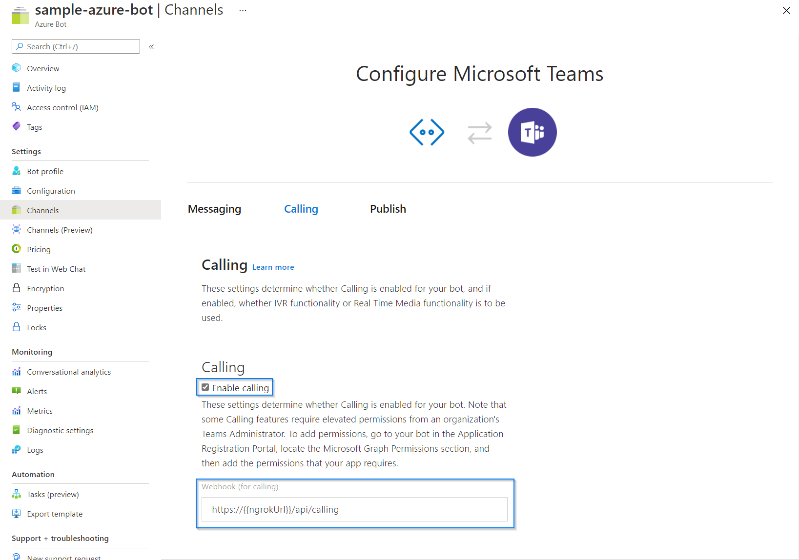

# How to create an Azure Bot

## Useful links
- [How to create an application registration](https://docs.microsoft.com/en-us/azure/active-directory/develop/quickstart-register-app#register-an-application)
- [How to create an Azure Bot resource](https://docs.microsoft.com/en-us/azure/bot-service/abs-quickstart?view=azure-bot-service-4.0#create-an-azure-bot-resource)

## Getting Started
To add calling capabilities to the bot, it's necessary to create an Azure Bot resource. To do so, before creating the Azure Bot, we need to create an application registration with the required permissions the Azure Bot will use to authenticate against the Microsoft Graph API and get access to different resources.

### Bot Application Registration

To create the application registration, review the following Microsoft [documentation](https://docs.microsoft.com/en-us/azure/active-directory/develop/quickstart-register-app#register-an-application) that will explain how to do it.

After reviewing the documentation, create the application registration with the following settings:

* `Name`: A meaningful name for your application registration.
* `Authentication`: 
  * `Platform configurations:` None. 
  * `Supported account types:` Accounts in this organizational directory only. 
* `Certificates and clients:` A secrets needs to be created for this application and stored in a secure location. Give a long expiration for this secret (check your organization’s policies on credential expiration). 
* `Token configuration:` None. 
* `Expose an API:` None
* `App roles:` None. 
* `API permissions:` This app requires several permissions to access the Microsoft Teams calls. Add the permissions shown in the table below. 

API / Permission name  | Type | Display | Description | Admin consent 
----------|----------|----------|----------|----------
 Calls.AccessMedia.All  | Application | Access media streams in a call as an app preview. | Allows the app to get direct access to media streams in a call, without a signed-in user. | Yes
 Calls.Initiate.All | Application | Initiate outgoing 1:1 calls from the app preview.| Allows the app to place outbound calls to a single user and transfer calls to users in your organization’s directory, without a signed-in user. | Yes
 Calls.InitiateGroupCall.All  | Application | Initiate outgoing group calls from the app preview | Allows the app to place outbound calls to multiple users and add participants to meetings in your organization, without a signed-in user. | Yes
 Calls.JoinGroupCall.All | Application | Join group calls and meetings as an app preview. | Allows the app to join group calls and scheduled meetings in your organization, without a signed-in user. The app is joined with the privileges of a directory user to meetings in your tenant. | Yes
 Calls.JoinGroupCallAsGuest.All | Application | Join group calls and meetings as a guest preview. | Allows the app to anonymously join group calls and scheduled meetings in your organization, without a signed-in user. The app is joined as a guest to meetings in your tenant. | Yes
 User.Read | Delegated | Sign in and read user profile | Allows users to sign-in to the app, and allows the app to read the profile of signed-in users. It also allows the app to read basic company information of signed-in users | No
 User.Read.All | Application | Read all users' full profiles | Allows the app to read user profiles without a signed in user. We use it to retrieve get the user photos | Yes

 

 Several of the permissions that were configured in this application require to be consented by an admin of the Azure AD tenant. To grant this consent, ask an Azure AD administrator to access the following URL and accept the permissions for this application (replace the {{applicationId}} placeholder with the id of the application registration previously created): 

> https://login.microsoftonline.com/common/adminconsent?client_id={{applicationId}}&state=1

> **Note**: Despite that constructing the Tenant Admin Consent URL requires a configured Redirect URI/Reply URL in the App Registration Portal, to grant consent manually we don't need to add it to the reply URL in the consent URL. To add reply URLs for your bot, access your bot registration, choose Advanced Options > Edit Application Manifest. Add your Redirect URI to the field reply URLs.

### Azure Bot
To continue with the registration of the calling bot, we must create an [Azure Bot resource](https://docs.microsoft.com/en-us/azure/bot-service/abs-quickstart?view=azure-bot-service-4.0#create-an-azure-bot-resource). While doing so, consider the following settings:

* `Bot handle:` A meaningful name. 
* `Subscription` Your Azure subscription.
* `Resource group`: The resource group where you want to create the resource  
* `Pricing tier:` F0. 
* `Microsoft App ID:` Click on `Use existing app registration`, then input the client ID and client secret that were created for the bot application registration. 
* Leave the rest of the settings as-is. 

Once the Bot Channel Registration is created, apply the following changes to the resource: 

1. In the resource blade, click `Channels`, then go to the `Connect to channels` section and click edit on the `Microsoft Teams` channel. If this channel is not already added by default, add the `Microsoft Teams` channel first using the options in this page. 

||
|:--:|
|*Azure Bot Service - Connect to channels*|
2. Once inside, go to the `Calling` tab and check the `Enable calling` checkbox. In the `Webhook` URL add the path to the following route using your domain name: 
   * `https://{domain-name}/api/calling `

||
|:--:|
|*Azure Bot Service - Calling tab*|
3. Click `Save` to impact the changes. 

> **Optional:** You can go to `Bot profile` section and upload an icon for this bot or change the name that it will show inside the meetings. 