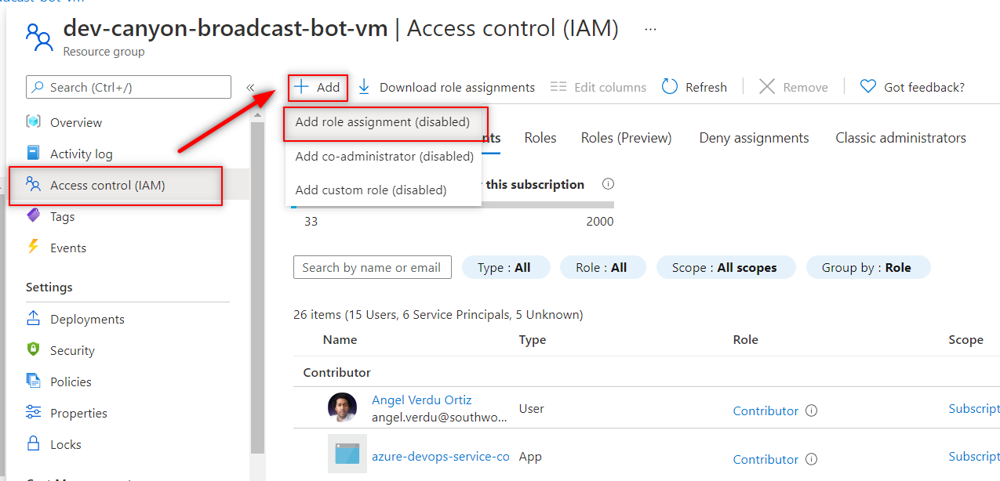

# Azure SDK Service Principal

## Getting Started

Broadcaster for Teams Core has some components that require interaction with Azure resources using the Azure SDK. To allow this interaction, we need to create a Service Principal for Broadcaster for Teams Core and assign it Contributor access to the specified Azure Resources. In this guide, we are going to explain how to create the Service Principal and assign the permissions.

### App Registration
While [registering the app registration](https://docs.microsoft.com/en-us/azure/active-directory/develop/howto-create-service-principal-portal#register-an-application-with-azure-ad-and-create-a-service-principal), consider the following settings:

- **Name**: Meaningful name.
- **Supported account types**: Accounts in any organizational directory (Any Azure AD directory - Multitenant)
- **Redirect URL**: This field is not required to be filled.

Once you've registered the app registration you must [add a client secret](https://docs.microsoft.com/en-us/azure/active-directory/develop/quickstart-register-app#add-a-client-secret), copy its value and save it together with the application client id in a secure place, we will need it for future steps.

You will need the id and secret of this service principal to [configure the Pipeline's libraries]() for the deployments.

### Assign Contributor Role
For the time being, Broadcaster for Teams core needs to interact with the virtual machine where the BotService API is hosted (to turn on/turn off the virtual machine), so we have to go to the resource group where the virtual machine was created and through Access Control (IAM) assign contributor role to the application (check [How to assign a role to an application](https://docs.microsoft.com/en-us/azure/active-directory/develop/howto-create-service-principal-portal#assign-a-role-to-the-application)).

[← Back to Running the solution in Azure](README.md#running-the-solution-in-azure)